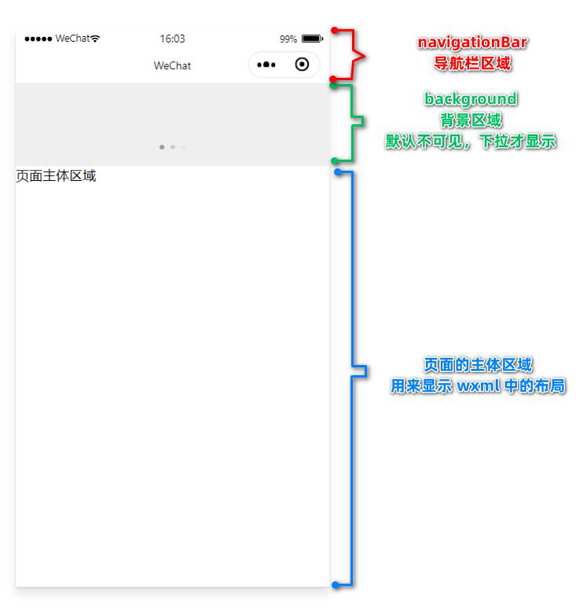
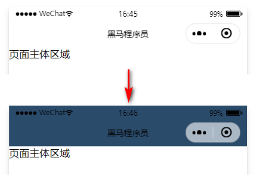
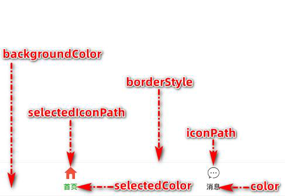
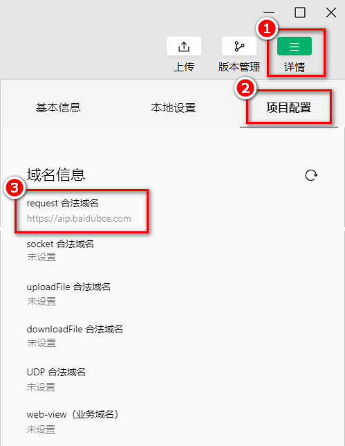
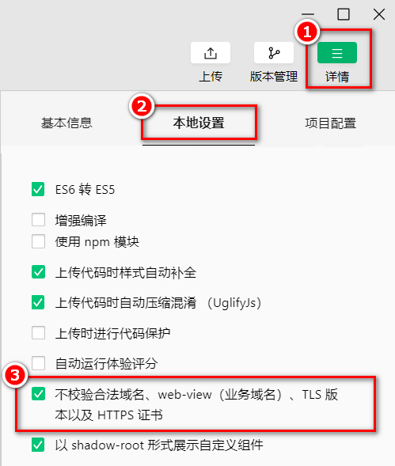

# 1. wxml 模板语法

## 数据绑定的 基本原则

- 在 data 中定义数据
- 在 WXML 中使用数据

## 1.1 在data中定义页面的数据

像这样：

```js
Page({
  data: {
    // 字符串类型的数据
    info：'init data',
    // 数组类型的数据
    msgList: [{msg: 'hello'}, {msg: 'world'}]
  }
})
```

## 1.2 Mustache 语法的格式

把data 中的数据绑定到页面中渲染，使用 Mustache 语法 （双大括号）将变量包起来即可。

## 1.3 Mustache 语法的应用场景

- 绑定内容
- 绑定属性
- 运算（包括三元运算、算数运算符）

### 1.3.1 动态绑定内容

页面的数据如下：

```js
Page({
  data: {
    // 字符串类型的数据
    info：'init data',
    // 数组类型的数据
    msgList: [{msg: 'hello'}, {msg: 'world'}]
  }
})
```

结构为：

```
<image src="{{ imgSrc }}"></image>
```

### 1.3.2 三元运算

页面的数据如下：

```js
Page({
  data: {
    randomNum: Math.random() * 10 // 生成10以内的随机数
  }
})
```

结构为：

```
<view> {{ randomNum >= 5 ? '随机数字 >= 5' : '随机数字 < 5' }} </view>
```

### 1.3.2 算数运算

页面的数据如下：

```js
Page({
  data: {
    randomNum: Math.random().toFixed(2) // 生成一个带两位小数的随机数
  }
})
```

结构为：

```
<view>生成100以内的随机数 {{ randomNum * 100 }} </view>
```


## 1.4 事件绑定

事件是 渲染层到逻辑层的通讯方式 。通过事件可以将用户在渲染层产生的行为，反馈到逻辑层进行业务的处理。


### 1.4.1小程序中常用的事件

|     **事件类型**     |    **事件名称**     |                         **触发时机**                         |         **备注**         |
| :------------------: | :-----------------: | :----------------------------------------------------------: | :----------------------: |
|  **`tap` 点击事件**  |      `bindtap`      |                       点击事件（冒泡）                       |     最常用的点击事件     |
|                      |     `catchtap`      |                     点击事件（阻止冒泡）                     |   需阻止事件冒泡时使用   |
|                      |   `bindlongpress`   |                           长按事件                           |     长按触发（冒泡）     |
|                      |  `catchlongpress`   |                     长按事件（阻止冒泡）                     |   需阻止事件冒泡时使用   |
| **`touch` 触摸事件** |  `bindtouchstart`   |                           触摸开始                           |       触摸交互相关       |
|                      |   `bindtouchmove`   |                           触摸移动                           |       触摸交互相关       |
|                      |   `bindtouchend`    |                           触摸结束                           |       触摸交互相关       |
|                      |  `bindtouchcancel`  |                 触摸取消（如被其他事件打断）                 |                          |
|     **表单事件**     |     `bindinput`     |                      输入框内容实时变化                      |     实时监听输入内容     |
|                      |    `bindchange`     |               输入框内容变化（失去焦点时触发）               |        非实时监听        |
|                      |     `bindfocus`     |                        输入框获取焦点                        |                          |
|                      |     `bindblur`      |                        输入框失去焦点                        |                          |
|                      |    `bindsubmit`     |                           表单提交                           | 需在 `<form>` 组件上绑定 |
|   **页面生命周期**   |      `onLoad`       |           页面加载时触发（接收页面参数 `options`）           |     页面初始化时调用     |
|                      |      `onShow`       |            页面显示时触发（每次打开页面都会调用）            |                          |
|                      |      `onReady`      |               页面初次渲染完成时触发（仅一次）               |                          |
|                      |      `onHide`       |              页面隐藏时触发（如跳转到其他页面）              |                          |
|                      |     `onUnload`      | 页面卸载时触发（如 `redirectTo` 或 `navigateBack` 关闭页面） |                          |
|                      | `onPullDownRefresh` | 下拉刷新时触发（需在页面配置中启用 `enablePullDownRefresh`） |       下拉刷新功能       |
|                      |   `onReachBottom`   |       上拉触底时触发（需配置 `onReachBottomDistance`）       |     上拉加载更多功能     |
|                      |   `onPageScroll`    |         页面滚动时触发（可获取滚动位置 `scrollTop`）         |         滚动监听         |

------

**事件类型说明**：

1. **`tap` 点击事件**
   - 包括普通点击 (`bindtap`/`catchtap`) 和长按 (`bindlongpress`/`catchlongpress`)。
   - `catch` 前缀会阻止事件冒泡到父组件。
2. **`touch` 触摸事件**
   - 用于更精细的触摸交互（如滑动、拖拽等）。
   - 通常需要结合坐标计算实现自定义手势。
3. **表单事件**
   - 监听输入框或表单的交互行为。
   - `bindinput` 适合实时搜索，`bindchange` 适合最终提交验证。
4. **页面生命周期事件**
   - 控制页面加载、显示、隐藏等状态。
   - `onPullDownRefresh` 和 `onReachBottom` 需在页面配置中启用。

### 1.4.2 事件对象的属性列表

当事件回调触发的时候，会收到一个事件对象 event ，它的详细属性如下表所示：

|   **属性类别**   |                **属性名**                 |  **类型**  |                           **说明**                           |            **适用场景**            |
| :--------------: | :---------------------------------------: | :--------: | :----------------------------------------------------------: | :--------------------------------: |
|   **基础属性**   |                  `type`                   |   string   |               事件类型（如 `tap`、`input` 等）               |              所有事件              |
|                  |                `timeStamp`                |   number   |               事件生成时的时间戳（单位：毫秒）               |         性能分析、事件计时         |
|                  |               **`target`**                | **object** |              **触发事件的组件的一些属性值集合**              |           **区分事件源**           |
|                  |              `currentTarget`              |   object   |       当前组件的一些属性值集合（可能不同于 `target`）        |       事件冒泡时区分当前组件       |
| **触摸事件特有** |                 `touches`                 |   array    |              当前停留在屏幕上的触摸点信息的数组              |     `touchstart`/`move`/`end`      |
|                  |             `changedTouches`              |   array    | 触摸事件中发生变化的触摸点信息的数组（如从无到有、位置变化等） |     `touchstart`/`move`/`end`      |
| **表单事件特有** |               **`detail`**                | **object** | **额外的信息（如 `input` 事件的输入值、`scroll` 事件的滚动位置等）** | **`input`/`scroll`/`form` 等事件** |
|  **自定义数据**  |                 `dataset`                 |   object   |      事件源组件上由 `data-` 开头的自定义属性组成的对象       |       所有事件（组件间通信）       |
|     **其他**     | `touches[0].clientX` `touches[0].clientY` |   number   |                触摸点的客户端屏幕坐标（X/Y）                 |          精确触摸位置计算          |
|                  |   `touches[0].pageX` `touches[0].pageY`   |   number   |             触摸点的页面坐标（含滚动偏移，X/Y）              |       考虑页面滚动的触摸位置       |
|                  |           `detail.x` `detail.y`           |   number   |            某些事件（如 `scroll`）的滚动位置坐标             |              滚动事件              |

------

### 1.4.3 target 和 currentTarget 的区别

target是触发该事件的源头组件 ，而 currentTarget 则是 当前事件所绑定的组件 。举例如下：


点击内部的按钮时，点击事件以冒泡 的方式向外扩散，也会触发外层 view 的 tap 事件处理函数。

此时，对于外层的 view 来说：

- e.target 指向的是触发事件的源头组件，因此， e.target 是内部的按钮组件
- e.currentTarget 指向的是当前正在触发事件的那个组件，因此， e.currentTarget 是当前的 view 组

### 1.4.4 bindtap 的语法格式

在 小程序中，不存HTML 中的 onclick 鼠标点击事件，而是通过 tap 事件 来响应用户的触摸行为。
① 通过 bindtap ，可以为组件绑定 tap 触摸事件，语法如下：

```html
<button type="primary" bindtap="btnTapHandler">按钮</button>
```

② 在页面的 .js 文件中定义对应的事件处理函数，事件参数通过形参 eventevent（一般 简写成 e） 来接收：

```js
Page({
  btnTapHandler(e){
    console.loe(e)
  }
})
```

### 1.4.5 在事件处理函数中为data中的数据赋值

通过调用 this.setData(dataObject) 方法，可以给页面`data`中的数据重新赋值：

```js
// 页面的 .js 文件
Page({
  data: {
    count: 0
  },
  // 修改 count 的值
  changeCount() {
    this.setData({
      count: this.data.count + 1
    })
  }
})
```

**更推荐将方法放在 `methods` 对象中**（虽然直接定义在Page下也有效）

```js
Page({
  data: { count: 0 },
  methods: {
    changeCount() {  // 更规范的写法
      this.setData({ count: this.data.count + 1 })
    }
  }
})
```

- **优势**：代码组织更清晰，与Vue等框架风格一致。

### 1.4.6 事件传参

小程序中的事件传参比较特殊，不能在绑定事件的同时为事件处理函数传递参数 。例如，下面的代码将不能正常工作：

```html
<button type="primary" bindtap="btnHandle(123)">事件传参</button>
```

因为小程序会把 bindtap 的属性值，统一当作事件名称来处理，相当于要调用一个名称为 btnHandler(123)的事件处理函数。

正确的做法为，为组件提供 data-* 自定义属性传参，其中 * 代表参数名称：

```html
<button bindtap="btnHandle" data-info="{{2}}">事件传参</button>
```

最终：

- info 被解析为参数的名称
- 数值 2 被解析为参数的值

事件处理函数中，通过 event.target.dataset.参数名即可获取到具体参数的值：

```js
btnHandle(event){
    // dataset 是一个对象，包含了所有通过 data-* 传递过来的参数想
    console.log(event.target.dataset)
    // 通过 datase 可以访问到具体参数的值
    console.log(event.target.dataset.info)
  }
```

### 1.4.7 bindinput 的语法格式

在小程序中，通过 input 事件 来响应文本框的输入事件，语法格式如下：
① 通过 bindinput ，可以为文本框绑定输入事件：

```html
<input bindinput="inputHandler" />
```

② 在页面的 .js 文件中定义事件处理函数：

```js
inputHandler(e){
  // e.detail.value 是变化过后，文本框的最新值
  console.log(e.detail.value)
}
```

### 1.4.8 实现文本框和 data 之间的数据同步

定义数据:

```js
Page({
  data:{
  	msg:'hello world'
  }
})
```

渲染结构：

```html
<input value="{{msg}}" bindinput="iptHandler" />
```

美化样式：

```css
input {
	border: 1px soild #eee;
	padding: 5px;
	margin: 5px;
	border-redius: 3px;
}
```

绑定 input 事件处理函数：

```js
// 文本框内容改变事件
iptHandler(e){
	this.setData({
		// 通过 e.detail.value 获取到文本框的最新值
		msg：e.detail.value
	})
}
```

当用户在输入框输入内容时：

1. 小程序框架会自动触发 `bindinput` 绑定的 `iptHandler` 函数。
2. **框架会将一个事件对象 `e` 作为参数传入 `iptHandler`**。
3. 这个 `e` 对象的 `detail.value` 属性**已经包含了输入框的最新值**（由小程序框架内部维护）。

## 1.5 条件渲染

### 1.5.1 wx:if

在小程序中，使用 `wx:if="{{ condition }}"` 来判断是否需要渲染该代码块：

```html
<view wx:if="{{condition}}">True</view>
```

也可以使用 `wx:elif` 和 `wx:else` 添加判断分支：

```html
<view wx:if="{{type === 1}}">男</view>
<view wx:elif="{{type === 2}}">女</view>
<view wx:else>保密</view>
```

如果要一次性控制多个组件的展示与隐藏，可以使用一个 `<block>` 标签将多个组件包裹起来，并在 `<block>` 上使用 `wx:if` 控制：

```html
<block wx:if="{{true}}">
  <view>view</view>
  <view>view</view>
</block>
```

> 注意：`<block>` 并不是一个组件，它只是一个包裹性质的容器，不会在页面中做任何渲染。

### 1.5.2 hidden

小程序中，也可以使用 `hidden="{{ condition }}"` 控制元素的显示与隐藏：

```html
<view hidden="{{condition}}">条件为 true 隐藏，条件为 false 显示</view>
```

------

### wx:if 与 hidden 的对比

1. 运行方式不同：

- `wx:if` 是以 **动态创建和移除元素** 的方式控制显示。
- `hidden` 是以 **切换样式（display: none/block）** 的方式控制显示。

2. 使用建议：

- **频繁切换时**，建议使用 `hidden`。
- **条件复杂时**，建议使用 `wx:if` 搭配 `wx:elif` 和 `wx:else` 来控制展示与隐藏。

## 1.6 列表渲染

### 1.6.1 wx:for

通过 wx:for 可以根据指定的数组，循环渲染重复的组件结构：

```html
<view wx:for="{{array}}">
	索引是：{{index}} 当前项是：{{item}}
</view>
```

默认情况下，当前循环项的索引 用 index 表示； 当前循环项 用 item 表示。

### 1.6.2手动指定索引和当前项的变量名 *

- 使用 wx:for for-index 可以指定 当前循环项的索引 的变量名

- 使用 wx:for for-item 可以指定 当前项 的变量名
  示例代码如下：

  ```html
  <view wx:for="{{array}}" wx:for-index="idx" wx:for-item="itemName">
  	索引是：{{idx}} 当前项是：{{itemName}}
  </view>
  ```

### 1.6.3 wx:key 的使用

类似于 Vue 列表渲染中的 :key ，小程序在实现列表渲染时，也建议为渲染出来的列表项指定唯一的 key 值， 从而 提高渲染的效率 ：

```html
// data 数据
data: {
  userList: [
    { id: 1, name: '小红' },
    { id: 2, name: '小黄' },
    { id: 3, name: '小白' }
  ]
}

<!-- wxml 结构 -->
<view wx:for="{{userList}}" wx:key="id">{{item.name}}</view>
```


#  2. wxss 模板样式

## 2.1 基本概念

WXSS (WeiXin Style Sheets)是一套 样式语言 ，用于美化 WXML 的组件样式，类似于网页开发中的 CSS 。

WXSS 具有 CSS 大部分特性， 同时WXSS 还对 CSS 进行了扩充以及修改，以适应微信小程序的开发。
与 CSS 相比， WXSS 扩展的特性有：

- rpx 尺寸单位
- @import 样式导入

## 2.2 rpx

rpx（responsive pixel ）是微信小程序独有的，用来 解决屏适配的尺寸单位 。

rpx的实现原理非常简单：鉴于不同设备屏幕的大小不同，为了实现屏幕的自动适配，rpx 把所有设备的屏幕，在宽度上等分为 750 份（即： 当前屏幕的总宽度为 750rpx）。

- 在较小 的设备上， 1rpx 所代表的宽度较小
- 在较大 的设备上， 1rpx 所代表的宽度较大

小程序在不同设备上运行的时候，会自动把rpx 的样式单位换算成对应的像素单位来渲染，从而实现屏幕适配。

## 2.3 rpx 与 px 之间的单位换算

**rpx 与 px 的核心区别**

|  单位   | 全称                           |                      特点                      |                           适用场景                           |
| :-----: | ------------------------------ | :--------------------------------------------: | :----------------------------------------------------------: |
| **rpx** | responsive pixel（响应式像素） | 根据屏幕宽度自动缩放，保证不同设备显示比例一致 | 小程序中**推荐优先使用**，尤其是需要适配多种屏幕的场景（如布局、字体大小） |
| **px**  | pixel（物理像素）              |          固定物理像素值，不随屏幕变化          |     用于需要**精确控制像素**的场景（如边框、阴影等细节）     |

------

**rpx 与 px 的换算规则**

小程序的 rpx 设计目标是：**在所有设备上，750rpx 恰好等于屏幕宽度**。
因此，换算公式为：

rpx=px×设计稿宽度（px）750

或反向换算：

px=rpx×750设计稿宽度（px）

**常见场景示例**：

1. **以 750px 宽度的设计稿为准**（小程序官方推荐设计稿宽度）：
   - **1px（设计稿） = 1rpx（小程序）**
     （因为 `750rpx = 750px`，所以 `1rpx = 1px`）
   - **例如**：设计稿中一个按钮宽度为 `150px`，则小程序中直接写 `width: 150rpx`。
2. **以其他宽度（如 375px）的设计稿为准**：
   - 换算公式：`1px（设计稿） = 2rpx（小程序）`
     （因为 `750rpx = 375px`，所以 `1rpx = 0.5px`，即 `1px = 2rpx`）
   - **例如**：设计稿中一个元素高度为 `100px`，则小程序中需写 `height: 200rpx`。

## 2.4 样式导入

使用 WXSS 提供的 @import 语法，可以导入外联的样式表。

@import 后跟需要导入的外联样式表的 相对路径 ，用 ;表示语句结束，示例如下：

```css
//** common.wxss **//
.small-p {
  padding: 5px;
}
```

```css
//** app.wxss **//
@import "common.wxss"
.middle-p {
  padding: 5px;
}
```

## 2.5 全局样式和局部样式

定义在 app.wxss 中的样式为全局样式 ，作用于每一个页面。

在页面的 .wxss 文件中定义的样式为局部样式 ，只作用于当前页面。

::: tip 注意：

① 当局部样式和全局样式冲突时，根据 就近原则 ，局部样式会 覆盖 全局样式

② 当局部样式的 权重大于或等于 全局样式的权重时，才会覆盖全局的样式

:::


# 3. 全局配置

## 3.1 window

### 3.1.1全局配置文件及常用配置项

小程序根目录下的 app.json 文件是小程序的 全局配置文件 。常用的配置项如下：

① pages：记录当前小程序所有页面的存放路径

② window：全局设置小程序窗口的外观

③ tabBar：设置小程序底部的 tabBar 效果

④ style：是否启用新版的组件样式



### 3.1.2 了解 window 节点常用的配置项

|             配置项             |  类型   |   默认值    |                             说明                             |
| :----------------------------: | :-----: | :---------: | :----------------------------------------------------------: |
| `navigationBarBackgroundColor` | string  | `"#000000"` |     导航栏背景颜色，支持十六进制颜色值（如 `"#ffffff"`）     |
|    `navigationBarTextStyle`    | string  |  `"white"`  |      导航栏标题文字颜色，仅支持 `"black"` 或 `"white"`       |
|    `navigationBarTitleText`    | string  |      -      |                      导航栏标题文字内容                      |
|       `navigationStyle`        | string  | `"default"` | 导航栏样式，可选值： • `"default"`（默认样式，显示状态栏和导航栏） • `"custom"`（自定义导航栏，隐藏默认导航栏，需自行实现） |
|       `backgroundColor`        | string  | `"#ffffff"` |               窗口的背景色，支持十六进制颜色值               |
|     `backgroundTextStyle`      | string  |  `"light"`  |      下拉 loading 的样式，仅支持 `"light"` 或 `"dark"`       |
|    `enablePullDownRefresh`     | boolean |   `false`   |             是否开启下拉刷新，详见 页面下拉刷新              |
|    `onReachBottomDistance`     | number  |    `50`     |       页面上拉触底事件触发时距页面底部距离，单位为 px        |
|        `disableScroll`         | boolean |   `false`   | 设置为 `true` 则页面整体不能上下滚动（仅在 `page.json` 中有效，`app.json` 中设置无效） |

**补充说明**

- **`navigationBarTextStyle`** 和 **`backgroundTextStyle`** 仅支持 `"black"`/`"white"` 和 `"light"`/`"dark"`，分别对应浅色/深色模式下的显示效果。
- **`navigationStyle: "custom"`** 时，需自行实现导航栏（如使用 `<view>` 模拟），并处理状态栏高度适配（可通过 `wx.getSystemInfoSync().statusBarHeight` 获取状态栏高度）。
- **`disableScroll`** 仅在页面配置（`page.json`）中生效，全局配置（`app.json`）中设置无效。

### 3.1.3 设置导航栏的标题

设置步骤： app.json -> windowwindow-> navigationBarTitleText
需求：把导航栏上的标题，从默认的“WeChatWeChat”修改为“ 黑马程序员 ”，效果如图所示


### 3.1.4 设置导航栏背景色

设置步骤： app.json -> windowwindow-> navigationBarBackgroundColor
需求：把导航栏标题的背景色，从默认的 `#fff` 修改为 `#2b4b6b` ，效果如图所示：



### 3.1.5  设置的导航栏的标题颜色

设置步骤： app.json -> windowwindow-> navigationBarTextStyle
需求：把导航栏上的标题颜色，从默认的`black` 修改为 `whitewhite`：


::: warning 注意：

navigationBarTextStyle 的可选值只有 black 和 white

:::

### 3.1.6  全局开启下拉刷新

概念：下拉刷新 是移动端的专有名词，指的是通过手指在屏幕上的下拉滑动操作，从而 重新加载页面数据 的行为。

设置步骤： app.json -> windowwindow-> 把 enablePullDownRefresh 的值设置为 true
注意：在 app.json 中启用下拉刷新功能，会作用于每个小程序页面！

### 3.1.7 设置下来刷新时的窗口背景色

当全局开启下拉刷新功能之后，默认的窗口背景为白色。

如果自定义下拉刷新窗口背景色，设置步骤为: app.json ->window-> 为 backgroundColor 指定 16 进制的颜色值 #efefef：


### 3.1.8 下拉刷新时的 loading 样式

当全局开启下拉刷新功能之后，默认窗口的loading 样式为白色，如果要更改 loading 样式的效果，设置步 骤为 app.json -> windowwindow-> 为 backgroundTextStyle 指定 dark 值：


::: warning 注意：

backgroundTextStyle 的可选值只有 light 和 dark 

:::

### 3.1.9 设置上拉触底的距离

概念：上拉触底是移动端的专有名词，通过手指在屏幕上的滑动操作，从而加载更多数据的行为。

设置步骤： app.json -> windowwindow-> 为 onReachBottomDistance 设置新的数值。

注意： 默认距离为 50px ，如果没有特殊需求，建议使用默认值即可。


## 3.2 tabBar

tabBar是移动端应用常见的页面效果， 用于实现多页面的快速切换 。小程序中通常将其分为：

<div style="display: flex; gap: 10px;">
    
    
</div>


::: tip 

tabBar 中只能配置 最少 2 个、最多 5 个 tab 页签
当渲染 顶部 tabBar 时，不显示 iconicon，只显示文本

::: 

### 3.2.1  tabBar 的六个组成部分



① backgroundColorbackgroundColor：tabBar 的背景色
② selectedIconPath ：选中时的图片路径
③ borderStyleborderStyle：tabBar 上边框的颜色
④ iconPath ：未选中时的图片路径
⑤ selectedColorselectedColor：tab 上的文字选中时颜色
⑥ colorcolor：tab 上文字的默认（未选中）颜色

### 3.2.3 tabBar 节点的配置项

|      配置项       |  类型  | 必填 |  默认值   |                             说明                             |
| :---------------: | :----: | :--: | :-------: | :----------------------------------------------------------: |
|      `color`      | string |  是  |     -     |  TabBar 上的文字默认颜色，十六进制颜色值（如 `"#999999"`）   |
|  `selectedColor`  | string |  是  |     -     | TabBar 上的文字选中时的颜色，十六进制颜色值（如 `"#1AAD19"`） |
| `backgroundColor` | string |  是  |     -     |      TabBar 的背景色，十六进制颜色值（如 `"#ffffff"`）       |
|   `borderStyle`   | string |  否  | `"black"` | TabBar 上边框的颜色，可选值： • `"black"`（黑色） • `"white"`（白色） |
|      `list`       | array  |  是  |     -     |         TabBar 的列表，最少 2 个、最多 5 个 `tab` 项         |

`list` 是一个数组，每个元素是一个对象，表示一个 `tab` 项，必须包含以下字段：

|       配置项       |  类型  | 必填 |                    说明                    |
| :----------------: | :----: | :--: | :----------------------------------------: |
|     `pagePath`     | string |  是  |     页面路径，必须在 `pages` 中已定义      |
|       `text`       | string |  是  |               tab 上按钮文字               |
|     `iconPath`     | string |  否  | 未选中时的图标路径（建议尺寸 81px × 81px） |
| `selectedIconPath` | string |  否  |  选中时的图标路径（建议尺寸 81px × 81px）  |

### 3.2.4 tabBar 案例

```json
{
	"pages": [ //pages数组中第一项表示应用启动页，参考：https://uniapp.dcloud.io/collocation/pages
		{
			"path": "pages/index/index",
			"style": {
				"navigationBarTitleText": "uni-app"
			}
		},
		{
			"path" : "pages/my/my",
			"style" : 
			{
				"navigationBarTitleText" : "我的"
				// 下拉刷新开关
				// "enablePullDownRefresh": true
			}
		},
		{
			"path" : "pages/zhishi/zhishi",
			"style" : 
			{
				"navigationBarTitleText" : ""
			}
		},
		{
			"path" : "pages/guide/guide",
			"style" : 
			{
				"navigationBarTitleText" : ""
			}
		}
	],
	"globalStyle": {
		"navigationBarTextStyle": "white",
		"navigationBarTitleText": "uni-app",
		"navigationBarBackgroundColor": "#00c473",
		// 下拉刷新的背景色
		"backgroundColor": "#ff0000"
	},
	"tabBar": {
		"selectedColor": "#4cd964",
		"list": [
			{
				"pagePath": "pages/index/index",
				"text": "首页",
				"iconPath": "/static/tab/首页@3x.png",
				"selectedIconPath": "/static/tab/首页_选择@3x.png"
			},
			{
				"pagePath": "pages/zhishi/zhishi",
				"text": "知识",
				"iconPath": "/static/tab/知识@3x.png",
				"selectedIconPath": "/static/tab/知识_选择@3x.png"
			},
			{
				"pagePath": "pages/guide/guide",
				"text": "指导",
				"iconPath": "/static/tab/指导@3x.png",
				"selectedIconPath": "/static/tab/指导_选择@3x.png"
			},
			{
				"pagePath": "pages/my/my",
				"text": "我的",
				"iconPath": "/static/tab/我的@3x.png",
				"selectedIconPath": "/static/tab/我的_选择@3x.png"
			}
		]
	},
	"uniIdRouter": {}
}
```

## 3.3 页面配置

小程序中，每个页面都有自己的 `.json` 配置文件，用来对 当前页面 的窗口外观、页面效果等进行配置。

### 3.3.1 页面配置VS全局配置

小程序中， app.json 中的 window 节点，可以 全局配置 小程序中 每个页面的窗口表现 。如果某些小程序页面 想要拥有特殊的窗口表现 ，此时 页面级别的 .json 配置文件 ”就可以实现这种需求。

注意：当页面配置与全局配置冲突时，根据就近原则，最终的效果以页面配置为准 。

以下是小程序**页面配置（`page.json`）**常用配置项的 **Markdown 表格**，清晰分类展示：

------

### **1. 导航栏配置**

|             配置项             |  类型  |     默认值      |                     说明                      |
| :----------------------------: | :----: | :-------------: | :-------------------------------------------: |
| `navigationBarBackgroundColor` | string | 继承 `app.json` |  导航栏背景颜色（十六进制，如 `"#ffffff"`）   |
|    `navigationBarTextStyle`    | string | 继承 `app.json` | 导航栏文字颜色，仅支持 `"black"` 或 `"white"` |
|    `navigationBarTitleText`    | string | 继承 `app.json` |              导航栏标题文字内容               |

------

### **2. 背景与下拉刷新**

|         配置项          |  类型   |     默认值      |                             说明                             |
| :---------------------: | :-----: | :-------------: | :----------------------------------------------------------: |
|    `backgroundColor`    | string  | 继承 `app.json` |            页面背景色（十六进制，如 `"#eeeeee"`）            |
|  `backgroundTextStyle`  | string  | 继承 `app.json` | 下拉 loading 样式，可选 `"light"`（浅色）或 `"dark"`（深色） |
| `enablePullDownRefresh` | boolean | 继承 `app.json` | 是否开启下拉刷新（需在页面 JS 中监听 `onPullDownRefresh` 事件） |

------

### **3. 滚动与触底**

|         配置项          |  类型   |             默认值              |                       说明                       |
| :---------------------: | :-----: | :-----------------------------: | :----------------------------------------------: |
| `onReachBottomDistance` | number  |  继承 `app.json`（默认 `50`）   |   页面上拉触底事件触发时距底部距离（单位：px）   |
|     `disableScroll`     | boolean | 继承 `app.json`（默认 `false`） | 是否禁用页面滚动（仅页面配置有效，全局配置无效） |

------

### **4. 自定义组件**

|      配置项       |  类型  | 默认值 |                             说明                             |
| :---------------: | :----: | :----: | :----------------------------------------------------------: |
| `usingComponents` | object |  `{}`  | 声明页面自定义组件，格式为： `"组件名": "组件路径"`（如 `"custom-card": "/components/card/index"`） |

------

### **5. 其他配置**

|      配置项       |  类型   |     默认值      |                             说明                             |
| :---------------: | :-----: | :-------------: | :----------------------------------------------------------: |
| `navigationStyle` | string  | 继承 `app.json` | 导航栏样式，可选 `"default"`（默认）或 `"custom"`（自定义导航栏，需自行实现） |
|  `disableScroll`  | boolean | 继承 `app.json` |                禁用页面滚动（仅页面配置有效）                |

------

### **关键说明**

1. **优先级**：
   - 页面配置（`page.json`）中的设置会覆盖全局配置（`app.json`）中的同名配置。
   - 例如：若全局 `navigationBarTextStyle` 为 `"black"`，但某页面设置为 `"white"`，则该页面导航栏文字为白色。
2. **页面独有功能**：
   - `usingComponents` 仅在当前页面生效，其他页面无法直接引用。
   - `disableScroll` 仅在页面配置中有效，全局配置无效。
3. **动态修改**：
   - 部分配置（如导航栏标题）可通过 JS 动态修改（如 `wx.setNavigationBarTitle`）。

------

### **完整示例**

```json
{
  "navigationBarBackgroundColor": "#1AAD19",
  "navigationBarTextStyle": "white",
  "navigationBarTitleText": "首页",
  "backgroundColor": "#f8f8f8",
  "enablePullDownRefresh": true,
  "onReachBottomDistance": 100,
  "usingComponents": {
    "custom-navbar": "/components/navbar/index"
  }
}
```


# 4. 网络数据请求

## 小程序中网络请求的限制

出于 安全性 方面的考虑，小程序官方对 数据接口的请求 做出了如下两个限制：
① 只能请求 HTTPS 类型的接口
② 必须将 接口的域名 添加到 信任列表 中



## 配置 request 合法域名

配置步骤： 登录微信小程序管理后台 -> 开发 -> 开发设置 -> 服务器域名 ->修改 request 合法域名：

::: info 注意事项：
① 域名只支持 https 协议

② 域名不能使用 IP 地址或 localhost

③ 域名必须经过 ICP 备案

④ 服务器域名一个月内最多可申请 5 次修改

:::

### get 请求

调用微信小程序提供的 wx.request() 方法发起 GET 数据请求，示例代码如下：

 ```js
 // 发起 GET 请求获取数据
 wx.request({
   url: 'https://example.com/api/data', // 请求接口地址
   method: 'GET', // 请求方法（GET 可省略，默认就是 GET）
   data: { // 请求参数（可选）
     id: 123,
     type: 'news'
   },
   success(res) { // 请求成功回调
     console.log('请求成功:', res.data);
     // 在这里处理返回的数据，例如更新页面
     this.setData({
       dataList: res.data
     });
   },
   fail(err) { // 请求失败回调
     console.error('请求失败:', err);
     wx.showToast({
       title: '网络请求失败',
       icon: 'none'
     });
   }
 });
 ```

### post 请求

```js
// 发起 POST 请求提交数据
wx.request({
  url: 'https://example.com/api/submit', // 接口地址
  method: 'POST', // 明确指定 POST 方法
  data: { // 请求体数据（表单格式或JSON）
    username: 'test',
    password: '123456'
  },
  success(res) { // 请求成功回调
    console.log('提交成功:', res.data);
    if (res.statusCode === 200) {
      wx.showToast({ title: '提交成功' });
    }
  },
  fail(err) { // 请求失败回调
    console.error('提交失败:', err);
    wx.showToast({
      title: '网络错误',
      icon: 'none'
    });
  }
});
```

### 页面初始化加载时的数据请求

在很多情况下，我们需要在页面刚加载的时候 ，自动请求一些初始化的数据 。此时需要在页面的 onLoad 事件 中调用获取数据的函数，示例代码如下：

```js
/**
 * 生命周期函数--监听页面加载
 */
onLoad: function (options) {
    this.getSwiperList()
    this.getGridList()
},
// 获取轮播图的数据
getSwiperList() {…},
// 获取九宫格的数据
getGridList() {…}
```

### 跳过 request 域名校验

如果后端程序员 仅仅提供了 http 协议的接口 、暂时没有提供 https协议的接口 。
此时为了不耽误开发的进度，我们可以在微信开发者工具中，临时开启「 开发环境不校验请求域名、 TLS 版本及 HTTPS 证书 」选项， 跳过 request 合法域名的校验。



::: warning 注意：

跳过 request 合法域名校验的选项， 仅限 在开发与调试阶段 使用！

:::

### 关于跨域和 Ajax 的说明

跨域问题 只存在于 基于浏览器的 Web 开发中。由于小程序的宿主环境不是浏览器，而是微信客户端，所以小程序中不存在跨域的问题 。

Ajax技术的核心是依赖于浏览器中的XMLHttpRequest 这个对象，由于小程序的宿主环境是微信客户端 ，所以小程序中不能叫做“发起 Ajax 请求”，而是叫做“发起网络数据请求 ”。

