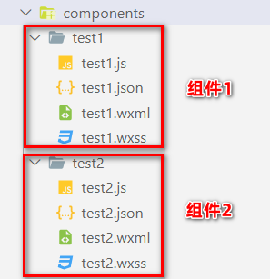
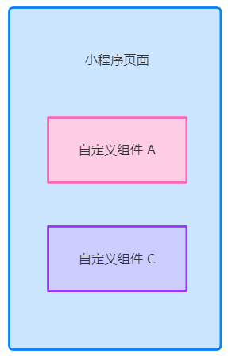

# 总结

① 能够创建并引用组件

- 全局引用 、 局部引用usingComponents

② 能够知道如何修改组件的样式隔离选项

- options -> styleIsolationstyleIsolation（ isolated, apply apply-shared, sharedshared）

③ 能够知道如何定义和使用数据监听器

- observers

④ 能够知道如何定义和使用纯数据字段

- options -> pureDataPattern

⑤ 能够知道实现组件父子通信有哪 3种方式

- 属性绑定、 事件绑定 、this.selectComponent(' id 或class 选择器 ')

⑥ 能够知道如何定义和使用 behaviors

- 调用 Behavior() 构

# 自定义组件

## 1.1 创建组件

① 在项目的根目录中，鼠标右键，创建 componentscomponents-> test 文件夹

② 在新建的 components -> test 文件夹上，鼠标右键，点击“ 新建 ComponentComponent”

③ 键入组件的名称之后回车，会自动生成组件对应的 4 个文件，后缀名分别为 .js js，.json json， .wxml 和 .wxss

注意：为了保证目录结构的清晰，建议把不同的组件，存放到单独目录中，例如：



## 1.2 引用组件

组件的引用方式分为“ 局部引用 ”和 全局引用 ”：

- 在页面的 `.json` 配置文件中引用组件的方式，叫做“局部引用”。示例代码如下：

  ```json
  // 在页面的 .json 文件中，引入组件
  {
    "usingComponents": {
      "my-test1": "/components/test1/test1"
    }
  }
  ```

  ```html
  <!-- 在页面的 .wxml 文件中，使用组件 -->
  <my-test1></my-test1>
  ```

  

- 在 app.json 全局配置文件中引用组件的方式，叫做“全局引用”：

  ```json
  // 在 app.json 文件中, 引入组件
  {
    "pages": [ /* 省略不必要的代码 */ ],
    "window": { /* 省略不必要的代码 */ },
    "usingComponents": {
      "my-test2": "/components/test2/test2"
    }
  }
  ```

  ```html
  // 在页面的 .wxml 文件中, 使用组件
  <my-test2></my-test2>
  ```

## 1.3 全局引用 vs 局部引用

根据组件的 使用频率 和范围 ，来选择合适的引用方式：

- 如果某组件 在多个页面中经常被用到 ，建议进行“全局引用
- 如果某组件只 在特定的页面中被用到 ，建议进行“局部引用

## 1.4 组件和页面的区别

从表面来看，组件和页面都是由
.js 、.json 、.wxml 和 .wxss 这四个文件组成的。但是，组件和页面的 .js 与 .json 文件有明显的不同：

- 组件的 .json 文件中需要声明 "component": true 属性
- 组件的 .js 文件中调用的是 Component() 函数
- 组件的事件处理函数需要定义到 methods 节点中

## 2. 样式

## 2.1 组件样式隔离

默认情况下，自定义组件的样式只对当前组件生效，不会影响到组件之外的UI 结构，如图所示：

- 组件 A 的样式 不会影响 组件 C 的样式
- 组件 A 的样式 不会影响 小程序页面的样式
- 小程序页面的样式 不会影响 组件 A 和 C 的样式



好处：① 防止外界的样式影响组件内部的样式；② 防止组件的样式破坏外界的样式

## 2.2 组件样式隔离的注意点

- app.wxss 中的全局样式对组件无效
- 只有 class 选择器会有样式隔离效果， id 选择器、属性选择器、标签选择器不受样式隔离的影响

建议：在组件和引用组件的页面中建议使用 class 选择器， 不要使用 id 、属性、标签选择器 ！

## 2.3 修改组件的样式隔离选项

默认情况下，自定义组件的样式隔离特性能够防止组件内外样式互相干扰的问题。但有时，我们希望在外界能
够控制组件内部的样式，此时，可以通过 styleIsolation 修改组件的样式隔离选项，用法如下：

```js
// 在组件的 .js 文件中新增如下配置
Component({
  options: {
    styleIsolation: 'isolated'
  }
})
```

```json
// 或在组件的 .json 文件中新增如下配置
{
  "styleIsolation": "isolated"
}
```

## 2.4 styleIsolation 的可选值

|        可选值        | 组件样式对外部页面的影响 | 外部页面样式对组件的影响 |          典型使用场景          |
| :------------------: | :----------------------: | :----------------------: | :----------------------------: |
| `isolated（默认值）` |         不会影响         |         不会影响         | 需要严格隔离组件样式（默认值） |
|    `apply-shared`    |         不会影响         |        会穿透生效        |  外部页面需覆盖组件内部分样式  |
|       `shared`       |        会穿透生效        |        会穿透生效        |   组件与外部页面共享全局样式   |

## 3. 数据、方法和属性

### data

在小程序组件中，用于组件模板渲染的私有数据，需要定义到 data 节点中：

```js
Component({
  /**
   * 组件的初始数据
   */
  data: {
    count: 0
  }
})
```

### method

在小程序组件中， 事件处理函数和自定义方法需要定义到 methods 节点中：

```js
Component({
  methods: { // 组件的方法列表【包含事件处理函数和自定义方法】
    addCount() { // 事件处理函数
      this.setData({ count: this.data.count + 1 })
      this._showCount() // 通过 this 直接调用自定义方法
    },
    _showCount() { // 自定义方法建议以 _ 开头
      wx.showToast({
        title: 'count值为: ' + this.data.count,
        icon: 'none'
      })
    }
  }
})
```

### properties

在小程序组件中，properties 是组件的对外属性，用来接收外界传递到组件中的数据：

```js
Component({
  // 属性定义
  properties: {
    max: { // 完整定义属性的方式【当需要指定属性默认值时,建议使用此方式】
      type: Number, // 属性值的数据类型
      value: 10 // 属性默认值
    },
    max: Number // 简化定义属性的方式【不需指定属性默认值时,可以使用简化方式】
  }
})
```

```html
<my-test1 max="10"></my-test1>
```

### data 和 properties 的区别

在小程序的组件中， properties 属性和 data 数据的用法相同，它们都是可读可写的，只不过：

- data 更倾向于 存储组件的私有数据
- properties 更倾向于 存储外界传递到组件中的数据

 ```js
 Component({
   methods: {
     showInfo() {
       console.log(this.data) // 输出结果: {count: 0, max: 10}
       console.log(this.properties) // 输出结果: {count: 0, max: 10}
       // 结果为 true,证明 data 数据和 properties 属性【在本质上是一样的、都是可读可写的】
       console.log(this.data === this.properties)
     }
   }
 })
 ```

### 使用 setData 修改 properties 的值

由于 data 数据 和 properties 属性 在本质上没有任何区别，因此 properties 属性的值也可以用于页面渲染，
或使用 setData 为 properties 中的属性重新赋值：

```html
// 在组件的 .wxml 文件中使用 properties 属性的值
<view>max属性的值为: {{max}}</view>
```

```js
Component({
  properties: { max: Number }, // 定义属性
  methods: {
    addCount() {
      this.setData({ max: this.properties.max + 1 }) // 使用 setData 修改属性的值
    }
  }
})
```

::: details 也要看情况

因为**`properties` 定义的属性也会挂载到组件实例的 data 上**（表现得像是 data 的一部分），所以你可以用 `setData()` 来更新它，就像你更新 `data` 一样。

但是：逻辑上效果是否生效，要看「绑定方式」

| 使用方式                         | `setData({ max: ... })` 是否有效   | 建议                   |
| -------------------------------- | ---------------------------------- | ---------------------- |
| 属性未绑定（写死或不传）         | ✅ 有效                             | 可以直接改             |
| 属性绑定（如 `max="{{value}}"`） | ❌ 无效，会被外部覆盖（可短暂修改） | 触发事件通知父组件修改 |

🔧 举个例子：

父组件的 JS：

```
Page({
  data: {
    value: 5
  }
})
```

父组件的 WXML：

```
<my-component max="{{value}}" />
```

------

🔍 这时候发生了什么？

- `my-component` 的 `max` 属性值是 **父组件的 `value`**。
- 所以 `max` 是**“受控属性”**。
- 在 `my-component` 内部用 `this.setData({ max: xxx })` 来修改，是不会真正生效的（或会被下一轮更新自动覆盖）。

------

✅ 不绑定的情况：

```
<my-component max="5" />  <!-- 字面值，字符串形式 -->
```

或：

```
<my-component />  <!-- 使用默认值 -->
```

这种情况下，`max` 没有被“动态绑定”，组件内部用 `setData({ max: ... })` 是有效的。

但：当父组件中使用 `<my-component max="{{anyValue}}" />` 时，组件内部 `setData({ max: ... })` 虽然 **语法合法**，但**不会生效**，因为：

- `max` 是由父组件**绑定传入**的（受控属性），在子组件里修改 `max`，**下一轮渲染时会被父组件的值重新覆盖**。
- 也就是说，页面上可能会短暂看到变化，但很快就又变回原值。

------

📌 总结一下

| 用法                               | 是否“绑定” | 说明                                                  |
| ---------------------------------- | ---------- | ----------------------------------------------------- |
| `<my-component max="{{value}}" />` | ✅ 是绑定   | max 属性受父组件数据控制，组件内部不能直接改          |
| `<my-component max="5" />`         | ❌ 非绑定   | max 是字符串形式字面量，可以在组件内部用 setData 修改 |
| `<my-component />`                 | ❌ 非绑定   | 使用默认值，也可以在组件内部修改                      |

:::
