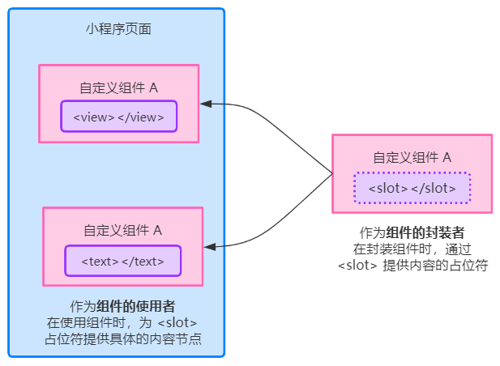
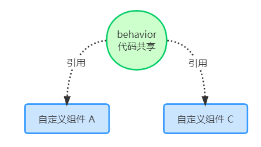

## 自定义组件-目标

① 能够创建并引用组件

- 全局引用、局部引用usingComponents

② 能够知道如何修改组件的样式隔离选项

- options -> styleIsolationstyleIsolation（ isolated, apply apply-shared, sharedshared）

③ 能够知道如何定义和使用数据监听器

- observers

④ 能够知道如何定义和使用纯数据字段

- options -> pureDataPattern

⑤ 能够知道实现组件父子通信有哪 3种方式

- 属性绑定、 事件绑定 、this.selectComponent(' id 或class 选择器 ')

⑥ 能够知道如何定义和使用 behaviors

- 调用 Behavior() 构

## 1. 组件的创建和使用

### 1.1 创建组件

① 在项目的根目录中，鼠标右键，创建 componentscomponents-> test 文件夹

② 在新建的 components -> test 文件夹上，鼠标右键，点击“ 新建 ComponentComponent”

③ 键入组件的名称之后回车，会自动生成组件对应的 4 个文件，后缀名分别为 .js js，.json json， .wxml 和 .wxss

注意：为了保证目录结构的清晰，建议把不同的组件，存放到单独目录中，例如：


### 1.2 引用组件

组件的引用方式分为“ 局部引用 ”和 全局引用 ”：

- 在页面的 `.json` 配置文件中引用组件的方式，叫做“局部引用”。示例代码如下：

  ```json
  // 在页面的 .json 文件中，引入组件
  {
    "usingComponents": {
      "my-test1": "/components/test1/test1"
    }
  }
  ```

  ```html
  <!-- 在页面的 .wxml 文件中，使用组件 -->
  <my-test1></my-test1>
  ```

  

- 在 app.json 全局配置文件中引用组件的方式，叫做“全局引用”：

  ```json
  // 在 app.json 文件中, 引入组件
  {
    "pages": [ /* 省略不必要的代码 */ ],
    "window": { /* 省略不必要的代码 */ },
    "usingComponents": {
      "my-test2": "/components/test2/test2"
    }
  }
  ```

  ```html
  // 在页面的 .wxml 文件中, 使用组件
  <my-test2></my-test2>
  ```

### 1.3 全局引用 vs 局部引用

根据组件的 使用频率 和范围 ，来选择合适的引用方式：

- 如果某组件 在多个页面中经常被用到 ，建议进行“全局引用
- 如果某组件只 在特定的页面中被用到 ，建议进行“局部引用

### 1.4 组件和页面的区别

从表面来看，组件和页面都是由
.js 、.json 、.wxml 和 .wxss 这四个文件组成的。但是，组件和页面的 .js 与 .json 文件有明显的不同：

- 组件的 .json 文件中需要声明 "component": true 属性
- 组件的 .js 文件中调用的是 Component() 函数
- 组件的事件处理函数需要定义到 methods 节点中

## 2. 样式

### 2.1 组件样式隔离

默认情况下，自定义组件的样式只对当前组件生效，不会影响到组件之外的UI 结构，如图所示：

- 组件 A 的样式 不会影响 组件 C 的样式
- 组件 A 的样式 不会影响 小程序页面的样式
- 小程序页面的样式 不会影响 组件 A 和 C 的样式


好处：① 防止外界的样式影响组件内部的样式；② 防止组件的样式破坏外界的样式

### 2.2 组件样式隔离的注意点

- app.wxss 中的全局样式对组件无效
- 只有 class 选择器会有样式隔离效果， id 选择器、属性选择器、标签选择器不受样式隔离的影响

建议：在组件和引用组件的页面中建议使用 class 选择器， 不要使用 id 、属性、标签选择器 ！

### 2.3 修改组件的样式隔离选项

默认情况下，自定义组件的样式隔离特性能够防止组件内外样式互相干扰的问题。但有时，我们希望在外界能
够控制组件内部的样式，此时，可以通过 styleIsolation 修改组件的样式隔离选项，用法如下：

```js
// 在组件的 .js 文件中新增如下配置
Component({
  options: {
    styleIsolation: 'isolated'
  }
})
```

```json
// 或在组件的 .json 文件中新增如下配置
{
  "styleIsolation": "isolated"
}
```

### 2.4 styleIsolation 的可选值

|        可选值        | 组件样式对外部页面的影响 | 外部页面样式对组件的影响 |          典型使用场景          |
| :------------------: | :----------------------: | :----------------------: | :----------------------------: |
| `isolated（默认值）` |         不会影响         |         不会影响         | 需要严格隔离组件样式（默认值） |
|    `apply-shared`    |         不会影响         |        会穿透生效        |  外部页面需覆盖组件内部分样式  |
|       `shared`       |        会穿透生效        |        会穿透生效        |   组件与外部页面共享全局样式   |

## 3. 数据、方法和属性

### data

在小程序组件中，用于组件模板渲染的私有数据，需要定义到 data 节点中：

```js
Component({
  /**
   * 组件的初始数据
   */
  data: {
    count: 0
  }
})
```

### method

在小程序组件中， 事件处理函数和自定义方法需要定义到 methods 节点中：

```js
Component({
  methods: { // 组件的方法列表【包含事件处理函数和自定义方法】
    addCount() { // 事件处理函数
      this.setData({ count: this.data.count + 1 })
      this._showCount() // 通过 this 直接调用自定义方法
    },
    _showCount() { // 自定义方法建议以 _ 开头
      wx.showToast({
        title: 'count值为: ' + this.data.count,
        icon: 'none'
      })
    }
  }
})
```

### properties

在小程序组件中，properties 是组件的对外属性，用来接收外界传递到组件中的数据：

```js
Component({
  // 属性定义
  properties: {
    max: { // 完整定义属性的方式【当需要指定属性默认值时,建议使用此方式】
      type: Number, // 属性值的数据类型
      value: 10 // 属性默认值
    },
    max: Number // 简化定义属性的方式【不需指定属性默认值时,可以使用简化方式】
  }
})
```

```html
<my-test1 max="10"></my-test1>
```

### data 和 properties 的区别

在小程序的组件中， properties 属性和 data 数据的用法相同，它们都是可读可写的，只不过：

- data 更倾向于 存储组件的私有数据
- properties 更倾向于 存储外界传递到组件中的数据

 ```js
 Component({
   methods: {
     showInfo() {
       console.log(this.data) // 输出结果: {count: 0, max: 10}
       console.log(this.properties) // 输出结果: {count: 0, max: 10}
       // 结果为 true,证明 data 数据和 properties 属性【在本质上是一样的、都是可读可写的】
       console.log(this.data === this.properties)
     }
   }
 })
 ```

### 使用 setData 修改 properties 的值

由于 data 数据 和 properties 属性 在本质上没有任何区别，因此 properties 属性的值也可以用于页面渲染，
或使用 setData 为 properties 中的属性重新赋值：

```html
// 在组件的 .wxml 文件中使用 properties 属性的值
<view>max属性的值为: {{max}}</view>
```

```js
Component({
  properties: { max: Number }, // 定义属性
  methods: {
    addCount() {
      this.setData({ max: this.properties.max + 1 }) // 使用 setData 修改属性的值
    }
  }
})
```

::: details 也要看情况

因为**`properties` 定义的属性也会挂载到组件实例的 data 上**（表现得像是 data 的一部分），所以你可以用 `setData()` 来更新它，就像你更新 `data` 一样。

但是：逻辑上效果是否生效，要看「绑定方式」

| 使用方式                         | `setData({ max: ... })` 是否有效   | 建议                   |
| -------------------------------- | ---------------------------------- | ---------------------- |
| 属性未绑定（写死或不传）         | ✅ 有效                             | 可以直接改             |
| 属性绑定（如 `max="{{value}}"`） | ❌ 无效，会被外部覆盖（可短暂修改） | 触发事件通知父组件修改 |

🔧 举个例子：

父组件的 JS：

```
Page({
  data: {
    value: 5
  }
})
```

父组件的 WXML：

```
<my-component max="{{value}}" />
```

------

🔍 这时候发生了什么？

- `my-component` 的 `max` 属性值是 **父组件的 `value`**。
- 所以 `max` 是**“受控属性”**。
- 在 `my-component` 内部用 `this.setData({ max: xxx })` 来修改，是不会真正生效的（或会被下一轮更新自动覆盖）。

------

✅ 不绑定的情况：

```
<my-component max="5" />  <!-- 字面值，字符串形式 -->
```

或：

```
<my-component />  <!-- 使用默认值 -->
```

这种情况下，`max` 没有被“动态绑定”，组件内部用 `setData({ max: ... })` 是有效的。

但：当父组件中使用 `<my-component max="{{anyValue}}" />` 时，组件内部 `setData({ max: ... })` 虽然 **语法合法**，但**不会生效**，因为：

- `max` 是由父组件**绑定传入**的（受控属性），在子组件里修改 `max`，**下一轮渲染时会被父组件的值重新覆盖**。
- 也就是说，页面上可能会短暂看到变化，但很快就又变回原值。

------

📌 总结一下

| 用法                               | 是否“绑定” | 说明                                                  |
| ---------------------------------- | ---------- | ----------------------------------------------------- |
| `<my-component max="{{value}}" />` | ✅ 是绑定   | max 属性受父组件数据控制，组件内部不能直接改          |
| `<my-component max="5" />`         | ❌ 非绑定   | max 是字符串形式字面量，可以在组件内部用 setData 修改 |
| `<my-component />`                 | ❌ 非绑定   | 使用默认值，也可以在组件内部修改                      |

:::

## 4. 数据监听器

### 4.1 概述

数据监听器用于监听和响应任何属性和数据字段的变化，从而执行特定的操作。它的作用类似于 vue 中的 watch 侦听器。在小程序组件中，数据监听器的基本语法格式如下：

```js
Component({
  observers: {
    '字段A, 字段B': function(字段A的新值, 字段B的新值) {
      // do something
    }
  }
})
```

### 4.2 基本用法

组件的 UI 结构如下：

```html
// 组件的 UI 结构如下
<view>{{n1}} + {{n2}} = {{sum}}</view>
<button size="mini" bindtap="addN1">n1自增</button>
<button size="mini" bindtap="addN2">n2自增</button>
```

`.js`文件代码：

```js
Component({
  data: { n1: 0, n2: 0, sum: 0 }, // 数据节点
  methods: { // 方法列表
    addN1() { this.setData({ n1: this.data.n1 + 1 }) },
    addN2() { this.setData({ n2: this.data.n2 + 1 }) }
  },
  observers: { // 数据监听节点
    'n1, n2': function(n1, n2) { // 监听 n1 和 n2 数据的变化
      this.setData({ sum: n1 + n2 }) // 通过监听器,自动计算 sum 的值
    }
  }
})
```

### 4.3 监听对象属性的变化

数据监听器支持监听对象中单个或多个属性的变化：

```js
Component({
  observers: {
    '对象.属性A, 对象.属性B': function(属性A的新值, 属性B的新值) {
      // 触发此监听器的 3 种情况:
      // 【为属性A赋值】使用 setData 设置 this.data.对象.属性A 时触发
      // 【为属性B赋值】使用 setData 设置 this.data.对象.属性B 时触发
      // 【直接为对象赋值】使用 setData 设置 this.data.对象 时触发
      // do something...
    }
  }
})
```

#### 4.3.1 纯数据字段

概念：纯数据字段 指的是那些不用于界面渲染的 data 字段 。

应用场景：例如有些情况下，某些`data`中的字段 既不会展示在界面上，也不会传递给其他组件，仅仅在当前组件内部使用。带有这种特性的 data 字段适合被设置为纯数据字段。

好处：纯数据字段有助于提升页面更新的性能 。

在 Component 构造器的 options 节点中，指定 pureDataPattern 为一个 正则表达式 ，字段名符合这个正则表达式的字段将成为纯数据字段，示例代码如下：

```js
Component({
  options: {
    // 指定所有 _ 开头的数据字段为纯数据字段
    pureDataPattern: /^_/
  },
  data: {
    a: true, // 普通数据字段
    _b: true, // 纯数据字段
  }
})
```

## 5. 组件的生命周期

### 概述

小程序组件可用的全部生命周期如下表所示：

|  生命周期阶段  |               函数名                |                           触发时机                           |                             说明                             |
| :------------: | :---------------------------------: | :----------------------------------------------------------: | :----------------------------------------------------------: |
| **初始化阶段** |              `created`              | 组件实例刚被创建，但还未完成数据观测、属性和方法的运算，以及 `$el` 的渲染 |   此时无法获取节点信息（如 `this.selectComponent` 不可用）   |
|                |             `attached`              |                   组件实例进入页面节点树后                   | 可以访问节点信息（如 `this.selectComponent`），适合进行初始化操作 |
|                |               `ready`               |                 组件布局完成，可获取节点信息                 | 此时组件已完成所有渲染，适合依赖布局的操作（如获取节点尺寸） |
|  **更新阶段**  |               `moved`               |                组件实例被移动到另一个节点树中                |               适用于跨页面或动态插入组件的场景               |
|                |             `detached`              |                   组件实例从页面节点树移除                   |                适合清理定时器、事件监听等资源                |
|  **数据更新**  | `observer`（通过 `observers` 定义） |                   监听的数据字段变化时触发                   |     需在 `observers` 中声明，支持监听多个字段或对象属性      |
|  **错误处理**  |               `error`               |                    组件方法抛出错误时触发                    |                      可用于全局错误捕获                      |

最重要的生命周期函数有3 个，分别是 created 、attached 、detached，它们各自的特点如下：

① 组件实例 刚被创建好 的时候，created 生命周期函数会被触发

- 此时还不能调用 setData
- 通常在这个生命周期函数中，只应该用于给组件的 this 添加一些自定义的属性字段

② 在组件 完全初始化完毕、进入页面节点树后 ， attached 生命周期函数会被触发

- 此时，this.data 已被初始化完毕
- 这个生命周期很有用，绝大多数初始化的工作可以在这个时机进行（例如发请求获取初始数据）

③ 在组件 离开页面节点树后， detached 生命周期函数会被触发

- 退出一个页面时，会触发页面内每个自定义组件的 detached 生命周期函数
- 此时适合做一些清理性质的工作

### lifetimes 节点

在小程序组件中，生命周期函数可以直接定义在 Component 构造器的第一级参数中，可以在 lifetimes 字段 内进行声明（ 这是推荐的方式，其优先级最高 ）：

```js
Component({
  // 推荐用法
  lifetimes: {
    attached() { }, // 在组件实例进入页面节点树时执行
    detached() { }, // 在组件实例被从页面节点树移除时执行
  },
  // 以下是旧式的定义方式
  attached() { }, // 在组件实例进入页面节点树时执行
  detached() { }, // 在组件实例被从页面节点树移除时执行
})
```

## 6. 组件所在页面的生命周期

有时， 自定义组件的行为依赖于页面状态的变化 ，此时就需要用到 组件所在页面的生命周期 。

例如：每当触发页面的 show 生命周期函数的时候，我们希望能够重新生成一个随机的 RGB 颜色值。

在自定义组件中，组件所在页面的生命周期函数有如下3个：

| 页面生命周期 | 页面中写法   | 组件中写法（不加 `on`）          |
| ------------ | ------------ | -------------------------------- |
| 页面显示     | `onShow()`   | `pageLifetimes: { show() {} }`   |
| 页面隐藏     | `onHide()`   | `pageLifetimes: { hide() {} }`   |
| 页面卸载     | `onUnload()` | `pageLifetimes: { unload() {} }` |

组件所在页面的生命周期函数，需要定义在（组件文件的）pageLifetimes 节点中，示例代码如下：

```js
Component({
  pagelifetimes: {
    show: function() {}, // 页面被展示
    hide: function() {}, // 页面被隐藏
    resize: function(size) {} // 页面尺寸变化
  }
})
```

### 案例：生成随机的 rgb 色值

```js
Component({
  methods: {
    // 生成随机 RGB 颜色的方法。非事件处理函数建议以 _ 开头
    _randomColor() {
      this.setData({ // 为 data 里面的 _rgb 纯数据字段重新赋值
        _rgb: {
          r: Math.floor(Math.random() * 256),
          g: Math.floor(Math.random() * 256),
          b: Math.floor(Math.random() * 256)
        }
      })
    }
  },
  pageLifetimes: {
    // 组件所在的页面被展示时,立即调用 _randomColor 生成随机颜色值
    show: function() {
      this._randomColor()
    }
  }
})
```

## 7. 插槽

在自定义组件的 wxml 结构中，可以提供一个 `<slot>` 节点（插槽），用于承载组件使用者提供的 wxml 结构 。



### 单个插槽

在小程序中，默认每个自定义组件中只允许使用一个`<slot>` 进行占位，这种个数上的限制叫做单个插槽。

```html
<!-- 组件的封装者 -->
<view class="wrapper">
  <view>这里是组件的内部节点</view>
  <!-- 对于不确定的内容, 可以使用 <slot> 进行占位, 具体的内容由组件的使用者决定 -->
  <slot></slot>
</view>

<!-- 组件的使用者 -->
<component-tag-name>
  <!-- 这部分内容将被放置在组件 <slot> 的位置上 -->
  <view>这里是插入到组件slot中的内容</view>
</component-tag-name>
```

### 启用多个插槽

在小程序的自定义组件中，需要使用多`<slot>`插槽时，可以在组件的 .js 文件中，通过如下方式进行启用:

```js
Component({
  options: {
    multipleSlots: true // 在组件定义时的选项中启用多 slot 支持
  },
  properties: { /* ... */ },
  methods: { /* ... */ }
})
```

### 定义多个插槽

可以在组件的 .wxml 中使用多个`<slot>`标签，以不同的 name 来区分不同的插槽：

```html
<!-- 组件模板 -->
<view class="wrapper">
  <!-- name 为 before 的第一个 slot 插槽 -->
  <slot name="before"></slot>
  <view>这是一段固定的文本内容</view>
  <!-- name 为 after 的第二个 slot 插槽 -->
  <slot name="after"></slot>
</view>
```

### 使用多个插槽

在页面中使用时，需要用 slot 属性来将节点插入到不同的 `<slot>` 中：

```html
<!-- 引用组件的页面模板 -->
<component-tag-name>
  <!-- 这部分内容将被放置在组件 <slot name="before"> 的位置上 -->
  <view slot="before">这里是插入到组件slot name="before"中的内容</view>
  <!-- 这部分内容将被放置在组件 <slot name="after"> 的位置上 -->
  <view slot="after">这里是插入到组件slot name="after"中的内容</view>
</component-tag-name>
```


## 8. 父子通信

### 三种通信方式

① 属性绑定

- 用于父组件向子组件的指定属性设置数据，仅能设置 JSON 兼容的数据

② 事件绑定

- 用于子组件向父组件传递数据，可以传递任意数据

③ 获取组件实例

- 父组件还可以通过 this.selectComponent() 获取子组件实例对象
- 这样就可以直接访问子组件的任意数据和方法

### 属性绑定

属性绑定用于实现父向子传值，而且只能传递普通类型的数据，无法将方法传递给子组件。父组件的示例代码如下：

```
// 父组件的 data 节点
data: {
    count: 0
}

// 父组件的 wxml 结构
<my-test3 count="{{count}}"></my-test3>
<view>-----</view>
<view>父组件中的count值为: {{count}}</view>
```

子组件在 properties 节点中 声明对应的属性并使用 。示例代码如下：

```
1 // 子组件的 properties 节点
2 properties: {
3   count: Number
4 }

5 // 子组件的 wxml 结构
6 <text>子组件中，count值为：{{count}}</text>
```

### 事件绑定

事件绑定用于实现子向父传值 ，可以传递任何类型的数据：

① 在父组件的 js 中，定义一个函数，这个函数即将通过自定义事件的形式，传递给子组件

```js
// 在父组件中定义 syncCount 方法
// 将来,这个方法会被传递给子组件,供子组件进行调用
syncCount() {
    console.log('syncCount')
},
```

② 在父组件的 wxml 中，通过自定义事件的形式，将步骤 1 中定义的函数引用，传递给子组件

```html
<!-- 使用 bind:自定义事件名称 (推荐: 结构清晰) -->
<my-test3 count="{{count}}" bind:sync="syncCount"></my-test3>
<!-- 或在 bind 后面直接写上自定义事件名称 -->
<my-test3 count="{{count}}" bindsync="syncCount"></my-test3>
```

③ 在子组件的 js 中，通过调用 ` this.triggerEvent( triggerEvent('自定义事件名称 ', { /* 参数对象 */ })`，将数据发送到父组件

```
// 子组件的 wxml 结构
<text>子组件中, count值为: {{count}}</text>
<button type="primary" bindtap="addCount">+1</button>

// 子组件的 js 代码
methods: {
    addCount() {
        this.setData({
            count: this.properties.count + 1
        })
        this.triggerEvent('sync', {value: this.properties.count})
    }
}
```

④ 在父组件的 js 中，通过 e.detail 获取到子组件传递过来的数据

```js
syncCount(e) {
  // console.log(e.detail.value)
  this.setData({
  count: e.detail.value
  })
},
```

### 获取组件实例

可以在父组件里调用 this.selectComponent()获取子组件的实例对象，从而直接访问子组件的任意数据和方法，调用时需要传入一个选择器，可以是id选择器或类选择器：

```html
// wxxml 结构
<my-test3 count="{{count}}" bind:sync="syncCount" class="customA" id="cA">
</my-test3>
<button bindtap="getChild">获取子组件实例</button>
```

```js
getChild() { // 按钮的 tap 事件处理函数
  // 切记下面参数不能传递标签选择器 'my-test3', 不然返回的是 null
  const child = this.selectComponent('.customA') // 也可以传递 id 选择器 #cA
  child.setData({ count: child.properties.count + 1 }) // 调用子组件的 setData 方法
  child.addCount() // 调用子组件的 addCount 方法
}
```

::: details 如果存在多个子组件

❓ **如果存在多个子组件，`selectComponent` 会怎样？**

> **不会返回多个，只返回第一个匹配的组件实例。**

🧩 详细说明如下：

| 方法                                 | 返回值                               | 是否返回多个           | 用法说明                               |
| ------------------------------------ | ------------------------------------ | ---------------------- | -------------------------------------- |
| `this.selectComponent(selector)`     | **返回单个组件实例（第一个匹配的）** | ❌ 只返回一个           | 适用于你只需要操作某一个特定子组件时   |
| `this.selectAllComponents(selector)` | **返回组件实例数组**                 | ✅ 会返回所有匹配的组件 | 用于需要同时操作多个同类型子组件的场景 |

:::

## 9. behaviors

behaviors是小程序中用于实现组件间代码共享 的特性，类似于 Vue.js 中的 “mixins”。



### behaviors 的工作方式

每个 behavior 可以包含一组 属性、数据、生命周期函数和方法。组件引用它时，它的属性、数据和方法会被合并到组件中。

每个组件可以引用多behaviorbehavior，behavior 也可以引用其它 behavior。

### 创建 behavior

调用 Behavior(Object object object)方法即可创建一个共享的behavior 实例对象，供所有的组件使用：

```js
// 调用 Behavior() 方法, 创建实例对象
// 并使用 module.exports 将 behavior 实例对象共享出去
module.exports = Behavior({
  // 属性节点
  properties: {},
  // 私有数据节点
  data: { username: 'zs' },
  // 事件处理函数和自定义方法节点
  methods: {},
  // 其它节点...
})
```

### 导入并使用 behavios

在组件中，使用 require() 方法导入需要的 behavior，挂载后即可访问 behavior 中的数据或方法：

```js
// my-component.js
// 1. 使用 require() 导入需要的自定义 behavior 模块
const myBehavior = require("../../behaviors/my-behavior")

Component({
  // 2. 将导入的 behavior 实例对象,挂载到 behaviors 数组节点中,即可生效
  behaviors: [myBehavior],
  // 组件的其它节点...
})
```

### behavior 中所有可用的节点

| 字段名             | 类型              | 说明                                                         |
| ------------------ | ----------------- | ------------------------------------------------------------ |
| **🔴 properties**   | `Object`          | **组件的属性定义，可设置默认值、类型和监听器 observer。**    |
| **🔴 data**         | `Object`          | **组件的内部状态数据，可通过 `this.setData()` 更新。**       |
| **🔴 methods**      | `Object`          | **组件的方法定义，可供页面或其他组件调用。**                 |
| **🔴 lifetimes**    | `Object`          | **组件生命周期钩子，如 `created`、`attached`、`detached`。** |
| 🔵 observers        | `Object`          | 数据字段监听器，监听 `properties` 或 `data` 的组合变化。     |
| 🔵 pageLifetimes    | `Object`          | 监听页面的生命周期（例如 `show`、`hide`）。                  |
| 🔵 behaviors        | `Array<Behavior>` | 引用其他 behavior，实现多重继承。                            |
| 🔵 externalClasses  | `string[]`        | 允许组件接收外部样式类名，便于自定义样式。                   |
| 🔵 relations        | `Object`          | 定义组件之间的关系（如父子、祖孙）。                         |
| 🔵 definitionFilter | `Function`        | 在 behavior 被定义时调用，可修改 definition 配置。           |

### 同名字段的覆盖和组合规则

组件和它引用的 behavior 中可以包含同名的字段，此时可以参考如下 3 种同名时的处理规则：

① 同名的数据字段 (datadata)

② 同名的属性 (propertiesproperties) 或方法 (methodsmethods)

③ 同名的 生命周期函数

### 同名字段的覆盖规则

::: details 点击查看详情

组件和它引用的 `behavior` 中可以包含同名的字段，对这些字段的处理方法如下：

- 如果有同名的属性 (properties) 或方法 (methods)：
  1. 若组件本身有这个属性或方法，则组件的属性或方法会覆盖 `behavior` 中的同名属性或方法；
  2. 若组件本身无这个属性或方法，则在组件的 `behaviors` 字段中定义靠后的 `behavior` 的属性或方法会覆盖靠前的同名属性或方法；
  3. 在 2 的基础上，若存在嵌套引用 `behavior` 的情况，则规则为：`引用者 behavior` 覆盖 `被引用的 behavior` 中的同名属性或方法。
- 如果有同名的数据字段 (data)：
  - 若同名的数据字段都是对象类型，会进行对象合并；
  - 其余情况会进行数据覆盖，覆盖规则为： `引用者 behavior` > `被引用的 behavior` 、 `靠后的 behavior` > `靠前的 behavior`。（优先级高的覆盖优先级低的，最大的为优先级最高）

生命周期函数和 observers 不会相互覆盖，而是在对应触发时机被逐个调用：

- 对于不同的生命周期函数之间，遵循组件生命周期函数的执行顺序；
- 对于同种生命周期函数和同字段 observers ，遵循如下规则：
  - `behavior` 优先于组件执行；
  - `被引用的 behavior` 优先于 `引用者 behavior` 执行；
  - `靠前的 behavior` 优先于 `靠后的 behavior` 执行；
- 如果同一个 `behavior` 被一个组件多次引用，它定义的生命周期函数和 observers 不会重复执行。

:::
