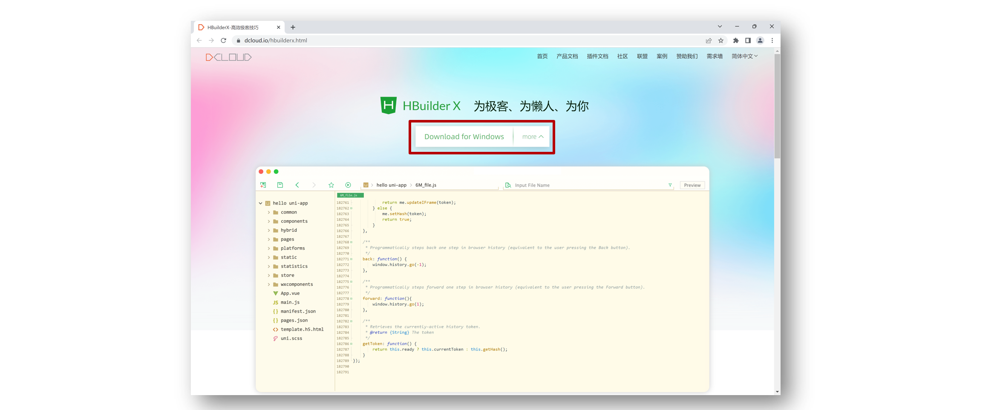
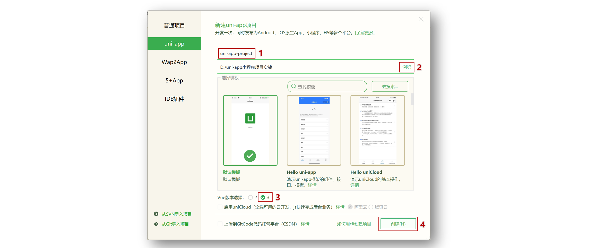
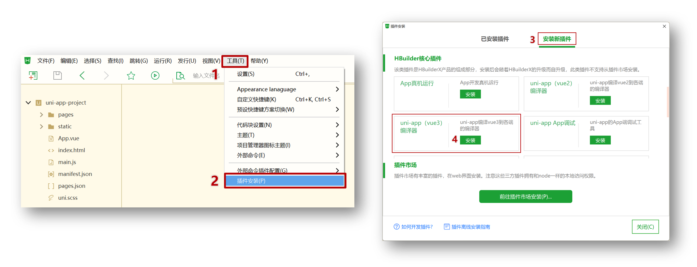
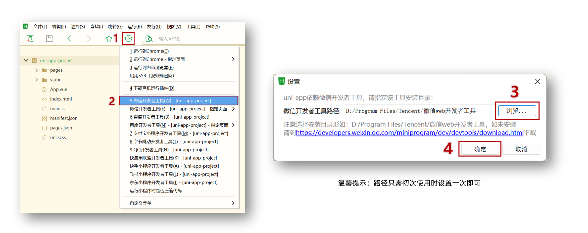
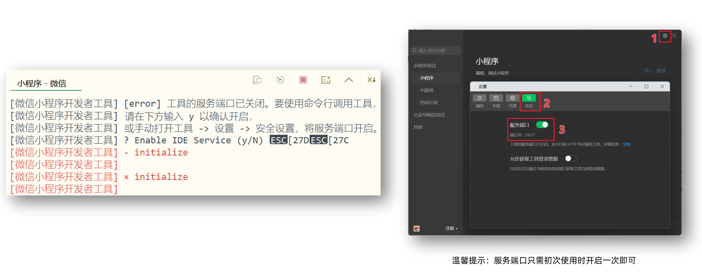
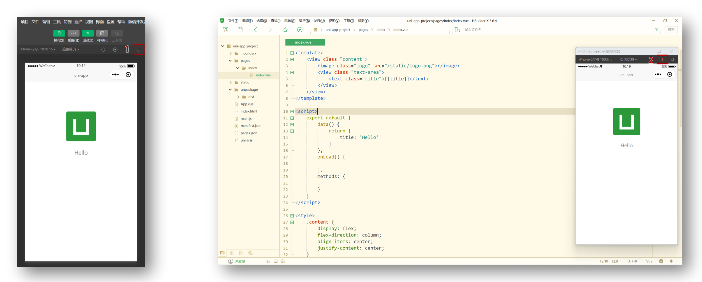

# uniapp 基础

## uni-app 和原生小程序开发区别

### 开发区别

uni-app 项目每个页面是一个 `.vue` 文件，数据绑定及事件处理同 `Vue.js` 规范：

1. 属性绑定 `src="{ { url }}"` 升级成 `:src="url"`

2. 事件绑定 `bindtap="eventName"` 升级成 `@tap="eventName"`，**支持（）传参**

3. 支持 Vue 常用**指令** `v-for`、`v-if`、`v-show`、`v-model` 等

### 其他区别补充

1. 调用接口能力，**建议前缀** `wx` 替换为 `uni` ，养成好习惯，**支持多端开发**。
2. `<style>` 页面样式不需要写 `scoped`，小程序是多页面应用，**页面样式自动隔离**。
3. **生命周期分三部分**：应用生命周期(小程序)，页面生命周期(小程序)，组件生命周期(Vue)


## 创建 uni-app 项目方式

**uni-app 支持两种方式创建项目：**

1. 通过 HBuilderX 创建（需安装 HBuilderX 编辑器）

2. 通过命令行创建（需安装 NodeJS 环境）

### HBuilderX 创建 uni-app 项目

**1.下载安装 HbuilderX 编辑器**



**2.通过 HbuilderX 创建 uni-app vue3 项目**



**3.安装 uni-app vue3 编译器插件**



**4.编译成微信小程序端代码**



**5.开启服务端口**



**小技巧分享：模拟器窗口分离和置顶**



**HBuildeX 和 微信开发者工具 关系**


::: tip 温馨提示
[HBuildeX](https://www.dcloud.io/hbuilderx.html) 和 [uni-app](https://uniapp.dcloud.net.cn/) 都属于 [DCloud](https://dcloud.io) 公司的产品。
:::

### 命令行创建 uni-app 项目

**优势**

通过命令行创建 uni-app 项目，**不必依赖 HBuilderX**，TypeScript 类型支持友好。

**命令行创建** **uni-app** **项目：**

vue3 + ts 版

::: code-group

```sh [github]
# 通过 npx 从 github 下载
npx degit dcloudio/uni-preset-vue#vite-ts 项目名称
```

```sh [👉国内 gitee]
# 通过 git 从 gitee 克隆下载 (👉备用地址)
git clone -b vite-ts https://gitee.com/dcloud/uni-preset-vue.git
```

```
npx degit dcloudio/uni-preset-vue#vite-ts 原始项目
```

:::

创建其他版本可查看：[uni-app 官网](https://uniapp.dcloud.net.cn/quickstart-cli.html)

::: danger 常见问题

- 运行 `npx` 命令下载失败，请尝试换成**手机热点重试**
- 换手机热点依旧失败，请尝试从[国内备用地址下载](https://gitee.com/dcloud/uni-preset-vue/tree/vite-ts/)
- 在 `manifest.json` 文件添加 [小程序 AppID](https://mp.weixin.qq.com/) 用于真机预览
- 运行 `npx` 命令需依赖 NodeJS 环境，[NodeJS 下载地址](https://nodejs.org/zh-cn)
- 运行 `git` 命令需依赖 Git 环境，[Git 下载地址](https://git-scm.com/download/)

:::

::: details 为什么执行项目初始化之后，安装的依赖不是最新的？

这是 **正常现象**，原因主要有以下几点：

------

✅ **1. 模板依赖是固定版本**

`npx degit dcloudio/uni-preset-vue#vite-ts` 只是把 **GitHub 仓库上的模板代码** 下载到本地，它不会自动更新模板里的 `package.json` 到最新版本。

模板作者（DCloud）为了保证**兼容性和稳定性**，通常会：

- 在 `package.json` 中写死特定版本或使用 **固定范围（^ 或 ~）**。
- 避免因为依赖升级导致构建失败。

------

✅ **2. degit 不会安装依赖，也不会检查最新版本**

`degit` 的作用：

- **复制 Git 仓库某个分支/标签的文件**。
- 它不会运行 `npm update`，也不会联系 npm registry 获取最新版本。

安装依赖时（`npm install` 或 `pnpm install`），会根据 `package.json` 和 `package-lock.json` 安装。

- 如果模板带了 `package-lock.json`，锁定了版本。
- 如果模板没有 lock 文件，但 `package.json` 里指定了老版本，仍会安装老版本。

------

✅ **3. uni-app 官方模板更新频率**

DCloud 的 uni-app 官方模板更新节奏相对慢，**可能模板里依赖版本已经落后于最新的 Vite / Vue / TypeScript 版本**，因为：

- uni-app 需要兼容 App、小程序等平台。
- 新版 Vite 或 TS 可能引入 breaking changes。

------

✅ **如何让依赖更新到最新版本？**

有几种方法：

------

**✔ 方法 1：用 `npm-check-updates` 更新依赖**

安装 `npm-check-updates`（简称 ncu）：

```
npm install -g npm-check-updates
```

然后在项目目录运行：

```
ncu -u
```

这会更新 `package.json` 中的依赖到最新版本。

再重新安装：

```
npm install
```

------

**✔ 方法 2：手动修改 `package.json`**

- 把主要依赖（`vue`、`vite`、`typescript` 等）改成 `"latest"` 或 `^最新版本号`。
- 然后重新执行 `npm install`。

------

**✔ 方法 3：使用 `pnpm` 并指定最新依赖**

如果你用 `pnpm`，可以直接：

```
pnpm up --latest
```

会直接更新到最新版本。

------

✅ **注意**

**更新到最新依赖可能会导致 uni-app 相关插件不兼容**，尤其是：

- `@dcloudio/uni-app`
- `@dcloudio/vite-plugin-uni`
- `vite`、`rollup` 插件

所以：

- **先更新非 uni-app 核心依赖**（比如 ESLint、TypeScript）。
- 核心依赖建议跟 uni-app 官方推荐版本走。

:::

使用命令行编译和运行 uni-app 项目

1. 安装依赖 `pnpm install`
2. 编译成微信小程序 `pnpm dev:mp-weixin`
3. 导入微信开发者工具

::: tip 温馨提示
编译成 H5 端可运行 `pnpm dev:h5` 通过浏览器预览项目。
:::

# 命令行安装专属坑位

官方cli核心依赖的陈旧问题

::: details 点击查看详情

坑位1：windows 中的 vscode，在开发云丰农服项目时，在一切都正常的情况下，使用macbook拉去项目代码、同样使用mac版本的vscode工具进行编辑时，控制台提示严重的uni-helper语言错误，表现为对.vue文件中的 uni-ui标签以及、相应的组件标签语法不高亮。

折腾了许久，反复对比发现，其实vscode的扩展包是跨平台实时同步的，考虑到项目以来也完全一致，包括`.vscode/settings.json`文件的一致，尝试升级最新版的mac-vscode，发现一切问题解决。

坑位2：

```
# 通过 npx 从 github 下载
npx degit dcloudio/uni-preset-vue#vite-ts 项目名称
```

这种方式拉去的项目核心依赖，非常陈旧，其中以：`@vue/tsconfig`的版本陈旧最为明显，除非更新到新版本，否则会持续提示报错。

```
# 卸载旧的，安装新的
npm uninstall @vue/tsconfig
npm install -D @vue/tsconfig@latest
```

这样，基本上可以进行后续开发了，当然还有一些配置，最好可以整一下。

:::

Uni-helper 脚手架

[详见官方文档](https://uni-helper.js.org/create-uni/core/)

::: details

```
pnpm create uni@latest
```


:::

## 用 VS Code 开发 uni-app 项目

### 为什么选择 VS Code？

- VS Code 对 **TS 类型支持友好**，前端开发者**主流的编辑器**
- HbuilderX 对 TS 类型支持暂不完善，期待官方完善 👀

### 使用 VS Code 开发配置

- 👉 前置工作：安装 vs code 扩展，[点击查看官方文档](https://cn.vuejs.org/guide/typescript/overview.html#ide-support)
  - 安装 **Volar** ：Vue3 语法提示插件（已弃用：改为 vue official）
  - 安装 **TypeScript Vue Plugin (Volar)** ：Vue3+TS 插件
  - **工作区禁用** Vue2 的 Vetur 插件(Vue3 插件和 Vue2 冲突)
  - **工作区禁用** @builtin typescript 插件（禁用后开启 Vue3 的 TS 托管模式）
- 👉 安装 uni-app 开发扩展
  - **uni-create-view** ：快速创建 uni-app 页面
  - **uni-helper uni-app** ：代码提示
  - **uniapp 小程序扩展** ：鼠标悬停查文档
- 👉 TS 类型校验
  - 安装 **类型声明文件** `pnpm i -D miniprogram-api-typings @uni-helper/uni-app-types`
  - 配置 `tsconfig.json`
- 👉 JSON 注释问题
  - 设置文件关联，把 `manifest.json` 和 `pages.json` 设置为 `jsonc`

`tsconfig.json` 参考

```json {11,12,14-15,18-22}
// tsconfig.json
{
  "extends": "@vue/tsconfig/tsconfig.json",
  "compilerOptions": {
    "sourceMap": true,
    "baseUrl": ".",
    "paths": {
      "@/*": ["./src/*"]
    },
    "lib": ["esnext", "dom"],
    // 类型声明文件
    "types": [
      "@dcloudio/types", // uni-app API 类型
      "miniprogram-api-typings", // 原生微信小程序类型
      "@uni-helper/uni-app-types", // uni-app 组件类型
      "@uni-helper/uni-ui-types" // 这一步，直接决定了 uni-ui 组件标签是否高亮
    ]
  },
  // vue 编译器类型，校验标签类型
  "vueCompilerOptions": {
    // 原配置 `experimentalRuntimeMode` 现调整为 `nativeTags`
    "nativeTags": ["block", "component", "template", "slot"], // [!code ++]
    "experimentalRuntimeMode": "runtime-uni-app" // [!code --]
  },
  "include": ["src/**/*.ts", "src/**/*.d.ts", "src/**/*.tsx", "src/**/*.vue"]
}
```

**工作区设置参考**

```json
// .vscode/settings.json
{
  // 在保存时格式化文件
  "editor.formatOnSave": true,
  // 文件格式化配置
  "[json]": {
    "editor.defaultFormatter": "esbenp.prettier-vscode"
  },
  // 配置语言的文件关联
  "files.associations": {
    "pages.json": "jsonc", // pages.json 可以写注释
    "manifest.json": "jsonc" // manifest.json 可以写注释
  }
}
```

::: danger 版本升级

- 原依赖 `@types/wechat-miniprogram` 现调整为 [miniprogram-api-typings](https://github.com/wechat-miniprogram/api-typings)。
- 原配置 `experimentalRuntimeMode` 现调整为 `nativeTags`。

:::

### 针对 jsonc 注释问题的补充

::: details 点击查看详情

最佳实践配置：

```ts
import js from '@eslint/js'
import globals from 'globals'
import tseslint from 'typescript-eslint'
import pluginVue from 'eslint-plugin-vue'
import json from '@eslint/json'
import markdown from '@eslint/markdown'
import css from '@eslint/css'
import { defineConfig } from 'eslint/config'

// import skipFormatting from '@vue/eslint-config-prettier/skip-formatting'
import eslintConfigPrettier from 'eslint-config-prettier/flat'

import eslintPluginPrettierRecommended from 'eslint-plugin-prettier/recommended'

// 提供 JSON/JSONC 的规则集合
import pluginJsonc from 'eslint-plugin-jsonc'
// 提供 JSONC 解析器 - 让 ESLint 能解析 //、/* */ 注释、尾逗号等 JSONC 语法
import jsoncParser from 'jsonc-eslint-parser'

export default defineConfig([
  // 首先添加忽略模式 - 防止非 Vue 文件被 Vue 规则处理
  {
    ignores: [
      'dist/**',
      'node_modules/**',
      'unpackage/**',
      '**/*.md',
      '**/*.css',
    ],
  },

  {
    files: ['**/*.{js,mjs,cjs,ts,mts,cts,vue}'],
    plugins: { js },
    extends: ['js/recommended'],
    languageOptions: { globals: { ...globals.browser, ...globals.node } },
  },
  // eslint-disable-next-line @typescript-eslint/no-explicit-any
  ...(tseslint.configs.recommended as any),

  pluginVue.configs['flat/essential'],
  {
    files: ['**/*.vue'],
    languageOptions: { parserOptions: { parser: tseslint.parser } },
  },
  {
    files: ['**/*.json', '**/*.jsonc', '**/*.json5'],
    languageOptions: {
      parser: jsoncParser, // 关键：必须显式指定 JSONC 解析器
    },
    // ----------- 目前没有发现这段有什么太大软用 ------------------
    plugins: { jsonc: pluginJsonc },
    // plugin:jsonc/recommended-with-jsonc 是 eslint-plugin-jsonc 插件内部提供的预设规则集
    // 也就是一个“官方推荐的 JSONC 配置”，专门用于解析 允许注释和尾逗号的 JSONC 文件
    // 事实上 eslint --fix . 根本无法识别下面这行配置,找不到, 写法被废弃了
    // extends: ['plugin:jsonc/recommended-with-jsonc'],
    rules: {
      // 直接从 eslint-plugin-jsonc 插件中获取推荐规则集，并按需覆盖关键项，避免使用废弃的 extends 语法
      // ...pluginJsonc.configs['recommended-with-jsonc'].rules,
      'jsonc/no-comments': 'off', // 允许注释
      'jsonc/comma-style': ['error', 'last'], // 这个规则只控制逗号的位置（比如在多行数组/对象里，逗号在行尾还是行首）
      'jsonc/no-dupe-keys': 'error', // 禁止重复 key
      'jsonc/valid-json-number': 'error', // 数字合法性校验
    },
    // ----------- 目前没有发现这段有什么太大软用 end ------------------
  },
  {
    files: ['**/*.md'],
    plugins: { markdown },
    language: 'markdown/commonmark',
    extends: ['markdown/recommended'],
  },
  {
    files: ['**/*.css'],
    plugins: { css },
    language: 'css/css',
    extends: ['css/recommended'],
  },

  eslintConfigPrettier,
  // 其中包含推荐配置
  eslintPluginPrettierRecommended,
  // skipFormatting,
])
```

这样的结果，会导致 eslint 接管所有 json 文件的风格和格式化，因此需要：

```ts
// settings.json
{
  // 保存时自动格式化
  "editor.formatOnSave": true,
  // 启用 ESLint Flat Config
  "eslint.useFlatConfig": true,
  // "editor.defaultFormatter": "dbaeumer.vscode-eslint",
  // 文件格式化配置
  "[json]": {
    // "editor.defaultFormatter": "vscode.json-language-features"
    // 但实际上，因为 eslint.validate 不包含 json，ESLint 不会处理普通 JSON 文件
    // 所以保存时会回退到 VSCode 内置的 JSON 格式化器
    // "editor.defaultFormatter": "dbaeumer.vscode-eslint"
  },
  "[jsonc]": {
    // "editor.defaultFormatter": "vscode.json-language-features",
    "editor.defaultFormatter": "dbaeumer.vscode-eslint", // [!code ++]
    // 缩进效果最终取决于 ESLint/Prettier，而不是 tabSize
    "editor.tabSize": 4,
    "editor.insertSpaces": true
  },
  // ESLint 校验范围
  "eslint.validate": ["javascript", "vue", "jsonc"], // [!code ++]
  // 配置语言的文件关联
  "files.associations": { // [!code ++]
    "pages.json": "jsonc", // [!code ++]
    "manifest.json": "jsonc" // [!code ++]
  } // [!code ++]
}
```

其中：

```json
"files.associations": {
  "pages.json": "jsonc",
  "manifest.json": "jsonc"
}
```

作用：告诉 VSCode 将这两个 JSON 文件当作 JSONC 类型处理

::: details 让 ESLint 真正识别 JSONC/带注释的 JSON 的完整步骤

步骤 1：安装依赖

```
pnpm add -D eslint-plugin-jsonc jsonc-eslint-parser
```

- **eslint-plugin-jsonc**：提供 JSON/JSONC 的规则集合
- **jsonc-eslint-parser**：让 ESLint 能解析 `//`、`/* */` 注释、尾逗号等 JSONC 语法

------

步骤 2：配置 ESLint

A)  **Flat Config**（`eslint.config.js` / `eslint.config.mjs`）

增加核心代码：

```ts
// 提供 JSON/JSONC 的规则集合
import pluginJsonc from 'eslint-plugin-jsonc'
// 提供 JSONC 解析器 - 让 ESLint 能解析 //、/* */ 注释、尾逗号等 JSONC 语法
import jsoncParser from 'jsonc-eslint-parser'

{
  files: ['**/*.json', '**/*.jsonc', '**/*.json5'],
  languageOptions: {
    parser: jsoncParser, // 关键：必须显式指定 JSONC 解析器
  },
  // ----------- 目前没有发现这段有什么太大软用 ------------------
  plugins: { jsonc: pluginJsonc },
  // plugin:jsonc/recommended-with-jsonc 是 eslint-plugin-jsonc 插件内部提供的预设规则集
  // 也就是一个“官方推荐的 JSONC 配置”，专门用于解析 允许注释和尾逗号的 JSONC 文件
  // 事实上 eslint --fix . 根本无法识别下面这行配置,找不到, 写法被废弃了
  // extends: ['plugin:jsonc/recommended-with-jsonc'],
  rules: {
    // 直接从 eslint-plugin-jsonc 插件中获取推荐规则集，并按需覆盖关键项，避免使用废弃的 extends 语法
    // ...pluginJsonc.configs['recommended-with-jsonc'].rules,
    'jsonc/no-comments': 'off', // 允许注释
    'jsonc/comma-style': ['error', 'last'], // 这个规则只控制逗号的位置（比如在多行数组/对象里，逗号在行尾还是行首）
    'jsonc/no-dupe-keys': 'error', // 禁止重复 key
    'jsonc/valid-json-number': 'error', // 数字合法性校验
  },
  // ----------- 目前没有发现这段有什么软用 end ------------------
},
```

> eslint 初始化配置文件当中，使用的是 `@eslint/json` 插件：
>
> ```ts
>   {
>     files: ['**/*.json'],
>     plugins: { json },
>     language: 'json/json',
>     extends: ['json/recommended'],
>   },
>   {
>     files: ['**/*.jsonc'],
>     plugins: { json },
>     language: 'json/jsonc',
>     extends: ['json/recommended'],
>     rules: {
>       'jsonc/no-comments': 'off',
>     },
>   },
>   {
>     files: ['**/*.json5'],
>     plugins: { json },
>     language: 'json/json5',
>     extends: ['json/recommended'],
>   },
> ```
>
> 它是 **纯 JSON 解析**，并不支持注释。操作时需要首先将以上部分注释或删除，否则：
>
> 这两组配置存在 **重叠**，容易导致解析冲突：
>   
>   - JSONC 文件：被 `@eslint/json`（不支持注释）和 `jsonc-eslint-parser`（支持注释）同时接管 → ⚠️ 注释报错
>    
>    ✅ 建议：
>    
>    - 如果你只想要 JSONC（支持注释），可以直接删掉。

------

B) **传统 .eslintrc**（`.eslintrc.js` / `.eslintrc.cjs` / `.eslintrc.json`）

（暂未踩坑实测，仅供参考）

```
// .eslintrc.js
module.exports = {
  // ...你的原有配置
  plugins: ['jsonc'],
  overrides: [
    {
      files: ['*.json', '*.jsonc', '*.json5'],
      parser: 'jsonc-eslint-parser',
      rules: {
        // 如果你想直接用推荐规则：
        // extends 在 overrides 里不能用，取而代之可手动复制推荐规则，或在根级 extends：
        // extends: ['plugin:jsonc/recommended-with-jsonc'],

        'jsonc/no-comments': 'off',
        'jsonc/no-dupe-keys': 'error',
        'jsonc/valid-json-number': 'error',
        // 'jsonc/sort-keys': ['warn', { pathPattern: '.*', order: { type: 'asc' } }],
      },
    },
  ],
  extends: [
    // 如果你希望在根级一次性启用 JSONC 推荐规则（更省事）：
    // 'plugin:jsonc/recommended-with-jsonc',
  ],
}
```

------

步骤 3：配置 settings.json 让 VS Code 正确校验 & 正确格式化

- **让 ESLint 插件去校验 JSON/JSONC 文件**（可选但推荐）
   在你的 VS Code `settings.json` 中加入/确认：

```json
{
  // 保存时自动格式化
  "editor.formatOnSave": true,
  // 启用 ESLint Flat Config
  "eslint.useFlatConfig": true,
  // 文件格式化配置
  "[json]": {
    "editor.defaultFormatter": "vscode.json-language-features"
  },
  "[jsonc]": {
    "editor.defaultFormatter": "vscode.json-language-features",
    "editor.tabSize": 4,
    "editor.insertSpaces": true
  },
  // ESLint 校验范围
  "eslint.validate": [
    "javascript",
    "vue",
    "jsonc"
  ],
  // 配置语言的文件关联
  "files.associations": {
    "pages.json": "jsonc",
    "manifest.json": "jsonc"
  }
}
```


:::

:::

::: details eslint flat config - 深入问题总结

defineConfig 和直接填写数组配置项之间有一些区别，加载顺序、执行时机，类型推荐很多方面的区别  /

在 **Flat Config** 中写了：

```
extends: ['plugin:jsonc/recommended-with-jsonc']
```

然后 ESLint  就会报：

```
Plugin "plugin:jsonc" not found
```

而项目依赖里确实有 `eslint-plugin-jsonc`。

这是 **Flat Config + 内置 `extends` 规则识别方式** 的一个已知坑：

- 在 Flat Config 中，`extends: ['plugin:jsonc/...']` 这种旧式命名方式 **不再被自动解析插件**，因为 Flat Config 直接使用 **插件对象** 而不是字符串引用。
- 所以 ESLint 找不到 `"plugin:jsonc"`，报插件不存在。

------

正确的做法（Flat Config）

1. **不要使用 `extends: ['plugin:jsonc/recommended-with-jsonc']` 字符串**。
2. 直接在 Flat Config 中引用插件的配置对象：

```
{
  files: ['pages.json', 'manifest.json'],
  plugins: { jsonc: pluginJsonc },
  languageOptions: {
    parser: jsoncParser, // 关键：必须显式指定 JSONC 解析器
  },
  rules: {
    ...pluginJsonc.configs['recommended-with-jsonc'].rules,
    'jsonc/no-comments': 'off',        // 允许注释
    'jsonc/comma-style': ['error', 'last'], // 自动修复尾随逗号
    'jsonc/no-dupe-keys': 'error',     // 禁止重复 key
    'jsonc/valid-json-number': 'error' // 数字合法性校验
  },
}
```

✅ 这样做可以：

- 保留 manifest.json 的注释和 JSONC 特性
- Flat Config 正确识别插件，不报 “plugin not found”

------

注意

- **不要同时使用** `extends: ['plugin:jsonc/recommended-with-jsonc']`，Flat Config 下会导致 `Plugin not found`。
- `...pluginJsonc.configs['recommended-with-jsonc'].rules` 已经包含大部分规则，配合 `parser: jsoncParser` 就足够了。

其中：

```
...pluginJsonc.configs['recommended-with-jsonc'].rules,
```

但是即使把这段注释掉，`jsonc` 文件的注释允许、重复 key 校验依旧生效 → 说明其实根本不是你这里的 `rules` 在接管，而是 **ESLint 默认就已经套用了 JSONC 插件的规则**。

这是怎么回事呢？梳理一下原因 👇

------

1. `eslint-plugin-jsonc` 自带了默认配置

如果你在项目里安装了 `eslint-plugin-jsonc`，并且有 `eslint.config.js` 或 `flat config` 模式，**只要 ESLint 解析到 JSON/JSONC 文件，就会自动应用这个插件的默认配置**。
 也就是说，即便你没写 `rules`，`jsonc/no-dupe-keys`、`jsonc/no-comments` 等规则就会生效。

------

2. 你写的 `rules` 部分其实是 **覆盖层**

```
rules: {
  ...pluginJsonc.configs['recommended-with-jsonc'].rules,
  'jsonc/no-comments': 'off',
}
```

这行代码只是**在插件的默认规则之上再覆盖一遍**。
 所以你把它注释掉，不影响 `jsonc/no-comments`，因为默认配置里已经允许 JSONC 注释了。

------

3. 为什么会有这种「看似无效」的感觉？

因为 JSON/JSONC 文件一旦被 `jsonc-eslint-parser` 解析器识别，`eslint-plugin-jsonc` 默认的 ruleset 就生效。
 如果你没有显式关掉默认规则（例如 `rules: { 'jsonc/no-dupe-keys': 'off' }`），它依旧会报错。

------

✅ **验证方法**
 你可以在 `eslint.config.js` 中加一条：

```
{
  files: ['**/*.json', '**/*.jsonc', '**/*.json5'],
  rules: {
    'jsonc/no-dupe-keys': 'off', // 显式关闭
  }
}
```

然后在 `manifest.jsonc` 里写两个相同的 key，看看是否还会报错。
 如果不报错，说明规则确实被你接管；如果依然报错，那就是配置加载方式有问题。

------

👉 所以总结下来：

- 你看到「即使注释掉 `rules` 也有效」，是因为插件 **默认规则已经启用了**。
- 你写的 `rules`，只是在默认基础上做「二次覆盖」。
- 想确认是否接管，只要试着 `off` 掉某个默认规则，就能立刻看出来。

:::

### settings.json当中 vscode.json-language-features VS dbaeumer.vscode-eslint

::: details - 点击查看详情

其中，**`"editor.defaultFormatter": "vscode.json-language-features"`**

- 只调用 VSCode 内置的 JSON/JSONC 格式化器。
- 格式化行为局限于缩进、对齐和简单空格调整。
- **不会触发 ESLint 规则**，所以 `jsonc/comma-style`、`jsonc/no-dupe-keys` 等规则不会生效。

`"editor.defaultFormatter": "vscode.json-language-features"` **只调用 VSCode 内置的 JSON/JSONC 格式化器**，作用仅限于：

- 自动缩进
- 对齐 key-value
- 对注释的基本格式化（JSONC）

VSCode 内置 JSON/JSONC 格式化器默认行为，强制文件以单行结尾，不依赖 ESLint。

它 **不会触发 ESLint**，也不会执行任何 ESLint 规则，但有一点需要需要注意，Prettier 对 JSON / JSONC 文件的提示是 **独立的**，并不依赖 ESLint，因此：当配置为"editor.defaultFormatter": "vscode.json-language-features"时，Prettier 会独立提示 JSON 格式问题。

这样配置意味着，保存时 VSCode 内置 JSON/JSONC 格式化器重新格式化 → 自动删除多余空行，删除后即出现与prettier的冲突，因为prettier末尾空行。

只有设置， **`"editor.defaultFormatter": "dbaeumer.vscode-eslint"` **并且 ESLint 配置正确时，保存才会触发 `eslint --fix`，对 JSONC 文件执行 ESLint 规则修复。

在 VSCode 中，`"editor.defaultFormatter": "dbaeumer.vscode-eslint"` 的意思是：

- **指定默认的代码格式化器**为 ESLint 插件（由 `dbaeumer.vscode-eslint` 提供）。
- 当你执行 **“保存时自动格式化”** 或手动触发 **格式化命令** 时，VSCode 会调用 ESLint 来对当前文件进行格式化。
- 这个格式化器 **会依据 ESLint 规则执行修复**，也就是等效于执行 `eslint --fix`：
  - 去掉尾随逗号
  - 调整缩进、空格
  - 修复 ESLint 允许自动修复的规则

⚠️ 注意：

- 它**不会覆盖 VSCode 内置格式化器**的功能，但会优先使用 ESLint 规则进行修复。
- 必须保证当前文件类型在 ESLint 校验范围内（`eslint.validate` 配置正确）并且 ESLint 配置中有可自动修复的规则，否则格式化不会生效。

换句话说：

> 只要保存时 ESLint 规则中有可自动修复的项（例如 `jsonc/comma-style`），设置 `"editor.defaultFormatter": "dbaeumer.vscode-eslint"` 就能直接把尾随逗号等问题修复掉，无需手动执行 `eslint --fix`。

(并且，实测无法实现针对jsonc文件的保存自动格式化，chatgpt 提示需要手动 eslint --fix 触发自动格式化，截至目前没有实测..)

**ESLint 配置中的 JSONC block**

```
{
  files: ['pages.json', 'manifest.json'],
  plugins: { json: pluginJsonc },
  languageOptions: { parser: jsoncParser },
  extends: ['plugin:jsonc/recommended-with-jsonc'],
  rules: {
    'jsonc/no-comments': 'off',
    'jsonc/comma-style': ['error', 'last'],
  },
}
```

- 由 ESLint 插件管理 JSONC 文件的规则。
- **可以检测尾随逗号、重复 key、注释合法性等**，并在执行 `eslint --fix` 或 `"editor.defaultFormatter": "dbaeumer.vscode-eslint"` 时自动修复。

:::


### VSCode 内置 JSON 格式化器 + Prettier 插件的交互问题

::: details - 点击查看详情

梳理一下原因和原理：

------

1️⃣ 尾随逗号自动删除

- **原因**：JSON（以及 JSONC）本身规范不允许尾随逗号。
- **执行者**：
  - **VSCode 内置 `json-language-features` 格式化器**
  - 或者 **Prettier**（如果它被配置为格式化 JSON）。
- **结果**：保存时，尾随逗号被自动删掉，无论 ESLint 规则怎么写，都无效，因为这是 **formatter** 的行为，不是 ESLint。

------

2️⃣ 末尾空行不自动删除

- **原因**：
  - **VSCode 内置 JSON 格式化器**不会处理文件末尾空行，它只保证 JSON 格式合法和缩进一致。
  - **Prettier**本身会对 JSON 文件的末尾空行有规则（`endOfLine` 或 `insert_final_newline`），但是 **如果 VSCode 没有让 Prettier 接管保存格式化**，就不会执行。
- **现象**：
  - 增加空行时，Prettier 报告末尾有多余空行。
  - 保存时，VSCode 内置格式化器把文件重写，会 **自动补上末尾一个空行**（这是它的行为），导致 Prettier 再次提示错误。

换句话说，Prettier 的提示和 VSCode 的保存格式化行为 **互相冲突**：

- Prettier 想让末尾没有空行 → 提示错误
- VSCode JSON formatter 想保证末尾有一个换行 → 保存时自动添加

------

3️⃣ 为什么保存行为看起来“添加空行”而不是删除

- VSCode JSON formatter 遵循 **POSIX 文件规范**：文本文件通常以换行结尾，所以它会在保存时确保最后一行有换行。
- Prettier 可能配置了 `"insert_final_newline": false` 或没有接管保存 → 两者冲突就出现你看到的现象。

------

4️⃣ 解决方案

你有几种选择：

方案 A：让 Prettier 接管 JSON/JSONC 的保存格式化

```
"[json]": {
  "editor.defaultFormatter": "esbenp.prettier-vscode",
  "editor.formatOnSave": true
},
"[jsonc]": {
  "editor.defaultFormatter": "esbenp.prettier-vscode",
  "editor.formatOnSave": true
}
```

- Prettier 执行保存格式化
- ESLint 只做校验，不修尾随逗号（规则关闭）
- 尾随逗号根据 Prettier 配置保留或删除
- 末尾空行统一由 Prettier 管理

方案 B：禁用 VSCode 内置 JSON 格式化

```
"[json]": {
  "editor.formatOnSave": false
},
"[jsonc]": {
  "editor.formatOnSave": false
}
```

- 保存时只执行 ESLint `--fix`
- Prettier 只做提示
- 末尾空行和尾随逗号由 ESLint 规则控制

方案 C：修改 Prettier 配置

- `.prettierrc` 中加入：

```
{
  "trailingComma": "all",
  "endOfLine": "lf",
  "insertFinalNewline": true
}
```

- 保证保存时 Prettier 和 VSCode 的行为一致
- JSONC 文件尾随逗号和末尾换行行为可统一

------

💡 **核心原因总结**：

- 尾随逗号被删除 → JSON/JSONC 内置 formatter 或 Prettier 执行
- 末尾空行行为不一致 → VSCode formatter 想保留最后一行换行，Prettier 想删除或提示错误 → 保存时冲突
- ESLint `jsonc` 规则对保存格式不起作用，因为它只在 `--fix` 时才生效

:::


### 针对微信开发者平台的配置

manifest.json 中：

```
/* 小程序特有相关 */
  "mp-weixin": {
    "appid": "wx4f770923649e818e",
    "setting": {
      "urlCheck": false
    },
```


## 代码风格

安装插件：

```
pnpm i -D eslint prettier eslint-plugin-vue @vue/eslint-config-prettier @vue/eslint-config-typescript @vue/tsconfig 
```

执行eslint初始化：

```
pnpm init @eslint/config
```

它其实就是调用 **`@eslint/create-config`** 这个官方工具。

执行流程

::: details 点击查看详情

1. **交互式提问**；
2. 根据答案生成一个 **配置文件**（`.eslintrc.ts` / `.eslintrc.js` / `.eslintrc.json`）；
3. 根据需要 **自动安装相关依赖**（例如 `eslint`、`eslint-plugin-vue`、`@vue/eslint-config-prettier` 等）；
   - 用的是 `pnpm add -D`，因为这些依赖都是开发依赖。
   - 如果你选了 Jiti，也会一并安装。

总结一下 **`@eslint/create-config v1.10.0`** 的初始化流程和选项：

1. **What do you want to lint?**
    → `javascript, json, jsonc, json5, md, css` ✅
2. **How would you like to use ESLint?**
    → `problems` （检查语法和常见问题，不做风格约束）
3. **What type of modules does your project use?**
    → `esm` （ES Module）
4. **Which framework does your project use?**
    → `vue` （uni-app 基于 Vue）
5. **Does your project use TypeScript?**
    → `Yes`
6. **Where does your code run?**
    → `browser, node`
7. **Which language do you want your configuration file be written in?**
    → `ts`
8. **What flavor of Markdown do you want to lint?**
    → `commonmark`
9. **Jiti is required for Node.js <24.3.0... Would you like to add Jiti as a devDependency?**
    → 建议现在 Node18 → 选 `Yes` ✅

这一步处理很关键，否则 TS 项目无法校验组件属性类型。

:::

然后，需要更改默认的 eslint 配置文件：

以下是初始化后的默认配置：

```ts
// eslint.config.mts
import { globalIgnores } from 'eslint/config'
import { defineConfigWithVueTs, vueTsConfigs } from '@vue/eslint-config-typescript'
import pluginVue from 'eslint-plugin-vue'
import skipFormatting from '@vue/eslint-config-prettier/skip-formatting'

// To allow more languages other than `ts` in `.vue` files, uncomment the following lines:
// import { configureVueProject } from '@vue/eslint-config-typescript'
// configureVueProject({ scriptLangs: ['ts', 'tsx'] })
// More info at https://github.com/vuejs/eslint-config-typescript/#advanced-setup

export default defineConfigWithVueTs(
  {
    name: 'app/files-to-lint',
    files: ['**/*.{ts,mts,tsx,vue}'],
  },

  globalIgnores(['**/dist/**', '**/dist-ssr/**', '**/coverage/**']),

  pluginVue.configs['flat/essential'],
  vueTsConfigs.recommended,
  skipFormatting,
)
```

适配 prettier 之后的配置：

```ts
import { globalIgnores } from 'eslint/config'
import { defineConfigWithVueTs, vueTsConfigs } from '@vue/eslint-config-typescript'
import pluginVue from 'eslint-plugin-vue'
import stylistic from '@stylistic/eslint-plugin'
import skipFormatting from '@vue/eslint-config-prettier/skip-formatting'
// eslint-plugin-prettier 并不内置多个格式规则
// 它只提供一条 prettier/prettier 规则，用来让 ESLint 调用 Prettier 并把格式问题当成 ESLint 错误报告出来
import eslintConfigPrettier from 'eslint-config-prettier/flat' // [!code ++]
// eslintPluginPrettierRecommended 并没有自己定义格式规则，它只是把 Prettier 的规则和 ESLint 联动起来
import eslintPluginPrettierRecommended from 'eslint-plugin-prettier/recommended' // [!code ++]

// To allow more languages other than `ts` in `.vue` files, uncomment the following lines:
// import { configureVueProject } from '@vue/eslint-config-typescript'
// configureVueProject({ scriptLangs: ['ts', 'tsx'] })
// More info at https://github.com/vuejs/eslint-config-typescript/#advanced-setup

export default defineConfigWithVueTs(
  {
    name: 'app/files-to-lint',
    files: ['**/*.{ts,mts,tsx,vue}'],
    plugins: { 
      // 不额外单独启用任何 Stylistic 规则 → 可以删掉
      // 偶尔想补充一些非 Prettier 规则（比如空行、注释风格等） → 保留
      // 这行只是告诉 ESLint：“我有一个叫 @stylistic 的插件，它提供了一堆 @stylistic/xxx 规则”。
      '@stylistic': stylistic,
    },
    // 在 rules 里，你要手动启用你需要的 Stylistic 规则：
    rules: {},
  },

  globalIgnores(['**/dist/**', '**/dist-ssr/**', '**/coverage/**']),

  pluginVue.configs['flat/essential'],
  vueTsConfigs.recommended,
  // skipFormatting，会 禁止 Prettier 检查，导致 .prettierrc 无效 // [!code ++]
  // 由此可以看出执行顺序的机制，当 skipFormatting 在前时，会被覆盖？？？ // [!code ++]
  skipFormatting, // [!code ++]
  eslintConfigPrettier, // [!code ++]
  eslintPluginPrettierRecommended, // [!code ++]
  // ✅ ✨ 插入推荐风格规则（官方建议的方式，前提是：不使用prettier） // [!code ++]
  // 可以理解为，@stylistic 插件本来的目的：  // [!code ++]
  // 是把 ESLint v9 中移除的格式规则（如 semi、indent 等）重新实现为插件。 // [!code ++]
  // 这套规则并不是为了和 Prettier 并用，而是: // [!code ++]
  // 给不使用 Prettier 的项目提供 ESLint 的格式检查能力 // [!code ++]
  // stylistic.configs.recommended, // [!code ++]
)
```


## 开发工具回顾

选择自己习惯的编辑器开发 uni-app 项目即可。

**HbuilderX 和 微信开发者工具 关系**


**VS Code 和 微信开发者工具 关系**


## 用 VS Code 开发

使用 `VS Code` 编辑器写代码，实现 tabBar 案例 + 轮播图案例。

::: tip 温馨提示

`VS Code` 可通过快捷键 `Ctrl + i` 唤起代码提示。

:::

# uni-ui组件库

## 安装

- 安装 sass & sass-loader

```
pnpm i sass sass-loader -D
```


```
pnpm i @dcloudio/uni-ui
```


## **配置easycom**

使用 `npm` 安装好 `uni-ui` 之后，需要配置 `easycom` 规则，让 `npm` 安装的组件支持 `easycom`

打开项目根目录下的 `pages.json` 并添加 `easycom` 节点：

```javascript
// pages.json
{
	"easycom": {
		"autoscan": true,
		"custom": {
			// uni-ui 规则如下配置
			"^uni-(.*)": "@dcloudio/uni-ui/lib/uni-$1/uni-$1.vue"
		}
	},
	
	// 其他内容
	pages:[
		// ...
	]
}
```

## **安装类型文件**

```
pnpm i -D @uni-helper/uni-app-types @uni-helper/uni-ui-types
```

然后，需要在项目`tsconfig.json`当中：

```json
{
  "extends": "@vue/tsconfig/tsconfig.json",
  "compilerOptions": {
    "sourceMap": true,
    "baseUrl": ".",
    "paths": {
      "@/*": ["./src/*"]
    },
    "lib": ["esnext", "dom"],
    "types": [
      "@dcloudio/types",
      "miniprogram-api-typings", // 原生微信小程序类型
      "@uni-helper/uni-app-types", // uni-app 组件类型
      "@uni-helper/uni-ui-types" // 这一步，直接决定了 uni-ui 组件标签是否高亮 // [code++]
  ]
  },
  "include": ["src/**/*.ts", "src/**/*.d.ts", "src/**/*.tsx", "src/**/*.vue"]
}

```


## 关于 uni-ui 组件标签不高亮的一个坑

(经过以上完整配置，99%已经高亮了)

::: details 点击查看详情

项目 src/env.d.ts 当中

```
/// <reference types="vite/client" />

declare module '*.vue' {
  import { DefineComponent } from 'vue'

  const component: DefineComponent<object, object, unknown>
  // const component: DefineComponent<object, object, any>
  export default component
}
```

其中，现象：

- unknown 时 uni-ui 组件标签高亮

- any 时，组件标签不高亮

**其他项目即使 `.vue` 模块声明用的是 `DefineComponent<{}, {}, any>`，也能高亮**，这主要和 Volar 的版本、Vite 配置以及项目依赖解析有关。我们可以分析一下原因：

------

 1️⃣ Volar 对高亮的类型推导逻辑

Volar 在模板里判断 `<UniCard>` 是否为已知组件时，会结合几个来源：

1. **全局组件声明 (`GlobalComponents`)**
   - Volar 优先从这里获取组件信息，高亮依赖此处存在类型信息。
2. **模块声明 (`\*.vue`)**
   - 告诉 TypeScript 导入 `.vue` 文件得到什么类型
   - 类型不需要具体 props，只要是 `DefineComponent` 或兼容类型即可
3. **Volar 插件版本和 “Take Over Mode”**
   - 不同版本在模板类型推导上有优化
   - “Take Over Mode” 会让 Volar 扫描整个项目，增强高亮和智能提示

------

2️⃣ 为什么 `any` 有时会生效，有时不生效

```
const component: DefineComponent<{}, {}, any>
```

- **生效条件**：
  - `GlobalComponents` 中明确声明了 `UniCard` 等组件
  - Volar 版本较新，模板类型推导更宽松
  - “Take Over Mode” 或类似设置启用
- **不生效条件**：
  - `GlobalComponents` 未声明组件
  - Volar 版本稍老，对 `any` 太宽泛的类型会跳过模板高亮
  - 项目依赖或 TypeScript 版本差异导致类型解析失败

换句话说，`any` 本身没有阻止高亮，但**高亮依赖上下文**（全局组件、Volar 版本、Take Over Mode 等）。

------

3️⃣ 实践经验

1. 对 `.vue` 模块声明，**用 `{}` 或 `unknown` 或 `any` 都可**，只要 Volar 能识别为 `DefineComponent` 类型即可。
2. 全局组件声明 (`components.d.ts`) 中声明组件名称和类型，是模板高亮最关键的一步。
3. 如果遇到不高亮，建议检查：
   - Volar 插件是否最新
   - TypeScript 版本（>= 4.9 或 5.x）
   - 是否开启 Take Over Mode
   - `.vue` 模块声明和 `GlobalComponents` 是否匹配

------

✅ **结论**：

- 高亮并非完全依赖 `.vue` 模块声明的 `any`/`unknown`，而是**Volar 能否识别导入组件类型 + 全局组件声明**
- 所以其他项目中 `any` 也能高亮，是因为全局组件声明和 Volar 配置已经满足了条件

:::


# 貌似新版 dcloudio/uni-app 核心解决了前面的所有问题

## 推翻前面的标签高亮结论(当然，也包括这个)

经过对比新旧项目的 ts.config.json 文件，我发现

::: code-group

``` json [最新拉取的项目 ts.config.json 初始化配置]
{
  "extends": "@vue/tsconfig/tsconfig.json",
  "compilerOptions": {
    "sourceMap": true,
    "verbatimModuleSyntax": true,
    "baseUrl": ".",
    "paths": {
      "@/*": ["./src/*"]
    },
    "lib": ["esnext", "dom"],
    "types": [
      "@dcloudio/types",
      "miniprogram-api-typings",
      "@uni-helper/uni-app-types",
      "@uni-helper/uni-ui-types"
    ]
  },
  "vueCompilerOptions": {
    "plugins": ["@uni-helper/uni-app-types/volar-plugin"]
  },
  "include": [
    "src/**/*.ts",
    "src/**/*.d.ts",
    "src/**/*.tsx",
    "src/**/*.vue",
    "*.d.ts"
  ]
}
```

``` json [小兔鲜项目初始化代码 ts.config.json]
{
  "extends": "@vue/tsconfig/tsconfig.json",
  "compilerOptions": {
    "allowJs": true,
    "sourceMap": true,
    "baseUrl": ".",
    "paths": {
      "@/*": ["./src/*"]
    },
    "lib": ["esnext", "dom"],
    "types": [
      "@dcloudio/types",
      "miniprogram-api-typings",
      "@uni-helper/uni-app-types",
      "@uni-helper/uni-ui-types"
    ]
  },
  "vueCompilerOptions": {
    // experimentalRuntimeMode 已废弃，请升级 Vue - Official 插件至最新版本
    "plugins": ["@uni-helper/uni-app-types/volar-plugin"]
  },
  "include": ["src/**/*.ts", "src/**/*.d.ts", "src/**/*.tsx", "src/**/*.vue"]
}
```

:::

经过洒家的精细颗粒度对比：

**仅仅增加 `allowJs: true` 并不能解决问题**，必须完全照搬原新项目的 tsconfig 才能使组件悬停提示正常。原因可以从以下几个角度分析：

------

### 1. **`extends: "@vue/tsconfig/tsconfig.json"`**

- 两者都使用了这个基础配置，因此不应该是差异的来源。
- 但需要注意，完全照搬的配置在 `"compilerOptions"` 中加入了 `allowJs: true`，并且没有 `verbatimModuleSyntax: true`，而你只增加了 `allowJs` 并保留了 `verbatimModuleSyntax: true`。

------

### 2. **`verbatimModuleSyntax: true` 的影响**

- `verbatimModuleSyntax` 会让 TS 更严格地解析 ES 模块导入/导出。
- 在 Uni App + Volar 环境下，这可能会导致 `.vue` 组件类型推导不完全，尤其是通过 `@uni-helper/uni-app-types/volar-plugin` 注入的组件类型。
- 换句话说，**启用 `verbatimModuleSyntax` 后，Volar 插件无法正确识别 Uni UI 组件的 props/emit 类型**，导致悬停提示消失，即使高亮仍然存在。

------

### 3. **`include` 配置的差异**

- 完全照搬的 tsconfig 只包含 `"src/**/*.ts", "src/**/*.d.ts", "src/**/*.tsx", "src/**/*.vue"`，而旧配置中你加了 `"*.d.ts"`。
- 虽然这通常不会影响组件提示，但在某些环境下，VSCode/TS Server 会根据 `include` 来触发类型推导，额外的 `"*.d.ts"` 可能引入不必要的全局声明，反而干扰插件行为。

------

### 4. **核心结论**

- **关键差异在于 `verbatimModuleSyntax: true`**。
- 必须完全照搬原新项目 tsconfig（没有 verbatimModuleSyntax，并且启用 `allowJs: true`），才能让 Volar 正确解析 Uni UI 组件类型，显示 **悬停提示**。
- 高亮依赖 `.vue` 文件声明 + Volar 插件，但悬停提示依赖 Volar 能够解析组件的完整类型信息，而 verbatimModuleSyntax 会阻碍这个解析过程。

------

✅ **总结**

- **高亮**：由 `.vue` 类型声明 + Volar 插件提供，和 tsconfig 关系不大。
- **悬停提示**：依赖 TS 完整类型推导 + Volar 插件 + `allowJs: true` + 不使用 `verbatimModuleSyntax`。
- 因此，**必须完全照搬新项目的 tsconfig 才能保证悬停提示正常**。


# uni-ui 常见坑位

## popup 弹出层的相对父盒子定位问题

::: details 点击查看详情

实际使用中发现，当弹出层被嵌套在深层组件中时，弹出内容的定位方式为相对父盒子定位。正常应该相对视口定位！

经过一番摸索，发现了问题，组件在调用位置被一个带有`style="transform: translateY(-44px)"`的父盒子包裹。

其实是 **经典 CSS 机制问题**，不是 UniApp 的 bug。

核心原因就是这里：

```
<view style="transform: translateY(-44px)">
```

一旦 **祖先元素有 `transform`**，就会触发一个浏览器规则：

> **`position: fixed` 不再相对 viewport，而是相对最近的 transform 祖先。**

也就是说浏览器内部会变成这样：

```
viewport
 └ transform container  ← containing block
      └ popup (fixed)
```

而不是：

```
viewport
 └ popup (fixed)
```

所以弹层就会 **跟着这个容器移动**，看起来像相对父级定位。

这里，原本`translateY` 的作用就是只是初始状态下的偏移，因此完全可以被`margin-top: -44px`替代。

:::

