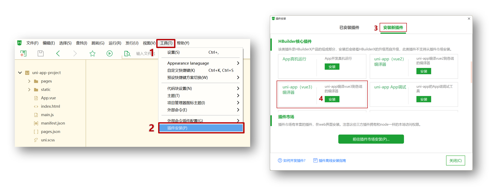

# uniapp 基础

## uni-app 和原生小程序开发区别

### 开发区别

uni-app 项目每个页面是一个 `.vue` 文件，数据绑定及事件处理同 `Vue.js` 规范：

1. 属性绑定 `src="{ { url }}"` 升级成 `:src="url"`

2. 事件绑定 `bindtap="eventName"` 升级成 `@tap="eventName"`，**支持（）传参**

3. 支持 Vue 常用**指令** `v-for`、`v-if`、`v-show`、`v-model` 等

### 其他区别补充

1. 调用接口能力，**建议前缀** `wx` 替换为 `uni` ，养成好习惯，**支持多端开发**。
2. `<style>` 页面样式不需要写 `scoped`，小程序是多页面应用，**页面样式自动隔离**。
3. **生命周期分三部分**：应用生命周期(小程序)，页面生命周期(小程序)，组件生命周期(Vue)


## 创建 uni-app 项目方式

**uni-app 支持两种方式创建项目：**

1. 通过 HBuilderX 创建（需安装 HBuilderX 编辑器）

2. 通过命令行创建（需安装 NodeJS 环境）

### HBuilderX 创建 uni-app 项目

**1.下载安装 HbuilderX 编辑器**


**2.通过 HbuilderX 创建 uni-app vue3 项目**


**3.安装 uni-app vue3 编译器插件**



**4.编译成微信小程序端代码**


**5.开启服务端口**


**小技巧分享：模拟器窗口分离和置顶**


**HBuildeX 和 微信开发者工具 关系**


::: tip 温馨提示
[HBuildeX](https://www.dcloud.io/hbuilderx.html) 和 [uni-app](https://uniapp.dcloud.net.cn/) 都属于 [DCloud](https://dcloud.io) 公司的产品。
:::

### 命令行创建 uni-app 项目

**优势**

通过命令行创建 uni-app 项目，**不必依赖 HBuilderX**，TypeScript 类型支持友好。

**命令行创建** **uni-app** **项目：**

vue3 + ts 版

::: code-group

```sh [github]
# 通过 npx 从 github 下载
npx degit dcloudio/uni-preset-vue#vite-ts 项目名称
```

```sh [👉国内 gitee]
# 通过 git 从 gitee 克隆下载 (👉备用地址)
git clone -b vite-ts https://gitee.com/dcloud/uni-preset-vue.git
```

```
npx degit dcloudio/uni-preset-vue#vite-ts #项目名称
```

:::

创建其他版本可查看：[uni-app 官网](https://uniapp.dcloud.net.cn/quickstart-cli.html)

::: danger 常见问题

- 运行 `npx` 命令下载失败，请尝试换成**手机热点重试**
- 换手机热点依旧失败，请尝试从[国内备用地址下载](https://gitee.com/dcloud/uni-preset-vue/tree/vite-ts/)
- 在 `manifest.json` 文件添加 [小程序 AppID](https://mp.weixin.qq.com/) 用于真机预览
- 运行 `npx` 命令需依赖 NodeJS 环境，[NodeJS 下载地址](https://nodejs.org/zh-cn)
- 运行 `git` 命令需依赖 Git 环境，[Git 下载地址](https://git-scm.com/download/)

:::

::: details 为什么执行项目初始化之后，安装的依赖不是最新的？

这是 **正常现象**，原因主要有以下几点：

------

✅ **1. 模板依赖是固定版本**

`npx degit dcloudio/uni-preset-vue#vite-ts` 只是把 **GitHub 仓库上的模板代码** 下载到本地，它不会自动更新模板里的 `package.json` 到最新版本。

模板作者（DCloud）为了保证**兼容性和稳定性**，通常会：

- 在 `package.json` 中写死特定版本或使用 **固定范围（^ 或 ~）**。
- 避免因为依赖升级导致构建失败。

------

✅ **2. degit 不会安装依赖，也不会检查最新版本**

`degit` 的作用：

- **复制 Git 仓库某个分支/标签的文件**。
- 它不会运行 `npm update`，也不会联系 npm registry 获取最新版本。

安装依赖时（`npm install` 或 `pnpm install`），会根据 `package.json` 和 `package-lock.json` 安装。

- 如果模板带了 `package-lock.json`，锁定了版本。
- 如果模板没有 lock 文件，但 `package.json` 里指定了老版本，仍会安装老版本。

------

✅ **3. uni-app 官方模板更新频率**

DCloud 的 uni-app 官方模板更新节奏相对慢，**可能模板里依赖版本已经落后于最新的 Vite / Vue / TypeScript 版本**，因为：

- uni-app 需要兼容 App、小程序等平台。
- 新版 Vite 或 TS 可能引入 breaking changes。

------

✅ **如何让依赖更新到最新版本？**

有几种方法：

------

**✔ 方法 1：用 `npm-check-updates` 更新依赖**

安装 `npm-check-updates`（简称 ncu）：

```
npm install -g npm-check-updates
```

然后在项目目录运行：

```
ncu -u
```

这会更新 `package.json` 中的依赖到最新版本。

再重新安装：

```
npm install
```

------

**✔ 方法 2：手动修改 `package.json`**

- 把主要依赖（`vue`、`vite`、`typescript` 等）改成 `"latest"` 或 `^最新版本号`。
- 然后重新执行 `npm install`。

------

**✔ 方法 3：使用 `pnpm` 并指定最新依赖**

如果你用 `pnpm`，可以直接：

```
pnpm up --latest
```

会直接更新到最新版本。

------

✅ **注意**

**更新到最新依赖可能会导致 uni-app 相关插件不兼容**，尤其是：

- `@dcloudio/uni-app`
- `@dcloudio/vite-plugin-uni`
- `vite`、`rollup` 插件

所以：

- **先更新非 uni-app 核心依赖**（比如 ESLint、TypeScript）。
- 核心依赖建议跟 uni-app 官方推荐版本走。

:::

使用命令行编译和运行 uni-app 项目

1. 安装依赖 `pnpm install`
2. 编译成微信小程序 `pnpm dev:mp-weixin`
3. 导入微信开发者工具

::: tip 温馨提示
编译成 H5 端可运行 `pnpm dev:h5` 通过浏览器预览项目。
:::

## 用 VS Code 开发 uni-app 项目

### 为什么选择 VS Code？

- VS Code 对 **TS 类型支持友好**，前端开发者**主流的编辑器**
- HbuilderX 对 TS 类型支持暂不完善，期待官方完善 👀

### 使用 VS Code 开发配置

- 👉 前置工作：安装 Vue3 插件，[点击查看官方文档](https://cn.vuejs.org/guide/typescript/overview.html#ide-support)
  - 安装 **Vue Language Features (Volar)** ：Vue3 语法提示插件
  - 安装 **TypeScript Vue Plugin (Volar)** ：Vue3+TS 插件
  - **工作区禁用** Vue2 的 Vetur 插件(Vue3 插件和 Vue2 冲突)
  - **工作区禁用** @builtin typescript 插件（禁用后开启 Vue3 的 TS 托管模式）
- 👉 安装 uni-app 开发插件
  - **uni-create-view** ：快速创建 uni-app 页面
  - **uni-helper uni-app** ：代码提示
  - **uniapp 小程序扩展** ：鼠标悬停查文档
- 👉 TS 类型校验
  - 安装 **类型声明文件** `pnpm i -D miniprogram-api-typings @uni-helper/uni-app-types`
  - 配置 `tsconfig.json`
- 👉 JSON 注释问题
  - 设置文件关联，把 `manifest.json` 和 `pages.json` 设置为 `jsonc`

`tsconfig.json` 参考

```json {11,12,14-15,18-22}
// tsconfig.json
{
  "extends": "@vue/tsconfig/tsconfig.json",
  "compilerOptions": {
    "sourceMap": true,
    "baseUrl": ".",
    "paths": {
      "@/*": ["./src/*"]
    },
    "lib": ["esnext", "dom"],
    // 类型声明文件
    "types": [
      "@dcloudio/types", // uni-app API 类型
      "miniprogram-api-typings", // 原生微信小程序类型
      "@uni-helper/uni-app-types" // uni-app 组件类型
    ]
  },
  // vue 编译器类型，校验标签类型
  "vueCompilerOptions": {
    // 原配置 `experimentalRuntimeMode` 现调整为 `nativeTags`
    "nativeTags": ["block", "component", "template", "slot"], // [!code ++]
    "experimentalRuntimeMode": "runtime-uni-app" // [!code --]
  },
  "include": ["src/**/*.ts", "src/**/*.d.ts", "src/**/*.tsx", "src/**/*.vue"]
}
```

**工作区设置参考**

```json
// .vscode/settings.json
{
  // 在保存时格式化文件
  "editor.formatOnSave": true,
  // 文件格式化配置
  "[json]": {
    "editor.defaultFormatter": "esbenp.prettier-vscode"
  },
  // 配置语言的文件关联
  "files.associations": {
    "pages.json": "jsonc", // pages.json 可以写注释
    "manifest.json": "jsonc" // manifest.json 可以写注释
  }
}
```

::: danger 版本升级

- 原依赖 `@types/wechat-miniprogram` 现调整为 [miniprogram-api-typings](https://github.com/wechat-miniprogram/api-typings)。
- 原配置 `experimentalRuntimeMode` 现调整为 `nativeTags`。

:::

### 针对微信开发者平台的配置


## 代码风格

安装插件：

```
pnpm i -D eslint prettier eslint-plugin-vue @vue/eslint-config-prettier @vue/eslint-config-typescript @vue/tsconfig 
```

执行eslint初始化：

```
pnpm init @eslint/config
```

它其实就是调用 **`@eslint/create-config`** 这个官方工具。

执行流程

::: details 点击查看详情

1. **交互式提问**；
2. 根据答案生成一个 **配置文件**（`.eslintrc.ts` / `.eslintrc.js` / `.eslintrc.json`）；
3. 根据需要 **自动安装相关依赖**（例如 `eslint`、`eslint-plugin-vue`、`@vue/eslint-config-prettier` 等）；
   - 用的是 `pnpm add -D`，因为这些依赖都是开发依赖。
   - 如果你选了 Jiti，也会一并安装。

总结一下 **`@eslint/create-config v1.10.0`** 的初始化流程和选项：

1. **What do you want to lint?**
    → `javascript, json, jsonc, json5, md, css` ✅
2. **How would you like to use ESLint?**
    → `problems` （检查语法和常见问题，不做风格约束）
3. **What type of modules does your project use?**
    → `esm` （ES Module）
4. **Which framework does your project use?**
    → `vue` （uni-app 基于 Vue）
5. **Does your project use TypeScript?**
    → `Yes`
6. **Where does your code run?**
    → `browser, node`
7. **Which language do you want your configuration file be written in?**
    → `ts`
8. **What flavor of Markdown do you want to lint?**
    → `commonmark`
9. **Jiti is required for Node.js <24.3.0... Would you like to add Jiti as a devDependency?**
    → 建议现在 Node18 → 选 `Yes` ✅

这一步处理很关键，否则 TS 项目无法校验组件属性类型。

:::

然后，需要更改默认的 eslint 配置文件：


## 开发工具回顾

选择自己习惯的编辑器开发 uni-app 项目即可。

**HbuilderX 和 微信开发者工具 关系**


**VS Code 和 微信开发者工具 关系**


## 用 VS Code 开发

使用 `VS Code` 编辑器写代码，实现 tabBar 案例 + 轮播图案例。

::: tip 温馨提示

`VS Code` 可通过快捷键 `Ctrl + i` 唤起代码提示。

:::