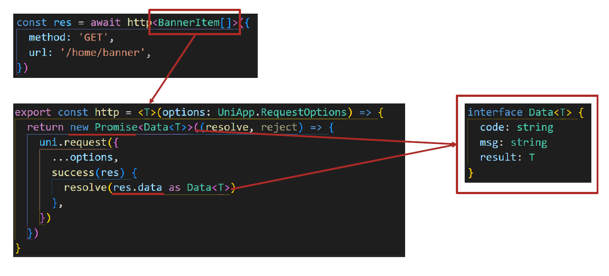
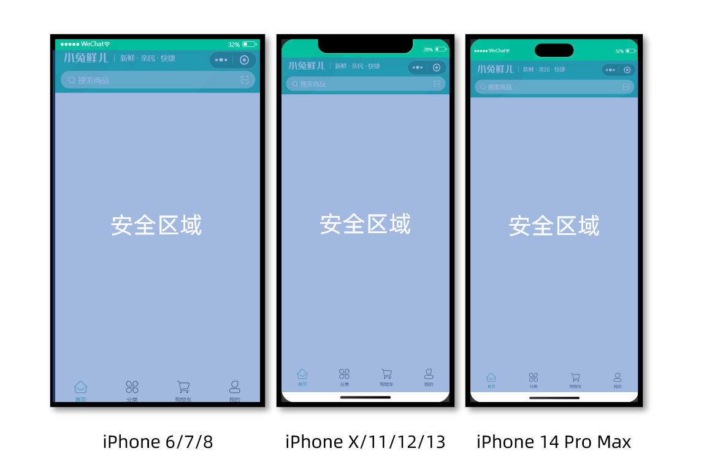

# Pinia 初始化

用法与 Vue3 完全一致，仅需适配兼容性问题。

### 持久化存储插件

安装持久化存储插件： [pinia-plugin-persistedstate](https://prazdevs.github.io/pinia-plugin-persistedstate/zh/guide/config.html#storage)

```bash
pnpm i pinia pinia-plugin-persistedstate
```

插件默认使用 `localStorage` 实现持久化，小程序端不兼容，需要替换持久化 API。

以及安装必要的依赖，否则会导致构建mp-weixin报错：

```
pnpm add destr deep-pick-omit -D
```


### 官方文档

在深入研究核心概念之前，我们得知道 Store 是用 `defineStore()` 定义的，它的第一个参数要求是一个**独一无二的**名字：

```ts
import { defineStore } from 'pinia'

//  `defineStore()` 的返回值的命名是自由的
// 但最好含有 store 的名字，且以 `use` 开头，以 `Store` 结尾。
// (比如 `useUserStore`，`useCartStore`，`useProductStore`)
// 第一个参数是你的应用中 Store 的唯一 ID。
export const useAlertsStore = defineStore('alerts', {
  // 其他配置...
})
```

这个**名字** ，也被用作 *id* ，是必须传入的， Pinia 将用它来连接 store 和 devtools。为了养成习惯性的用法，将返回的函数命名为 *use...* 是一个符合组合式函数风格的约定。

`defineStore()` 的第二个参数可接受两类值：Setup 函数或 Option 对象。

## Option Store

与 Vue 的选项式 API 类似，我们也可以传入一个带有 `state`、`actions` 与 `getters` 属性的 Option 对象：

```ts
export const useCounterStore = defineStore('counter', {
  state: () => ({ count: 0, name: 'Eduardo' }),
  getters: {
    doubleCount: (state) => state.count * 2,
  },
  actions: {
    increment() {
      this.count++
    },
  },
})
```

你可以认为 `state` 是 store 的数据 (`data`)，`getters` 是 store 的计算属性 (`computed`)，而 `actions` 则是方法 (`methods`)。

为方便上手使用，Option Store 应尽可能直观简单。

## Setup Store

也存在另一种定义 store 的可用语法。与 Vue 组合式 API 的 [setup 函数](https://cn.vuejs.org/api/composition-api-setup.html) 相似，我们可以传入一个函数，该函数定义了一些响应式属性和方法，并且返回一个带有我们想暴露出去的属性和方法的对象。

```ts
export const useCounterStore = defineStore('counter', () => {
  const count = ref(0)
  const name = ref('Eduardo')
  const doubleCount = computed(() => count.value * 2)
  function increment() {
    count.value++
  }

  return { count, name, doubleCount, increment }
})
```

在 *Setup Store* 中：

- `ref()` 就是 `state` 属性
- `computed()` 就是 `getters`
- `function()` 就是 `actions`

注意，要让 pinia 正确识别 `state`，你**必须**在 setup store 中返回 **`state` 的所有属性**。这意味着，你不能在 store 中使用**私有**属性。不完整返回会影响 [SSR](https://pinia.vuejs.org/zh/cookbook/composables.html) ，开发工具和其他插件的正常运行。

Setup store 比 [Option Store](https://pinia.vuejs.org/zh/core-concepts/#option-stores) 带来了更多的灵活性，因为你可以在一个 store 内创建侦听器，并自由地使用任何[组合式函数](https://cn.vuejs.org/guide/reusability/composables.html#composables)。不过，请记住，使用组合式函数会让 SSR 变得更加复杂。

Setup store 也可以依赖于全局**提供**的属性，比如路由。任何[应用层面提供](https://vuejs.org/api/application.html#app-provide)的属性都可以在 store 中使用 `inject()` 访问，就像在组件中一样：

```ts
import { inject } from 'vue'
import { useRoute } from 'vue-router'
import { defineStore } from 'pinia'

export const useSearchFilters = defineStore('search-filters', () => {
  const route = useRoute()
  // 这里假定 `app.provide('appProvided', 'value')` 已经调用过
  const appProvided = inject('appProvided')

  // ...

  return {
    // ...
  }
})
```

::: denger 

不要返回像 `route` 或 `appProvided` (上例中)之类的属性，因为它们不属于 store，而且你可以在组件中直接用 `useRoute()` 和 `inject('appProvided')` 访问。

::: 

## 你应该选用哪种语法？

和[在 Vue 中如何选择组合式 API 与选项式 API](https://cn.vuejs.org/guide/introduction.html#which-to-choose) 一样，选择你觉得最舒服的那一个就好。两种语法都有各自的优势和劣势。Option Store 更容易使用，而 Setup Store 更灵活和强大。如果你想深入了解两者之间的区别，请查看 Mastering Pinia 中的 [Option Stores vs Setup Stores 章节](https://masteringpinia.com/lessons/when-to-choose-one-syntax-over-the-other)。

## 使用 Store

虽然我们前面定义了一个 store，但在我们使用 `<script setup>` 调用 `useStore()`(或者使用 `setup()` 函数，**像所有的组件那样**) 之前，store 实例是不会被创建的：

```vue
<script setup>
import { useCounterStore } from '@/stores/counter'
// 在组件内部的任何地方均可以访问变量 `store` ✨
const store = useCounterStore()
</script>
```

你可以定义任意多的 store，但为了让使用 pinia 的益处最大化(比如允许构建工具自动进行代码分割以及 TypeScript 推断)，**你应该在不同的文件中去定义 store**。

一旦 store 被实例化，你可以直接访问在 store 的 `state`、`getters` 和 `actions` 中定义的任何属性。我们将在后续章节继续了解这些细节，目前自动补全将帮助你使用相关属性。

请注意，`store` 是一个用 `reactive` 包装的对象，这意味着不需要在 getters 后面写 `.value`。就像 `setup` 中的 `props` 一样，**我们不能对它进行解构**：

```ts
<script setup>
import { useCounterStore } from '@/stores/counter'
import { computed } from 'vue'

const store = useCounterStore()
// ❌ 下面这部分代码不会生效，因为它的响应式被破坏了
// 与 reactive 相同: https://vuejs.org/guide/essentials/reactivity-fundamentals.html#limitations-of-reactive
const { name, doubleCount } = store
name // 将会一直是 "Eduardo" //
doubleCount // 将会一直是 0 //
setTimeout(() => {
  store.increment()
}, 1000)
// ✅ 而这一部分代码就会维持响应式
// 💡 在这里你也可以直接使用 `store.doubleCount`
const doubleValue = computed(() => store.doubleCount)
</script>
```

## 从 Store 解构

为了从 store 中提取属性时保持其响应性，你需要使用 `storeToRefs()`。它将为每一个响应式属性创建引用。当你只使用 store 的状态而不调用任何 action 时，它会非常有用。请注意，你可以直接从 store 中解构 action，因为它们也被绑定到 store 上：

```ts
<script setup>
import { storeToRefs } from 'pinia'
import { useCounterStore } from '@/stores/counter' // 需要引入 store
const store = useCounterStore()
// `name` 和 `doubleCount` 都是响应式引用
// 下面的代码同样会提取那些来自插件的属性的响应式引用
// 但是会跳过所有的 action 或者非响应式（非 ref 或者 非 reactive）的属性
const { name, doubleCount } = storeToRefs(store)
// 名为 increment 的 action 可以被解构
const { increment } = store
</script>
```


# Pinia 配置

## 基本配置

::: code-group

```ts [store/modules/members.ts]
import { defineStore } from 'pinia'
import { ref } from 'vue'

/**
 * 👇 建议放到 store 外部（避免重复定义）
 */
export interface MemberProfile {
  id: number
  token: string
  openid: string
  userId: number
  name?: string
  email?: string
}

export const useMemberStore = defineStore(
  'member',
  () => {
    // ======================
    // state
    // ======================
    const profile = ref<MemberProfile | null>(null)

    // ======================
    // actions
    // ======================
    const setProfile = (val: MemberProfile) => {
      profile.value = val
    }

    const clearProfile = () => {
      profile.value = null
    }

    // ======================
    // getter（可选但推荐）
    // ======================
    const isLogin = () => {
      return !!profile.value?.token
    }

    return {
      profile,
      setProfile,
      clearProfile,
      isLogin,
    }
  },

  // ======================
  // persist（持久化）
  // ======================
  {
    persist: {
      key: 'member-store',
      storage: {
        getItem: (key: string) => {
          const value = uni.getStorageSync(key)
          return value || null
        },
        setItem: (key, value) => {
          uni.setStorageSync(key, value)
        },
      },
    },
  },
)
```

``` ts [store/index.ts]
import { createPinia } from 'pinia'
import persist from 'pinia-plugin-persistedstate'

// 创建 pinia 实例
const pinia = createPinia()
// 使用持久化存储插件
pinia.use(persist)

// 默认导出，给 main.ts 使用
export default pinia

// 模块统一导出
export * from './modules/member'
export * from './modules/theme'
export * from './modules/weather'
```

``` ts [main.ts]
import { createSSRApp } from 'vue'
import App from './App.vue'
import pinia from './stores'

export function createApp() {
  const app = createSSRApp(App)

  app.use(pinia)

  return {
    app,
  }
}
```

:::

## 持久化的逻辑

✔ Pinia 内部真实结构：

```
store = {
  $state: {
    profile,
  },
  setProfile,
  clearProfile
}
```

✔ persist 监听的是：

```
store.$state（整个对象）
```

🎯 最终一句话总结

>  ✔ store 是整个状态容器
>  ✔ profile 只是 store 里的一个状态字段
>  ✔ persist 监听的是整个 store.$state，而不是单个 profile


## 多端兼容

**网页端持久化 API**

```
// 网页端API
localStorage.setItem()
localStorage.getItem()
```

**多端持久化 API**

```
// 兼容多端API
uni.setStorageSync()
uni.getStorageSync()
```

**参考代码**

```ts
// stores/modules/member.ts
export const useMemberStore = defineStore(
  'member',
  () => {
    //…省略
  },
  {
    // 配置持久化
    persist: {
      // 调整为兼容多端的API
      storage: {
        setItem(key, value) {
          uni.setStorageSync(key, value) 
        },
        getItem(key) {
          return uni.getStorageSync(key) 
        },
      },
    },
  },
)
```

# 拦截器&请求函数

## 拦截器 - 创建 http.ts 模块

**uniapp 拦截器**： [uni.addInterceptor](https://uniapp.dcloud.net.cn/api/interceptor.html)

**接口说明**：[接口文档](https://www.apifox.cn/apidoc/shared-0e6ee326-d646-41bd-9214-29dbf47648fa/doc-1521513)

实现需求

1. 拼接基础地址
2. 设置超时时间
3. 添加请求头标识
4. 添加 token

src/utils/http.ts

```ts
// src/utils/http.ts

import { useMemberStore } from '@/stores'

// 请求基地址
const baseURL = 'https://pcapi-xiaotuxian-front-devtest.itheima.net'

// 拦截器配置
const httpInterceptor = {
  // 拦截前触发
  invoke(options: UniApp.RequestOptions) {
    // 1. 非 http 开头需拼接地址
    if (!options.url.startsWith('http')) {
      options.url = baseURL + options.url
    }
    // 2. 请求超时
    options.timeout = 10000
    // 3. 添加小程序端请求头标识
    options.header = {
      'source-client': 'miniapp',
      ...options.header,
    }
    // 4. 添加 token 请求头标识
    const memberStore = useMemberStore()
    const token = memberStore.profile?.token
    if (token) {
      options.header.Authorization = token
    }
  },
}

// 拦截 request 请求
uni.addInterceptor('request', httpInterceptor)
// 拦截 uploadFile 文件上传
uni.addInterceptor('uploadFile', httpInterceptor)
```


## 封装 Promise 请求函数

实现需求

1. 返回 Promise 对象，用于处理返回值类型
2. 成功 resolve
   1. 提取数据
   2. 添加泛型
3. 失败 reject
   1. 401 错误
   2. 其他错误
   3. 网络错误

**参考代码**

```ts
/**
 * 请求函数
 * @param  UniApp.RequestOptions
 * @returns Promise
 *  1. 返回 Promise 对象，用于处理返回值类型
 *  2. 获取数据成功
 *    2.1 提取核心数据 res.data
 *    2.2 添加类型，支持泛型
 *  3. 获取数据失败
 *    3.1 401错误  -> 清理用户信息，跳转到登录页
 *    3.2 其他错误 -> 根据后端错误信息轻提示
 *    3.3 网络错误 -> 提示用户换网络
 */
type Data<T> = {
  code: string
  msg: string
  result: T
}
// 2.2 添加类型，支持泛型
export const http = <T>(options: UniApp.RequestOptions) => {
  // 1. 返回 Promise 对象
  return new Promise<Data<T>>((resolve, reject) => {
    uni.request({
      ...options,
      // 响应成功
      success(res) {
        // 状态码 2xx，参考 axios 的设计
        if (res.statusCode >= 200 && res.statusCode < 300) {
          // 2.1 提取核心数据 res.data
          resolve(res.data as Data<T>)
        } else if (res.statusCode === 401) {
          // 401错误  -> 清理用户信息，跳转到登录页
          const memberStore = useMemberStore()
          memberStore.clearProfile()
          uni.navigateTo({ url: '/pages/login/login' })
          reject(res)
        } else {
          // 其他错误 -> 根据后端错误信息轻提示
          uni.showToast({
            icon: 'none',
            title: (res.data as Data<T>).msg || '请求错误',
          })
          reject(res)
        }
      },
      // 响应失败
      fail(err) {
        uni.showToast({
          icon: 'none',
          title: '网络错误，换个网络试试',
        })
        reject(err)
      },
    })
  })
}
```


## 设置类型



# 自定义导航栏

## 前置

```json
// src/pages.json
{
  "path": "pages/index/index",
  "style": {
    "navigationStyle": "custom", // 隐藏默认导航
    "navigationBarTextStyle": "white",
    "navigationBarTitleText": "首页"
  }
}
```

## 安全区域的概念

不同手机的安全区域不同，适配安全区域能防止页面重要内容被遮挡。

可通过 `uni.getSystemInfoSync()` 获取屏幕边界到安全区的距离。



```ts
// 获取屏幕边界到安全区域距离
const { safeAreaInsets } = uni.getSystemInfoSync
```

可能需要在 eslint 配置中声明：

```json
{
  files: ['**/*.{js,mjs,cjs,ts,mts,cts,vue}'],
  plugins: { js },
  extends: ['js/recommended'],
  // 增加 uni: 'readonly'
  languageOptions: { globals: { ...globals.browser, ...globals.node, uni: 'readonly' } },
},
```

完整的组件代码：

```
```


# iconfont 图标

首先，下载所需要的 iconfont 文件：

然后，到项目根组件 App.vue 中添加以下配置：

```vue {13-37}
<script setup lang="ts">
import { onLaunch, onShow, onHide } from '@dcloudio/uni-app'
onLaunch(() => {
  console.log('App Launch')
})
onShow(() => {
  console.log('App Show') 
})
onHide(() => {
  console.log('App Hide') 
})
</script>
<style>
/* 字体定义必须在所有样式之前 */ 
@font-face { 
  font-family: 'iconfont';
  src:
    url('/static/fonts/iconfont.woff2') format('woff2'),
    url('/static/fonts/iconfont.woff') format('woff'),
    url('/static/fonts/iconfont.ttf') format('truetype');
  font-weight: normal;
  font-style: normal;
  font-display: block;
  /* 添加这一行 */
}

/* 基础图标样式 */
.iconfont {
  font-family: 'iconfont' !important;
  font-size: 16px;
  font-style: normal;
  -webkit-font-smoothing: antialiased;
  -moz-osx-font-smoothing: grayscale;
  display: inline-block;
  /* 添加这一行 */
}
</style>

```

使用：

```vue
<template>
  <view
    class="navbar"
    :style="{ paddingTop: safeAreaInsets?.top + 'px' }"
  >
    <!-- logo文字 -->
    <view class="logo">
      <image
        class="logo-image"
        src="@/static/images/yun-logo.png"
      ></image>
      <text class="logo-image-text">云峰农服</text>
      <!-- <text class="logo-text">快捷 · 易用 · 高效</text> -->
    </view>

    <!-- 搜索条 -->
    <!-- <view class="search">
      <text class="icon-search">搜索商品</text>
      <text class="icon-scan"></text>
    </view> -->

    <!-- navBar-bottom -->
    <view class="navbar-bottom">
      <div class="tianqi">
        <text class="tianqi-temp">28°</text>
        <text class="tianqi-desc">晴</text>
        <image
          class="tianqi-icon"
          src="@/static/icon/天气-晴.svg"
        ></image>
      </div>
      <div class="location">
        <text class="iconfont location-icon">&#xe790;</text>
        <text class="info-text">牡丹区</text>
      </div>
      <div class="shidu">
        <text class="iconfont shidu-icon">&#xe682;</text>
        <text class="info-text">65%</text>
      </div>
      <div class="air">
        <text class="iconfont air-icon">&#xe60e;</text>
        <text class="info-text air-text">良好</text>
      </div>
    </view>
  </view>
</template>
```


# iconify 在uniapp 中的使用-适配小程序

在 **uni-app（Vue3 版本）** 中使用 **Iconify 图标系统** 是完全可行的，而且比很多本地图标方案更灵活（比如支持上千套图标库）。

第一步，安装依赖：

```
pnpm add @iconify/vue
```

第二步，配置按需引入：

需要借助：

- 👉 **unplugin-vue-components**
-  👉 **unplugin-auto-import**

这两个插件是 Vite 官方推荐的自动导入方案：

坑位：需要指定版本号，否则会报一些兼容性错误：  "unplugin-auto-import": "19",  "unplugin-vue-components": "28",

```
pnpm add -D unplugin-vue-components@28 unplugin-auto-import@19
```

unplugin-vue-components 会生成 src/components.d.ts，里面也会声明 `<Icon>`

然后：`vite.config.ts`

```ts {9-27}
import { defineConfig } from 'vite'
import uni from '@dcloudio/vite-plugin-uni'

import Components from 'unplugin-vue-components/vite'
import AutoImport from 'unplugin-auto-import/vite'

// https://vitejs.dev/config/
export default defineConfig({
  plugins: [
    uni(), // 自动引入 vue api (可选)
    AutoImport({
      imports: ['vue'],
      dts: 'src/auto-imports.d.ts',
    }),

    // 自动注册组件
    Components({
      dts: 'src/components.d.ts',
      resolvers: [
        // 自动引入 Iconify 的 Icon 组件
        (name) => {
          if (name === 'Icon') {
            return { name: 'Icon', from: '@iconify/vue' }
          }
        },
      ],
    }),
  ],
})
```

由于 **小程序环境下无法直接使用 Iconify 的 SVG 渲染**。

因此需要第三步：创建 `@/utils/iconLoader.ts`

```ts
// src/utils/iconLoader.ts
import { getIconData } from '@iconify/utils/lib/icon-set/get-icon';

// 1. 导入所有需要的图标集
// 罪魁祸首，注释掉后减少了 7MB+，这完全解决了包体积问题。
// import { icons as mdiIcons } from '@iconify-json/mdi';
// import { icons as phIcons } from '@iconify-json/ph';
import { icons as wiIcons } from '@iconify-json/wi'; // ← 新增这行

// 相当于：
// const mdiIcons = require('@iconify-json/mdi').icons
// const phIcons = require('@iconify-json/ph').icons

// 2. 定义图标数据类型
export interface IconData {
  body: string      // SVG path 数据
  width: number     // 图标原始宽度
  height: number    // 图标原始高度
}

// 3. 配置支持的图标集映射
const iconSets: Record<string, any> = {
  // // Material Design Icons - 谷歌 Material Design 风格
  // 'mdi': mdiIcons,

  // // Phosphor Icons - 灵活的一致性图标
  // 'ph': phIcons,

  // Weather Icons - 天气图标集 ← 新增这个映射
  'wi': wiIcons,

}

// 4. 图标集信息（用于错误提示和文档）
export const iconSetInfo: Record<string, { name: string; count: number }> = {
  'mdi': { name: 'Material Design Icons', count: 7000 },
  'ph': { name: 'Phosphor Icons', count: 6000 },
  'wi': { name: 'Weather Icons', count: 215 },  // ← 新增这行
  'tabler': { name: 'Tabler Icons', count: 4500 },
  'carbon': { name: 'Carbon Icons', count: 2000 },
  'fa6-regular': { name: 'Font Awesome 6 Regular', count: 2000 },
  'fa6-solid': { name: 'Font Awesome 6 Solid', count: 2000 },
  'fa6-brands': { name: 'Font Awesome 6 Brands', count: 2000 },
}

// 5. 核心图标数据获取函数
export const getIconSVGData = (iconName: string): IconData | null => {
  try {
    // 5.1 解析图标名称
    const [prefix, name] = iconName.split(':')

    // 5.2 验证名称格式
    if (!prefix || !name) {
      console.warn(`🚫 图标名称格式错误: "${iconName}"。正确格式: "前缀:图标名"`)
      return null
    }

    // 5.3 查找对应的图标集
    const iconSet = iconSets[prefix]
    if (!iconSet) {
      const supportedPrefixes = Object.keys(iconSets).join(', ')
      console.warn(`🚫 不支持的图标集: "${prefix}"。支持的图标集: ${supportedPrefixes}`)
      return null
    }

    // 5.4 获取图标数据
    const iconData = getIconData(iconSet, name)
    if (!iconData) {
      const info = iconSetInfo[prefix]
      console.warn(`🚫 图标不存在: "${iconName}"。${info ? `请在 ${info.name} 中查看可用图标` : ''}`)
      return null
    }

    // 5.5 验证数据完整性
    if (!iconData.body || !iconData.width || !iconData.height) {
      console.warn(`🚫 图标数据不完整: "${iconName}"`)
      return null
    }

    // 5.6 返回标准化数据
    return {
      body: iconData.body,
      width: iconData.width,
      height: iconData.height
    }

  } catch (error) {
    console.error(`💥 获取图标数据时发生错误: "${iconName}"`, error)
    return null
  }
}

// 6. 批量获取图标数据（优化性能）
export const getMultipleIconsData = (iconNames: string[]): Record<string, IconData | null> => {
  const result: Record<string, IconData | null> = {}

  iconNames.forEach(iconName => {
    result[iconName] = getIconSVGData(iconName)
  })

  return result
}

// 7. 工具函数：获取支持的图标集列表
export const getSupportedIconSets = () => {
  return Object.entries(iconSetInfo).map(([prefix, info]) => ({
    prefix,
    name: info.name,
    count: info.count
  }))
}

// 8. 工具函数：检查图标是否存在
export const isIconAvailable = (iconName: string): boolean => {
  return getIconSVGData(iconName) !== null
}
```

创建 `@/components/SmartIcon.vue`

```vue
<!-- src/components/SmartIcon.vue -->
<template>
  <view
    v-if="isMpWeixin"
    class="smart-icon"
    :class="customClass"
  >
    <!-- 调试信息 -->
    <view
      v-if="showDebug"
      class="debug-panel"
    >
      <text class="debug-text">图标: {{ icon }}</text>
      <text class="debug-text">数据: {{ iconData ? '有' : '无' }}</text>
      <text class="debug-text">URL长度: {{ iconSvgUrl?.length || 0 }}</text>
    </view>

    <image
      v-if="iconSvgUrl && !loadError"
      :src="iconSvgUrl"
      class="smart-icon-image"
      :style="imageSizeStyle"
      mode="aspectFit"
      @load="handleImageLoad"
      @error="handleImageError"
    />

    <view
      v-else
      class="icon-error"
      :style="imageSizeStyle"
    >
      <text class="error-text">?</text>
    </view>
  </view>

  <Icon
    v-else
    :icon="icon"
    :width="width"
    :height="height"
    :color="color"
  />
</template>

<script setup lang="ts">
import { getIconSVGData, type IconData } from '@/utils/iconLoader'
import { Icon } from '@iconify/vue'
import { computed, defineProps, onMounted, ref, watch, withDefaults } from 'vue'

const props = withDefaults(
  defineProps<{
    icon: string
    width?: number
    height?: number
    color?: string
    customClass?: string
    showDebug?: boolean
  }>(),
  {
    width: 24,
    height: 24,
    color: '#000000',
    customClass: '',
    showDebug: true,
  },
)

const isMpWeixin = process.env.UNI_PLATFORM === 'mp-weixin'
const iconData = ref<IconData | null>(null)
const isLoading = ref(false)
const loadError = ref(false)

const imageSizeStyle = computed(() => ({
  width: `${props.width}px`,
  height: `${props.height}px`,
}))

const showDebug = computed(() => props.showDebug)

// 手动 Base64 编码函数
const manualBase64Encode = (uint8Array: Uint8Array): string => {
  const chars = 'ABCDEFGHIJKLMNOPQRSTUVWXYZabcdefghijklmnopqrstuvwxyz0123456789+/='
  let output = ''

  for (let i = 0; i < uint8Array.length; i += 3) {
    const a = uint8Array[i] ?? 0
    const b = uint8Array[i + 1] || 0
    const c = uint8Array[i + 2] || 0

    const bits = (a << 16) | (b << 8) | c

    output += chars.charAt((bits >> 18) & 0x3f)
    output += chars.charAt((bits >> 12) & 0x3f)
    output += chars.charAt((bits >> 6) & 0x3f)
    output += chars.charAt(bits & 0x3f)
  }

  // 添加填充
  const padding = uint8Array.length % 3
  if (padding === 1) {
    output = output.slice(0, -2) + '=='
  } else if (padding === 2) {
    output = output.slice(0, -1) + '='
  }

  return output
}

// 字符串转 ArrayBuffer
const stringToArrayBuffer = (str: string): Uint8Array => {
  if (typeof TextEncoder !== 'undefined') {
    const encoder = new TextEncoder()
    return encoder.encode(str)
  } else {
    // 降级方案
    const buf = new ArrayBuffer(str.length)
    const bufView = new Uint8Array(buf)
    for (let i = 0; i < str.length; i++) {
      bufView[i] = str.charCodeAt(i)
    }
    return bufView
  }
}

// Base64 编码兼容函数
// 修改 Base64 编码兼容函数，移除已弃用的 API 检查
const base64Encode = (str: string): string => {
  try {
    // 统一使用手动 Base64 编码（最可靠）
    const uint8Array = stringToArrayBuffer(str)
    return manualBase64Encode(uint8Array)
  } catch (error) {
    console.error('Base64 编码失败:', error)
    // 降级方案
    return manualBase64Encode(new Uint8Array(Array.from(str).map(c => c.charCodeAt(0))))
  }
}

// 修复 SVG 内容格式问题
const iconSvgUrl = computed(() => {
  if (!isMpWeixin || !iconData.value) return ''

  try {
    console.log('🛠 生成 SVG Data URL...')

    let svgContent = ''

    // 检查 iconData.body 是完整的 SVG 路径标签还是纯路径数据
    if (iconData.value.body.includes('<path')) {
      // 如果 body 已经是完整的 <path> 标签，直接使用
      console.log('📦 使用完整路径标签')
      svgContent = `<?xml version="1.0" encoding="UTF-8"?>
<svg xmlns="http://www.w3.org/2000/svg" 
     width="${props.width}" 
     height="${props.height}" 
     viewBox="0 0 ${iconData.value.width} ${iconData.value.height}">
  ${iconData.value.body.replace(/fill="currentColor"/g, `fill="${props.color}"`)}
</svg>`
    } else {
      // 如果 body 只是路径数据，构建完整的 <path> 标签
      console.log('📦 构建路径标签')
      svgContent = `<?xml version="1.0" encoding="UTF-8"?>
<svg xmlns="http://www.w3.org/2000/svg" 
     width="${props.width}" 
     height="${props.height}" 
     viewBox="0 0 ${iconData.value.width} ${iconData.value.height}">
  <path fill="${props.color}" d="${iconData.value.body}"/>
</svg>`
    }

    console.log('📐 SVG 内容:', svgContent)

    // 清理 SVG（移除换行和多余空格）
    const cleanSvg = svgContent.replace(/\s+/g, ' ').trim()

    // 使用兼容的 base64 编码
    const base64Svg = base64Encode(cleanSvg)
    if (!base64Svg) {
      console.error('❌ Base64 编码失败')
      return ''
    }

    const dataUrl = `data:image/svg+xml;base64,${base64Svg}`

    console.log('🔗 生成的 Data URL（前100字符）:', dataUrl.substring(0, 100))

    return dataUrl
  } catch (error) {
    console.error('💥 生成 SVG Data URL 失败:', error)
    return ''
  }
})

// 加载图标数据
const loadIconData = async () => {
  if (!isMpWeixin) return

  console.log(`🔍 加载图标: ${props.icon}`)

  isLoading.value = true
  loadError.value = false
  iconData.value = null

  try {
    const data = getIconSVGData(props.icon)
    console.log('📦 图标数据:', data)

    if (data && data.body) {
      iconData.value = data
      console.log('✅ 图标数据加载成功')

      // 调试：检查 body 内容类型
      if (data.body.includes('<path')) {
        console.log('🔍 body 包含完整路径标签')
      } else {
        console.log('🔍 body 是纯路径数据')
      }
    } else {
      loadError.value = true
      console.warn('❌ 图标数据为空')
    }
  } catch (error) {
    loadError.value = true
    console.error('💥 加载异常:', error)
  } finally {
    isLoading.value = false
  }
}

const handleImageLoad = () => {
  console.log('🎉 图片加载成功！')
  loadError.value = false
}

// eslint-disable-next-line @typescript-eslint/no-explicit-any
const handleImageError = (event: any) => {
  console.error('🖼 图片加载失败:', event)
  console.log('🔗 失败的 Data URL:', iconSvgUrl.value)
  loadError.value = true
}

watch(() => props.icon, loadIconData)
onMounted(loadIconData)
</script>

<style scoped>
.smart-icon {
  display: inline-flex;
  flex-direction: column;
  align-items: center;
  justify-content: center;
}

.smart-icon-image {
  display: block;
}

.debug-panel {
  background: #f0f0f0;
  padding: 4rpx 8rpx;
  border-radius: 4rpx;
  margin-bottom: 8rpx;
}

.debug-text {
  font-size: 10px;
  color: #666;
  display: block;
}

.icon-error {
  display: flex;
  align-items: center;
  justify-content: center;
  background: #ffebee;
  border-radius: 4px;
}

.error-text {
  font-size: 14px;
  color: #f44336;
}
</style>
```


# 组件中的调试信息

只需要在全局定义一个简单的 `debugLog` 函数即可，这样既保持了简洁性，又实现了代码复用。

::: details 点击查看详情

```ts
// src/utils/debugUtils.ts
import { ref } from 'vue'

// // 全局调试开关
// export const debugEnabled = ref(false)

// export const debugLog = (firstArg: string, ...restArgs: any[]) => {
//   if (!debugEnabled.value) return

//   // 如果只有一个参数，直接输出
//   if (restArgs.length === 0) {
//     console.log('🔍', firstArg)
//   }
//   // 如果第二个参数是字符串，认为是组件名模式
//   else if (restArgs.length >= 1 && typeof restArgs[0] === 'string') {
//     const [message, ...args] = restArgs
//     console.log(`🔍 [${firstArg}] ${message}`, ...args)
//   }
//   // 否则是简单调试模式
//   else {
//     console.log('🔍', firstArg, ...restArgs)
//   }
// }

// // 全局开关函数
// export const toggleGlobalDebug = () => {
//   debugEnabled.value = !debugEnabled.value
//   console.log(`🌍 全局调试 ${debugEnabled.value ? '开启' : '关闭'}`)
// }


// src/utils/debugUtils.ts
export const createDebugger = (componentName: string) => {
  const debugEnabled = ref(false)  // 每个组件独立的 ref

  const debugLog = (...args: any[]) => {
    if (debugEnabled.value) {
      console.log(`🔍 [${componentName}]`, ...args)
    }
  }

  const setDebug = (enabled: boolean) => {
    debugEnabled.value = enabled
    console.log(`🎯 ${componentName} 调试 ${enabled ? '开启' : '关闭'}`)
  }

  return {
    debugLog,
    setDebug,
    debugEnabled
  }
}

// 全局开关（可选）
export const globalDebugEnabled = ref(false)
```

```ts
// SmartIcon.vue
import { createDebugger } from '@/utils/debugUtils'

const COMPONENT_NAME = 'SmartIcon'
const { debugLog, setDebug, debugEnabled } = createDebugger(COMPONENT_NAME)

setDebug(false) // 添加这一行，组件加载时启停调试

defineExpose({
  enableDebug: () => setDebug(true), // 🎯 开启调试
  disableDebug: () => setDebug(false), // 🎯 关闭调试
  isDebugEnabled: () => debugEnabled.value, // 🎯 检查调试状态
})
```

:::

::: details `console.warn` 和 `console.error`

**对于 `console.warn` 和 `console.error`，最佳实践是：保持原样，不要用开关控制。**

🔍 原因分析

1. **错误和警告的重要性不同**

```
// 调试信息 - 可以开关控制
debugLog('生成 SVG Data URL...')        // ✅ 可控制

// 警告信息 - 应该始终显示  
console.warn('图标数据为空')            // ✅ 始终显示

// 错误信息 - 必须始终显示
console.error('加载异常:', error)       // ✅ 必须显示
```


2. **不同日志的用途**

| 日志类型        | 用途         | 是否应该控制     |
| :-------------- | :----------- | :--------------- |
| `console.log`   | 开发调试信息 | ✅ 应该控制       |
| `console.warn`  | 潜在问题警告 | ❌ 不应该控制     |
| `console.error` | 严重错误信息 | ❌ 绝对不应该控制 |

3. **实际场景考虑**

```
const loadIconData = async () => {
  try {
    const data = getIconSVGData(props.icon)
    debugLog('图标数据:', data)  // 调试信息，可关闭

    if (!data) {
      console.warn(`⚠️ [${COMPONENT_NAME}] 图标数据为空`)  // 警告，应该显示
      return
    }
  } catch (error) {
    console.error(`💥 [${COMPONENT_NAME}] 加载异常:`, error)  // 错误，必须显示
  }
}
```

:::


::: details iconLoader.ts 的作用

这个 `iconLoader.ts` 文件是整个图标系统的**数据层核心**，它与 SmartIcon 组件的关系如下：

核心作用

1. **图标数据仓库**

```ts
// 存储所有图标集的原始数据
const iconSets: Record<string, any> = {
  'mdi': mdiIcons,  // 包含 7000+ Material Design 图标
  'ph': phIcons,     // 包含 6000+ Phosphor 图标
}
```

- 相当于图标的"数据库"
- 管理多个图标集的原始 SVG 数据

2. **数据解析器**

```ts
export const getIconSVGData = (iconName: string): IconData | null => {
  const [prefix, name] = iconName.split(':')  // 解析 "mdi:account-box"
  const iconSet = iconSets[prefix]            // 找到对应的图标集
  const iconData = getIconData(iconSet, name) // 提取具体图标数据
  return { body, width, height }              // 返回标准化数据
}
```

- 将 `"mdi:account-box"` 这样的字符串转换为具体的 SVG 数据
- 提供统一的接口给组件层使用

与 SmartIcon 组件的关联

数据流关系：

text

```ts
SmartIcon 组件 (UI层) 
    ↓ (请求数据)
iconLoader.ts (数据层) 
    ↓ (返回数据)
SmartIcon 组件 (渲染显示)
```


具体调用过程：

1. **组件请求数据**：

```ts
// 在 SmartIcon.vue 中
const loadIconData = async () => {
  const data = getIconSVGData(props.icon)  // 调用 iconLoader
  // data = { body: "<path...>", width: 24, height: 24 }
}
```


1. **数据层处理**：

```ts
// iconLoader.ts 处理 "mdi:account-box"
输入: "mdi:account-box"
输出: {
  body: "<path fill="currentColor" d="M6 17c0-2 4-3.1..."/>",
  width: 24,
  height: 24
}
```


1. **组件渲染**：

```ts
// SmartIcon 使用返回的数据生成 SVG
const svgContent = `
  <svg ...>
    ${iconData.value.body.replace(/fill="currentColor"/g, `fill="${props.color}"`)}
  </svg>`
```


架构优势

1. **关注点分离**

- **iconLoader.ts**: 只负责数据管理和解析
- **SmartIcon.vue**: 只负责 UI 渲染和交互

2. **可维护性**

```ts
// 添加新图标集只需在这里扩展
const iconSets = {
  'mdi': mdiIcons,
  'ph': phIcons,
  'fa': faIcons,      // 未来扩展 FontAwesome
  'antd': antdIcons,  // 未来扩展 Ant Design
}
```

3. **错误处理**

```ts
// 统一的数据验证和错误提示
if (!iconSet) {
  console.warn(`不支持的图标集: "${prefix}"`)
}
if (!iconData) {
  console.warn(`图标不存在: "${iconName}"`)
}
```

4. **性能优化**

```ts
// 支持批量获取，减少重复解析
export const getMultipleIconsData = (iconNames: string[]) => {
  // 一次性获取多个图标数据
}
```

实际工作流程

当你在组件中使用：

```
<SmartIcon icon="mdi:account-box" color="#52c41a" />
```

实际执行过程：

1. 组件调用 `getIconSVGData("mdi:account-box")`
2. iconLoader 解析出前缀 `mdi` 和图标名 `account-box`
3. 在 mdi 图标集中查找 `account-box` 的 SVG 数据
4. 返回标准化的 `{ body, width, height }`
5. 组件用此数据生成 SVG Data URL
6. 最终渲染为图片显示

**总结**：`iconLoader.ts` 是图标系统的"大脑"，负责所有图标数据的存储、查找和标准化，而 `SmartIcon.vue` 是"展示层"，负责将数据渲染为用户可见的图标。

:::

::: details 后期使用 - 增加图标集

🔧 iconLoader.ts 必要修改

步骤1：导入 Weather Icons

```bash
pnpm add @iconify-json/wi
```

```ts
// src/utils/iconLoader.ts
import { getIconData } from '@iconify/utils/lib/icon-set/get-icon'

// 导入图标集 - 添加 wiIcons
import { icons as mdiIcons } from '@iconify-json/mdi'
import { icons as phIcons } from '@iconify-json/ph'
import { icons as wiIcons } from '@iconify-json/wi'  // ← 新增这行 （安装包后自动获取相应的类型声明）
```

步骤2：配置图标集映射

```ts
// 配置支持的图标集映射 - 添加 wi 映射
const iconSets: Record<string, any> = {
  'mdi': mdiIcons,
  'ph': phIcons,
  'wi': wiIcons,  // ← 新增这行
}
```

步骤3：更新图标集信息

```ts
// 图标集信息 - 添加 wi 信息
export const iconSetInfo: Record<string, { name: string; count: number }> = {
  'mdi': { name: 'Material Design Icons', count: 7000 },
  'ph': { name: 'Phosphor Icons', count: 6000 },
  'wi': { name: 'Weather Icons', count: 215 },  // ← 新增这行
  // ... 其他图标集信息
}
```

:::


::: details 坑位 - `process.env.UNI_PLATFORM === 'mp-weixin'`

坑位：TypeScript 在 **前端项目里识别不了 Node.js 的 `process` 全局变量**。在 uni-app / Vite 项目中常见，尤其你写了：

```
const isMpWeixin = process.env.UNI_PLATFORM === 'mp-weixin'
```

------

解决方法

1️⃣ 安装 Node 类型

```
pnpm add -D @types/node # 实测无需安装它
# 或 npm i -D @types/node
```

------

2️⃣ tsconfig.json 配置

在 `tsconfig.json` 的 `compilerOptions` 中添加：

```
{
  "compilerOptions": {
    "types": ["vite/client", "node"]
  }
}
```

- `vite/client` → 识别 Vite 全局类型
- `node` → 识别 `process`、`Buffer` 等 Node 全局变量

:::

为 JSON 创建类型声明

在 `types/iconify-json.d.ts` 中添加：

```
declare module '@iconify-json/mdi/icons' {
  const icons: Record<string, { body: string; width: number; height: number }>
  export = icons
}

declare module '@iconify-json/ph/icons' {
  const icons: Record<string, { body: string; width: number; height: number }>
  export = icons
}
```

- 让 TS 和 Vite 都能识别 JSON 模块
- 按需导入时不会报错

# iconify 专属坑位

::: details - 打包体积过大 - 点击查看详情

前述 iconLoader.ts 中：

```ts
// src/utils/iconLoader.ts
import { getIconData } from '@iconify/utils/lib/icon-set/get-icon';

// 罪魁祸首，注释掉后减少了 7MB+，这完全解决了包体积问题。
// 1. 导入所有需要的图标集
import { icons as mdiIcons } from '@iconify-json/mdi';  // [!code --]
import { icons as phIcons } from '@iconify-json/ph'; // [!code --]
import { icons as wiIcons } from '@iconify-json/wi'; 

// 相当于：
// const mdiIcons = require('@iconify-json/mdi').icons
// const phIcons = require('@iconify-json/ph').icons
```

注释上了 mid&ph 两个包的引入后，立即解决了构建后 vendor.js 体积过大的问题！

因此需要换方案：

首先，在项目根目录创建**/script`/auto-icon-builder.js`**：

```js
// scripts/auto-icon-builder.js

// eslint-disable-next-line @typescript-eslint/no-require-imports
const fs = require('fs')
// eslint-disable-next-line @typescript-eslint/no-require-imports
const path = require('path')

console.log('🚀 开始自动化图标分析...')

// 1. 分析项目中使用的图标
function findUsedIcons() {
  console.log('🔍 扫描图标使用...')
  const usedIcons = new Set()

  function scanFile(filePath) {
    try {
      const content = fs.readFileSync(filePath, 'utf8')
      // 匹配各种图标使用模式
      const iconPatterns = [
        /icon=["']([^"']+)["']/g,
        /getIconSVGData\(['"]([^'"]+)['"]\)/g,
        /icon:\s*["']([^"']+)["']/g,
      ]

      iconPatterns.forEach(function (pattern) {
        let match
        while ((match = pattern.exec(content)) !== null) {
          const iconName = match[1]
          if (iconName && iconName.includes(':')) {
            usedIcons.add(iconName)
          }
        }
      })
    } catch (error) {
      // 忽略无法读取的文件
      console.log(error)
    }
  }

  function scanDirectory(dir) {
    if (!fs.existsSync(dir)) return

    try {
      const files = fs.readdirSync(dir)
      files.forEach(function (file) {
        const filePath = path.join(dir, file)
        try {
          const stat = fs.statSync(filePath)
          if (stat.isDirectory() && !file.includes('node_modules') && !file.includes('.git')) {
            scanDirectory(filePath)
          } else if (/\.(vue|js|ts)$/.test(file)) {
            scanFile(filePath)
          }
        } catch (e) {
          // 忽略权限错误等
          console.log(e)
        }
      })
    } catch (error) {
      // 忽略目录访问错误
      console.log('error', error)
    }
  }

  // 扫描 src 目录
  const srcPath = path.join(__dirname, '../src')
  scanDirectory(srcPath)

  return Array.from(usedIcons).sort()
}

// 2. 自动从图标库提取SVG数据
function extractIconData(usedIcons) {
  console.log('📦 自动提取图标SVG数据...')
  const iconData = {}

  usedIcons.forEach(function (icon) {
    const parts = icon.split(':')
    if (parts.length < 2) return

    const prefix = parts[0]
    const name = parts[1]

    try {
      // 从 @iconify-json 包中读取图标数据
      const iconSetPath = path.join(__dirname, `../node_modules/@iconify-json/${prefix}/icons.json`)
      if (fs.existsSync(iconSetPath)) {
        const iconSet = JSON.parse(fs.readFileSync(iconSetPath, 'utf8'))
        const iconInfo = iconSet.icons?.[name]

        if (iconInfo && iconInfo.body) {
          if (!iconData[prefix]) iconData[prefix] = {}
          iconData[prefix][name] = {
            body: iconInfo.body,
            width: iconInfo.width || 24,
            height: iconInfo.height || 24,
          }
          console.log(`   ✅ ${icon} - 数据提取成功`)
        } else {
          console.log(`   ❌ ${icon} - 在图标集中未找到`)
          // 如果找不到，创建占位符
          if (!iconData[prefix]) iconData[prefix] = {}
          iconData[prefix][name] = {
            body: '',
            width: 24,
            height: 24,
          }
        }
      } else {
        console.log(`   ❌ ${icon} - 图标集文件不存在`)
        // 创建占位符
        if (!iconData[prefix]) iconData[prefix] = {}
        iconData[prefix][name] = {
          body: '',
          width: 24,
          height: 24,
        }
      }
    } catch (error) {
      console.log(`   ❌ ${icon} - 提取失败: ${error.message}`)
      // 创建占位符
      if (!iconData[prefix]) iconData[prefix] = {}
      iconData[prefix][name] = {
        body: '',
        width: 24,
        height: 24,
      }
    }
  })

  return iconData
}

// 3. 生成优化加载器
function generateOptimizedLoader(usedIcons, iconData) {
  console.log('🛠️ 生成优化加载器...')

  const loaderCode =
    '// 自动生成的图标加载器 - 构建时间: ' +
    new Date().toISOString() +
    '\n' +
    '// 使用的图标: ' +
    usedIcons.join(', ') +
    '\n\n' +
    '// 自动提取的图标数据\n' +
    'export const iconDb = ' +
    JSON.stringify(iconData, null, 2) +
    ';\n\n' +
    'export const getIconSVGData = (iconName) => {\n' +
    '  try {\n' +
    "    const [prefix, name] = iconName.split(':')\n" +
    '    if (!prefix || !name) {\n' +
    "      console.warn('🚫 图标名称格式错误:', iconName)\n" +
    '      return null\n' +
    '    }\n' +
    '    \n' +
    '    const iconSet = iconDb[prefix]\n' +
    '    if (!iconSet) {\n' +
    "      console.warn('🚫 图标集不存在:', prefix)\n" +
    '      return null\n' +
    '    }\n' +
    '    \n' +
    '    const data = iconSet[name]\n' +
    '    if (!data || !data.body) {\n' +
    "      console.warn('🚫 图标数据为空:', iconName)\n" +
    '      return null\n' +
    '    }\n' +
    '    \n' +
    '    return data\n' +
    '  } catch (error) {\n' +
    "    console.error('💥 获取图标数据错误:', iconName, error)\n" +
    '    return null\n' +
    '  }\n' +
    '};\n\n' +
    'export const getMultipleIconsData = (iconNames) => {\n' +
    '  const result = {};\n' +
    '  iconNames.forEach(iconName => {\n' +
    '    result[iconName] = getIconSVGData(iconName);\n' +
    '  });\n' +
    '  return result;\n' +
    '};\n\n' +
    'export const isIconAvailable = (iconName) => {\n' +
    '  return getIconSVGData(iconName) !== null;\n' +
    '};\n\n' +
    '// 兼容性函数\n' +
    'export const loadIconSet = async () => {\n' +
    '  return true;\n' +
    '};\n\n' +
    "export const preloadCommonIconSets = async (prefixes = ['wi']) => {\n" +
    "  console.log('✅ 预加载图标集:', prefixes.join(', '));\n" +
    '};'

  const outputDir = path.join(__dirname, '../src/utils')
  if (!fs.existsSync(outputDir)) {
    fs.mkdirSync(outputDir, { recursive: true })
  }

  fs.writeFileSync(path.join(outputDir, 'iconLoader.auto.js'), loaderCode)
}

// 4. 生成使用报告
function generateUsageReport(usedIcons, iconData) {
  const report = {
    timestamp: new Date().toISOString(),
    totalIcons: usedIcons.length,
    iconsByPrefix: {},
    usageReport: usedIcons,
    extractionStats: {
      total: usedIcons.length,
      success: 0,
      failed: 0,
    },
  }

  usedIcons.forEach(function (icon) {
    const parts = icon.split(':')
    if (parts.length < 2) return

    const prefix = parts[0]
    const name = parts[1]
    if (!report.iconsByPrefix[prefix]) report.iconsByPrefix[prefix] = []
    report.iconsByPrefix[prefix].push(icon)

    // 统计提取结果
    if (iconData[prefix]?.[name]?.body) {
      report.extractionStats.success++
    } else {
      report.extractionStats.failed++
    }
  })

  const outputDir = path.join(__dirname, '../src/utils')
  fs.writeFileSync(path.join(outputDir, 'icon-usage-report.json'), JSON.stringify(report, null, 2))

  return report
}

// 主流程
try {
  const usedIcons = findUsedIcons()

  if (usedIcons.length === 0) {
    console.log('ℹ️ 未发现图标使用')
    process.exit(0)
  }

  console.log('📊 发现的图标:')
  usedIcons.forEach(function (icon) {
    console.log('  - ' + icon)
  })

  const iconData = extractIconData(usedIcons)
  generateOptimizedLoader(usedIcons, iconData)
  const report = generateUsageReport(usedIcons, iconData)

  console.log('\n✅ 完全自动化构建完成!')
  console.log('📁 生成文件:')
  console.log('  - src/utils/iconLoader.auto.js')
  console.log('  - src/utils/icon-usage-report.json')
  console.log('\n📊 统计信息:')
  console.log('  - 总图标数: ' + report.totalIcons)
  console.log('  - 数据提取成功: ' + report.extractionStats.success)
  console.log('  - 数据提取失败: ' + report.extractionStats.failed)
  Object.keys(report.iconsByPrefix).forEach(function (prefix) {
    console.log('  - ' + prefix + ': ' + report.iconsByPrefix[prefix].length + ' 个图标')
  })
} catch (error) {
  console.error('❌ 自动化构建失败:', error.message)
  process.exit(1)
}
```

可以适当简化逻辑：

```ts
// scripts/auto-icon-builder.js

// eslint-disable-next-line @typescript-eslint/no-require-imports
const fs = require('fs')
// eslint-disable-next-line @typescript-eslint/no-require-imports
const path = require('path')

console.log('🚀 开始自动化图标分析...')

// 1. 分析项目中使用的图标
function findUsedIcons() {
  console.log('🔍 扫描图标使用...')
  const usedIcons = new Set()

  function scanFile(filePath) {
    try {
      const content = fs.readFileSync(filePath, 'utf8')
      const iconPatterns = [
        /icon=["']([^"']+)["']/g,
        /getIconSVGData\(['"]([^'"]+)['"]\)/g,
        /icon:\s*["']([^"']+)["']/g,
      ]

      iconPatterns.forEach(function (pattern) {
        let match
        while ((match = pattern.exec(content)) !== null) {
          const iconName = match[1]
          if (iconName && iconName.includes(':')) {
            usedIcons.add(iconName)
          }
        }
      })
      // eslint-disable-next-line @typescript-eslint/no-unused-vars
    } catch (error) {
      // 静默忽略无法读取的文件
    }
  }

  function scanDirectory(dir) {
    if (!fs.existsSync(dir)) return

    try {
      const files = fs.readdirSync(dir)
      files.forEach(function (file) {
        const filePath = path.join(dir, file)
        try {
          const stat = fs.statSync(filePath)
          if (stat.isDirectory() && !file.includes('node_modules') && !file.includes('.git')) {
            scanDirectory(filePath)
          } else if (/\.(vue|js|ts)$/.test(file)) {
            scanFile(filePath)
          }
          // eslint-disable-next-line @typescript-eslint/no-unused-vars
        } catch (e) {
          // 静默忽略权限错误
        }
      })
      // eslint-disable-next-line @typescript-eslint/no-unused-vars
    } catch (error) {
      // 静默忽略目录访问错误
    }
  }

  const srcPath = path.join(__dirname, '../src')
  scanDirectory(srcPath)
  return Array.from(usedIcons).sort()
}

// 2. 自动从图标库提取SVG数据
function extractIconData(usedIcons) {
  console.log('📦 自动提取图标SVG数据...')
  const iconData = {}

  usedIcons.forEach(function (icon) {
    const [prefix, name] = icon.split(':')
    if (!prefix || !name) return

    // 创建默认占位符（简化错误处理）
    if (!iconData[prefix]) iconData[prefix] = {}
    iconData[prefix][name] = {
      body: '',
      width: 24,
      height: 24,
    }

    try {
      const iconSetPath = path.join(__dirname, `../node_modules/@iconify-json/${prefix}/icons.json`)
      if (!fs.existsSync(iconSetPath)) {
        console.log(`   ❌ ${icon} - 图标集文件不存在`)
        return
      }

      const iconSet = JSON.parse(fs.readFileSync(iconSetPath, 'utf8'))
      const iconInfo = iconSet.icons?.[name]

      if (iconInfo?.body) {
        iconData[prefix][name] = {
          body: iconInfo.body,
          width: iconInfo.width || 24,
          height: iconInfo.height || 24,
        }
        console.log(`   ✅ ${icon} - 数据提取成功`)
      } else {
        console.log(`   ❌ ${icon} - 在图标集中未找到`)
      }
    } catch (error) {
      console.log(`   ❌ ${icon} - 提取失败: ${error.message}`)
    }
  })

  return iconData
}

// 3. 生成优化加载器
function generateOptimizedLoader(usedIcons, iconData) {
  console.log('🛠️ 生成优化加载器...')

  const loaderCode = `// 自动生成的图标加载器 - 构建时间: ${new Date().toISOString()}
// 使用的图标: ${usedIcons.join(', ')}

// 自动提取的图标数据
export const iconDb = ${JSON.stringify(iconData, null, 2)};

export const getIconSVGData = (iconName) => {
  try {
    const [prefix, name] = iconName.split(':');
    if (!prefix || !name) {
      console.warn('🚫 图标名称格式错误:', iconName);
      return null;
    }
    
    const iconSet = iconDb[prefix];
    if (!iconSet) {
      console.warn('🚫 图标集不存在:', prefix);
      return null;
    }
    
    const data = iconSet[name];
    if (!data?.body) {
      console.warn('🚫 图标数据为空:', iconName);
      return null;
    }
    
    return data;
  } catch (error) {
    console.error('💥 获取图标数据错误:', iconName, error);
    return null;
  }
};

export const getMultipleIconsData = (iconNames) => {
  const result = {};
  iconNames.forEach(iconName => {
    result[iconName] = getIconSVGData(iconName);
  });
  return result;
};

export const isIconAvailable = (iconName) => {
  return getIconSVGData(iconName) !== null;
};

// 兼容性函数
export const loadIconSet = async () => true;

export const preloadCommonIconSets = async (prefixes = ['wi']) => {
  console.log('✅ 预加载图标集:', prefixes.join(', '));
};`

  const outputDir = path.join(__dirname, '../src/utils')
  if (!fs.existsSync(outputDir)) {
    fs.mkdirSync(outputDir, { recursive: true })
  }

  fs.writeFileSync(path.join(outputDir, 'iconLoader.auto.js'), loaderCode)
}

// 主流程
try {
  const usedIcons = findUsedIcons()

  if (usedIcons.length === 0) {
    console.log('ℹ️ 未发现图标使用')
    process.exit(0)
  }

  console.log('📊 发现的图标:')
  usedIcons.forEach(icon => console.log('  - ' + icon))

  const iconData = extractIconData(usedIcons)
  generateOptimizedLoader(usedIcons, iconData)

  // 简化统计信息
  const successCount = Object.values(iconData).reduce(
    (sum, set) => sum + Object.values(set).filter(icon => icon.body).length,
    0,
  )

  console.log('\n✅ 完全自动化构建完成!')
  console.log('📁 生成文件: src/utils/iconLoader.auto.js')
  console.log('📊 统计信息:')
  console.log(`  - 总图标数: ${usedIcons.length}`)
  console.log(`  - 数据提取成功: ${successCount}`)
  console.log(`  - 数据提取失败: ${usedIcons.length - successCount}`)
} catch (error) {
  console.error('❌ 自动化构建失败:', error.message)
  process.exit(1)
}
```

然后，在 `pakage.json` 中增加：

```
{
  "scripts": {
    "build:icons": "node scripts/auto-icon-builder.js"
  }
}
```

src/utils/iconLoader.ts 中：

```ts
// src/utils/iconLoader.ts
import { getIconData } from '@iconify/utils/lib/icon-set/get-icon';

// 1. 只导入实际使用的图标数据（从自动生成的版本）
import { iconDb } from './iconLoader.auto'; // [!code ++]

// 1. 导入所有需要的图标集 // [!code --]
// 罪魁祸首，注释掉后减少了 7MB+，这完全解决了包体积问题。 // [!code --]
// import { icons as mdiIcons } from '@iconify-json/mdi'; // [!code --]
// import { icons as phIcons } from '@iconify-json/ph'; // [!code --]
// import { icons as wiIcons } from '@iconify-json/wi'; // ← 新增这行 // [!code --]

// 2. 定义图标数据类型
export interface IconData {
  body: string      // SVG path 数据
  width: number     // 图标原始宽度
  height: number    // 图标原始高度
}

// 3. 类型声明 // [!code ++]
interface IconDatabase { // [!code ++]
  wi?: Record<string, IconData>; // [!code ++]
  mdi?: Record<string, IconData>; // [!code ++]
  [key: string]: Record<string, IconData> | undefined; // [!code ++]
} // [!code ++]
// [!code ++]
const iconDbTyped = iconDb as IconDatabase; // [!code ++]

// 3. 配置支持的图标集映射 // [!code --]
const iconSets: Record<string, any> = { // [!code --]
  // // Material Design Icons - 谷歌 Material Design 风格 // [!code --]
  // 'mdi': mdiIcons, // [!code --]
// [!code --]
  // // Phosphor Icons - 灵活的一致性图标 // [!code --]
  // 'ph': phIcons, // [!code --]
// [!code --]
  // Weather Icons - 天气图标集 ← 新增这个映射 // [!code --]
  'wi': wiIcons, // [!code --]
// [!code --]
} // [!code --]

// 4. 图标集信息（基于实际使用的图标） // [!code --]
export const iconSetInfo: Record<string, { name: string; count: number }> = { // [!code --]
  'wi': { name: 'Weather Icons', count: Object.keys(iconDb.wi || {}).length }, // [!code --]
  'mdi': { name: 'Material Design Icons', count: Object.keys(iconDb.mdi || {}).length }, // 添加 mdi // [!code --]
} // [!code --]

// 5. 核心图标数据获取函数 // [!code --]
// 4. 核心图标数据获取函数 // [!code ++]
export const getIconSVGData = (iconName: string): IconData | null => {
  try {
    // 5.1 解析图标名称 // [!code --]
    // 4.1 解析图标名称 // [!code ++]
    const [prefix, name] = iconName.split(':')

    // 5.2 验证名称格式 // [!code --]
    // 4.2 验证名称格式 // [!code ++]
    if (!prefix || !name) {
      console.warn(`🚫 图标名称格式错误: "${iconName}"。正确格式: "前缀:图标名"`) // [!code --]
      console.warn(`🚫 图标名称格式错误: "${iconName}"`) // [!code ++]
      return null
    }

    // 5.3 首先检查自动生成的数据 // [!code --]
    // 4.3 首先检查自动生成的数据 // [!code ++]
    const autoData = (iconDb as Record<string, Record<string, IconData>>)[prefix]?.[name]; // [!code --]
    const autoData = iconDbTyped[prefix]?.[name]; // [!code ++]
    if (autoData && autoData.body) {
      return autoData;
    }

    // 5.4 回退到原来的逻辑（如果需要） // [!code --]
    const iconSet = iconSets[prefix] // [!code --]
    if (!iconSet) { // [!code --]
      const supportedPrefixes = Object.keys(iconSets).join(', ') // [!code --]
      console.warn(`🚫 不支持的图标集: "${prefix}"。支持的图标集: ${supportedPrefixes}`) // [!code --]
      return null // [!code --]
    } // [!code --]
// [!code --]
    // 5.5 获取图标数据 // [!code --]
    const iconData = getIconData(iconSet, name) // [!code --]
    if (!iconData) { // [!code --]
      const info = iconSetInfo[prefix] // [!code --]
      console.warn(`🚫 图标不存在: "${iconName}"。${info ? `请在 ${info.name} 中查看可用图标` : ''}`) // [!code --]
      return null // [!code --]
    } // [!code --]
// [!code --]
    // 5.6 验证数据完整性 // [!code --]
    if (!iconData.body || !iconData.width || !iconData.height) { // [!code --]
      console.warn(`🚫 图标数据不完整: "${iconName}"`) // [!code --]
      return null // [!code --]
    } // [!code --]
// [!code --]
    // 5.7 返回标准化数据 // [!code --]
    return { // [!code --]
      body: iconData.body, // [!code --]
      width: iconData.width, // [!code --]
      height: iconData.height // [!code --]
    } // [!code --]

    console.warn(`🚫 图标不存在或数据为空: "${iconName}"`) // [!code ++]
    return null // [!code ++]

  } catch (error) {
    console.error(`💥 获取图标数据时发生错误: "${iconName}"`, error)
    return null
  }
}

// 6. 批量获取图标数据（优化性能） // [!code --]
// 5. 批量获取图标数据 // [!code ++]
export const getMultipleIconsData = (iconNames: string[]): Record<string, IconData | null> => {
  const result: Record<string, IconData | null> = {}

  iconNames.forEach(iconName => {
    result[iconName] = getIconSVGData(iconName)
  })

  return result
}

// 7. 工具函数：获取支持的图标集列表 // [!code --]
export const getSupportedIconSets = () => { // [!code --]
  return Object.entries(iconSetInfo).map(([prefix, info]) => ({ // [!code --]
    prefix, // [!code --]
    name: info.name, // [!code --]
    count: info.count // [!code --]
  })) // [!code --]
} // [!code --]

// 8. 工具函数：检查图标是否存在 // [!code --]
// 6. 工具函数：检查图标是否存在 // [!code ++]
export const isIconAvailable = (iconName: string): boolean => {
  return getIconSVGData(iconName) !== null
}

// 9. 兼容性函数 // [!code --]
// 7. 兼容性函数 // [!code ++]
export const loadIconSet = async (prefix: string): Promise<boolean> => { // [!code --]
export const loadIconSet = async (): Promise<boolean> => { // [!code ++]
  console.log(`✅ 图标集 ${prefix} 已预加载`); // [!code --]
  return true; // [!code ++]
}

export const preloadCommonIconSets = async (prefixes: string[] = ['wi']): Promise<void> => { // [!code --]
export const preloadCommonIconSets = async (): Promise<void> => { // [!code ++]
  console.log(`✅ 预加载图标集: ${prefixes.join(', ')}`); // [!code --]
  console.log('✅ 图标集已预加载'); // [!code ++]
}
```

**优化后的 `iconLoader.ts`**：

```ts
// src/utils/iconLoader.ts

// 1. 只导入实际使用的图标数据（从自动生成的版本）
import { iconDb } from './iconLoader.auto';

// 2. 定义图标数据类型
export interface IconData {
  body: string      // SVG path 数据
  width: number     // 图标原始宽度
  height: number    // 图标原始高度
}

// 3. 类型声明
interface IconDatabase {
  wi?: Record<string, IconData>;
  mdi?: Record<string, IconData>;
  [key: string]: Record<string, IconData> | undefined;
}

const iconDbTyped = iconDb as IconDatabase;

// 4. 核心图标数据获取函数
export const getIconSVGData = (iconName: string): IconData | null => {
  try {
    // 4.1 解析图标名称
    const [prefix, name] = iconName.split(':')

    // 4.2 验证名称格式
    if (!prefix || !name) {
      console.warn(`🚫 图标名称格式错误: "${iconName}"`)
      return null
    }

    // 4.3 首先检查自动生成的数据
    const autoData = iconDbTyped[prefix]?.[name];
    if (autoData && autoData.body) {
      return autoData;
    }

    console.warn(`🚫 图标不存在或数据为空: "${iconName}"`)
    return null

  } catch (error) {
    console.error(`💥 获取图标数据时发生错误: "${iconName}"`, error)
    return null
  }
}

// 5. 批量获取图标数据
export const getMultipleIconsData = (iconNames: string[]): Record<string, IconData | null> => {
  const result: Record<string, IconData | null> = {}

  iconNames.forEach(iconName => {
    result[iconName] = getIconSVGData(iconName)
  })

  return result
}

// 6. 工具函数：检查图标是否存在
export const isIconAvailable = (iconName: string): boolean => {
  return getIconSVGData(iconName) !== null
}

// 7. 兼容性函数
export const loadIconSet = async (): Promise<boolean> => {
  return true;
}

export const preloadCommonIconSets = async (): Promise<void> => {
  console.log('✅ 图标集已预加载');
}
```

罪魁祸首是：引入的`iconify`包文件，导致打包后的项目体积过大。严格来说，也不是项目体积过大，而是引起了 `vendor.js`文件过大！

:::

::: details 图标偏移坑位 - 点击查看详情

自动从本地 iconify 包中爬数据的逻辑，其中：

```ts
// 2. 自动从图标库提取SVG数据
function extractIconData(usedIcons) {
  console.log('📦 自动提取图标SVG数据...')
  const iconData = {}

  usedIcons.forEach(function (icon) {
    const [prefix, name] = icon.split(':')
    if (!prefix || !name) return

    // 创建默认占位符（简化错误处理）
    if (!iconData[prefix]) iconData[prefix] = {}
    iconData[prefix][name] = {
      body: '',
      width: 24,
      height: 24,
    }

    try {
      const iconSetPath = path.join(__dirname, `../node_modules/@iconify-json/${prefix}/icons.json`)
      if (!fs.existsSync(iconSetPath)) {
        console.log(`   ❌ ${icon} - 图标集文件不存在`)
        return
      }

      const iconSet = JSON.parse(fs.readFileSync(iconSetPath, 'utf8'))
      const iconInfo = iconSet.icons?.[name]

      if (iconInfo?.body) {
        iconData[prefix][name] = {
          body: iconInfo.body,
          width: iconInfo.width, // [!code --]
          height: iconInfo.height, // [!code --]
        }
        console.log(`   ✅ ${icon} - 数据提取成功`)
      } else {
        console.log(`   ❌ ${icon} - 在图标集中未找到`)
      }
    } catch (error) {
      console.log(`   ❌ ${icon} - 提取失败: ${error.message}`)
    }
  })

  return iconData
}
```

其中：

```ts
width: iconInfo.width, // [!code error]
height: iconInfo.height, // [!code error]
```

根本取不到值！！！

经过一系列的排查，我得以通过ai发现，应当通过 iconSet 进行取值！！

:::

::: details - 进一步考虑

经历了数小时的折腾之后，对比之前的`iconLoader copy-本地引入-正常.ts`文件，发现其中：

``` ts {2,24-46}
// src/utils/iconLoader.ts
import { getIconData } from '@iconify/utils/lib/icon-set/get-icon';

// 5. 核心图标数据获取函数
export const getIconSVGData = (iconName: string): IconData | null => {
  try {
    // 5.1 解析图标名称
    const [prefix, name] = iconName.split(':')

    // 5.2 验证名称格式
    if (!prefix || !name) {
      console.warn(`🚫 图标名称格式错误: "${iconName}"。正确格式: "前缀:图标名"`)
      return null
    }

    // 5.3 查找对应的图标集
    const iconSet = iconSets[prefix]
    if (!iconSet) {
      const supportedPrefixes = Object.keys(iconSets).join(', ')
      console.warn(`🚫 不支持的图标集: "${prefix}"。支持的图标集: ${supportedPrefixes}`)
      return null
    }

    // 5.4 获取图标数据
    const iconData = getIconData(iconSet, name)
    if (!iconData) {
      const info = iconSetInfo[prefix]
      console.warn(`🚫 图标不存在: "${iconName}"。${info ? `请在 ${info.name} 中查看可用图标` : ''}`)
      return null
    }

    // 5.5 验证数据完整性
    if (!iconData.body || !iconData.width || !iconData.height) {
      console.warn(`🚫 图标数据不完整: "${iconName}"`)
      return null
    }

    // 通过打印数据验证，是可以取到对应 30x30 宽高的
    console.log(iconData);

    // 5.6 返回标准化数据
    return {
      body: iconData.body,
      width: iconData.width,
      height: iconData.height
    }

  } catch (error) {
    console.error(`💥 获取图标数据时发生错误: "${iconName}"`, error)
    return null
  }
}
```

iconify 其实提供了获取函数，于是：

**如果追求准确性和未来维护方便**：**使用 `getIconData` 更好**。
 你的目标是生成自动加载器，保证宽高、body 都正确，避免以后出现图标显示异常，所以这个方法最稳妥。

**如果只想快速生成占位符，或者图标都是标准默认大小**：直接读取 JSON 也可以，但风险略高。

既然已经遇到 `iconInfo.body 但没有 width/height` 的问题，**强烈推荐使用 `getIconData`**，哪怕脚本要改成动态 `import()`，因为它能确保生成的 `iconLoader.auto.js` 数据完全正确。

完整的生成逻辑如下：

```js
// scripts/auto-icon-builder.js

// eslint-disable-next-line @typescript-eslint/no-require-imports
const fs = require('fs')
// eslint-disable-next-line @typescript-eslint/no-require-imports
const path = require('path')

console.log('🚀 开始自动化图标分析...')

// 主函数 async 包裹
;(async () => {
  // 动态导入 getIconData
  const { getIconData } = await import('@iconify/utils/lib/icon-set/get-icon.js')

  // 1. 分析项目中使用的图标
  function findUsedIcons() {
    console.log('🔍 扫描图标使用...')
    const usedIcons = new Set()

    function scanFile(filePath) {
      try {
        const content = fs.readFileSync(filePath, 'utf8')
        const iconPatterns = [
          /icon=["']([^"']+)["']/g,
          /getIconSVGData\(['"]([^'"]+)['"]\)/g,
          /icon:\s*["']([^"']+)["']/g,
        ]
        iconPatterns.forEach(pattern => {
          let match
          while ((match = pattern.exec(content)) !== null) {
            const iconName = match[1]
            if (iconName && iconName.includes(':')) usedIcons.add(iconName)
          }
        })
      } catch (e) {
        console.log(e)
      }
    }

    function scanDirectory(dir) {
      if (!fs.existsSync(dir)) return
      try {
        const files = fs.readdirSync(dir)
        files.forEach(file => {
          const filePath = path.join(dir, file)
          try {
            const stat = fs.statSync(filePath)
            if (stat.isDirectory() && !file.includes('node_modules') && !file.includes('.git')) {
              scanDirectory(filePath)
            } else if (/\.(vue|js|ts)$/.test(file)) {
              scanFile(filePath)
            }
          } catch (e) {
            console.log(e)
          }
        })
      } catch (e) {
        console.log(e)
      }
    }

    const srcPath = path.join(__dirname, '../src')
    scanDirectory(srcPath)
    return Array.from(usedIcons).sort()
  }

  // 2. 自动从图标库提取SVG数据
  function extractIconData(usedIcons) {
    console.log('📦 自动提取图标SVG数据...')
    const iconData = {}

    usedIcons.forEach(icon => {
      const [prefix, name] = icon.split(':')
      if (!prefix || !name) return

      if (!iconData[prefix]) iconData[prefix] = {}

      try {
        const iconSetPath = path.join(
          __dirname,
          `../node_modules/@iconify-json/${prefix}/icons.json`,
        )
        if (!fs.existsSync(iconSetPath)) {
          console.log(`   ❌ ${icon} - 图标集文件不存在`)
          return
        }

        const iconSet = JSON.parse(fs.readFileSync(iconSetPath, 'utf8'))
        const data = getIconData(iconSet, name)

        if (data?.body) {
          iconData[prefix][name] = {
            body: data.body,
            width: data.width,
            height: data.height,
          }
          console.log(`   ✅ ${icon} - 数据提取成功`)
        } else {
          console.log(`   ❌ ${icon} - 图标未找到`)
        }
      } catch (e) {
        console.log(`   ❌ ${icon} - 提取失败: ${e.message}`)
      }
    })

    return iconData
  }

  // 3. 生成优化加载器
  function generateOptimizedLoader(usedIcons, iconData) {
    console.log('🛠️ 生成优化加载器...')

    const loaderCode = `// 自动生成的图标加载器 - 构建时间: ${new Date().toISOString()}
// 使用的图标: ${usedIcons.join(', ')}

// 自动提取的图标数据
export const iconDb = ${JSON.stringify(iconData, null, 2)};

export const getIconSVGData = (iconName) => {
  try {
    const [prefix, name] = iconName.split(':');
    if (!prefix || !name) {
      console.warn('🚫 图标名称格式错误:', iconName);
      return null;
    }
    
    const iconSet = iconDb[prefix];
    if (!iconSet) {
      console.warn('🚫 图标集不存在:', prefix);
      return null;
    }
    
    const data = iconSet[name];
    if (!data?.body) {
      console.warn('🚫 图标数据为空:', iconName);
      return null;
    }
    
    return data;
  } catch (error) {
    console.error('💥 获取图标数据错误:', iconName, error);
    return null;
  }
};

export const getMultipleIconsData = (iconNames) => {
  const result = {};
  iconNames.forEach(iconName => {
    result[iconName] = getIconSVGData(iconName);
  });
  return result;
};

export const isIconAvailable = (iconName) => {
  return getIconSVGData(iconName) !== null;
};

// 兼容性函数
export const loadIconSet = async () => true;

export const preloadCommonIconSets = async (prefixes = ['wi']) => {
  console.log('✅ 预加载图标集:', prefixes.join(', '));
};`

    const outputDir = path.join(__dirname, '../src/utils')
    if (!fs.existsSync(outputDir)) fs.mkdirSync(outputDir, { recursive: true })
    fs.writeFileSync(path.join(outputDir, 'iconLoader.auto.js'), loaderCode)
  }

  // 主流程
  try {
    const usedIcons = findUsedIcons()
    if (usedIcons.length === 0) {
      console.log('ℹ️ 未发现图标使用')
      return
    }

    console.log('📊 发现的图标:')
    usedIcons.forEach(icon => console.log('  - ' + icon))

    const iconData = extractIconData(usedIcons)
    generateOptimizedLoader(usedIcons, iconData)

    const successCount = Object.values(iconData).reduce(
      (sum, set) => sum + Object.values(set).filter(icon => icon.body).length,
      0,
    )

    console.log('\n✅ 完全自动化构建完成!')
    console.log('📁 生成文件: src/utils/iconLoader.auto.js')
    console.log('📊 统计信息:')
    console.log(`  - 总图标数: ${usedIcons.length}`)
    console.log(`  - 数据提取成功: ${successCount}`)
    console.log(`  - 数据提取失败: ${usedIcons.length - successCount}`)
  } catch (e) {
    console.error('❌ 自动化构建失败:', e.message)
    process.exit(1)
  }
})()
```

至此，完结撒花！

:::

# 自定义组件的自动导入

首先，自定义组件采取统一、规范的命名：

以后再说吧... 哈哈

# 关于vue文件行内样式换行的小坑

需要在 settings.json 当中明确指定 vue 文件的格式化工具：

```json
{
  // 保存时自动格式化
  "editor.formatOnSave": true,
  // 启用 ESLint Flat Config
  "eslint.useFlatConfig": true,
  // "editor.defaultFormatter": "dbaeumer.vscode-eslint",
  // 文件格式化配置
  "[json]": {
    // "editor.defaultFormatter": "vscode.json-language-features"
    // 但实际上，因为 eslint.validate 不包含 json，ESLint 不会处理普通 JSON 文件
    // 所以保存时会回退到 VSCode 内置的 JSON 格式化器
    // "editor.defaultFormatter": "dbaeumer.vscode-eslint"
  },
  "[jsonc]": {
    // 只调用 VSCode 内置的 JSON/JSONC 格式化器。
    // "editor.defaultFormatter": "vscode.json-language-features",
    //
    "editor.defaultFormatter": "dbaeumer.vscode-eslint",
    "editor.tabSize": 4,
    "editor.insertSpaces": true
  },
  // ESLint 校验范围
  "eslint.validate": ["javascript", "vue", "jsonc"],
  // 配置语言的文件关联
  "files.associations": {
    "pages.json": "jsonc",
    "manifest.json": "jsonc"
  },
  "typescript.tsdk": "node_modules\\typescript\\lib",

  // --- 新增配置：只针对 Vue/JS 使用 Prettier ---  // [!code ++]
  "[vue]": { // [!code ++]
    "editor.defaultFormatter": "dbaeumer.vscode-eslint" // [!code ++]
  }, // [!code ++]
  "[javascript]": { // [!code ++]
    "editor.defaultFormatter": "dbaeumer.vscode-eslint" // [!code ++]
  }, // [!code ++]
  "editor.codeActionsOnSave": { // [!code ++]
    "source.fixAll.eslint": "explicit", // [!code ++]
    "source.organizeImports": "explicit" // [!code ++]
  } // [!code ++]
} // [!code ++]
```

::: details 具体说明

🧩 现象背后的逻辑链

新增的这段配置：

```json
// --- 新增配置：只针对 Vue/JS 使用 Prettier ---
"[vue]": {
  "editor.defaultFormatter": "dbaeumer.vscode-eslint"
},
"[javascript]": {
  "editor.defaultFormatter": "dbaeumer.vscode-eslint"
},
"editor.codeActionsOnSave": {
  "source.fixAll.eslint": "explicit",
  "source.organizeImports": "explicit"
}
```

让 VS Code 明确地执行了 **“由 ESLint 负责格式化”** 这一行为。
 于是，“闪跳”就消失了。为什么？👇

------

⚙️ 原理分析（关键点在 VS Code 的行为优先级）

当你保存文件时，VS Code 可能触发多个「格式化来源」：

| 优先级 | 来源                                            | 触发条件                         |
| ------ | ----------------------------------------------- | -------------------------------- |
| 1️⃣      | 你显式指定的 `editor.defaultFormatter`          | 优先最高（当前生效）             |
| 2️⃣      | 语言服务器（如 Volar/Vetur）内置的格式化        | 当未指定 defaultFormatter 时触发 |
| 3️⃣      | ESLint 执行的自动修复（`source.fixAll.eslint`） | 当保存时启用 Code Actions        |
| 4️⃣      | 其他扩展或内置 formatter（如 Prettier 插件）    | 当 VS Code 未明确指派时触发      |

------

🧠 原始状态（有“闪跳”）是这样：

1. 你禁用了 Prettier 扩展 ✅
2. 但 VS Code 未明确指定谁是 formatter ❌
3. Volar（或 JS 语言服务）发现没有默认 formatter，于是调用了 Prettier 内部逻辑格式化
4. 紧接着 ESLint（通过 fixAll）再修复 → “闪跳”现象出现

> 🌀 **结果：两个不同的 formatter 接连修改同一个文件。**

------

✨ 你的新配置修复了冲突的原因

当你加上：

```
"[vue]": { "editor.defaultFormatter": "dbaeumer.vscode-eslint" }
```

VS Code 明确告诉自己：

> 「保存 .vue 文件时，只调用 ESLint 修复，不使用其他 formatter。」

于是流程变成：

```
保存文件 →
仅执行 ESLint 的 fixAll →
eslint-plugin-prettier 在 ESLint 内部调用 prettier 格式化 →
结果一次完成，无二次覆盖
```

------

✅ 结论总结

| 项目状态                             | 格式化来源              | 是否冲突   | 说明         |
| ------------------------------------ | ----------------------- | ---------- | ------------ |
| 未指定 formatter                     | Volar + ESLint          | ⚠️ 闪跳     | 两者都格式化 |
| 指定 `dbaeumer.vscode-eslint`        | ESLint（调用 Prettier） | ✅ 无冲突   | 统一控制     |
| 启用 Prettier 扩展但不禁 ESLint      | ESLint + Prettier 扩展  | ⚠️ 闪跳     | 两套系统竞争 |
| 完全禁用 Prettier 扩展 + 指定 ESLint | ESLint（内置 Prettier） | 🟢 理想状态 | 推荐团队使用 |

------

💡 **总结一句话：**

> 你这段配置的本质作用，是让 VS Code 的「格式化行为」**完全由 ESLint 接管**，
>  而 ESLint 再通过 `eslint-plugin-prettier` 内部调用 Prettier 实现一致的格式化。
>  从此 VS Code、Prettier、ESLint 不再打架，一切归于统一。👏

:::


# uni-icon 行内样式的覆写

组件样式会影响与之相邻的标签或文字，使两者不在同一水平线上因此需要行内覆写：

```html
<view class="right-info">
  <uni-icons
    type="location"
    size="24"
    style="margin-left: -10rpx"
  ></uni-icons>
  <view>
    {{ greenhouse.name }}
  </view>
</view>
```

