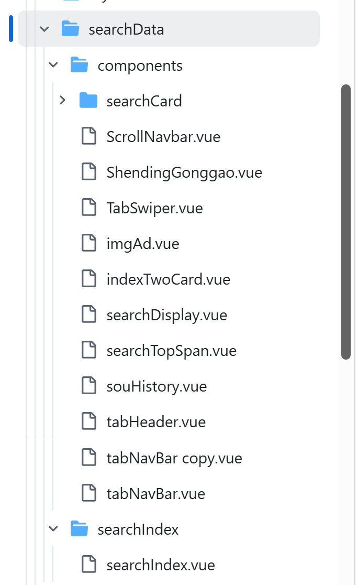

# uniapp开发微信小程序

## 1. 不支持onBackPress生命周期

`onBackPress` 的设计初衷是：

- App（Android 物理返回键）✅
- 部分 H5 返回行为 ✅

👉 但在 **微信小程序环境**：

- ❌ 没有物理返回键
- ❌ 导航栏返回按钮不对外暴露拦截能力
- ❌ 小程序码进入页面更是“系统接管导航栈”

👉 所以：

> **拦不住微信的返回行为**

因此，之前精心设计的首页面搜索逻辑，在效果基本满意之后，面临着一个无论如何也无法解决的问题，那就是，当：

输入框聚焦 + 搜索历史标签 display 的情况下，屏幕边缘滑向内侧所触发的系统层级的返回动作，会直接导致小程序被销毁 => 返回到微信，具体代码如下：




```vue
// searchIndex 
<script setup lang="ts">
// 此处略去1万行逻辑
</script>

<template>
  <!-- 搜索nav-bar 区域 -->
  <!-- @focus-change="handleFocusChange" -->
  <ScrollNavbar
    ref="navbarRef"
    v-model="searchKeyword"
    :tabs="tabs"
    @search="onSearchClick"
    @focus-change="handleFocusChange"
    @height-ready="navbarHeight = $event"
  />

  <!-- 下方tab区域 -->
  <view
    v-show="!isSearchFocused && navbarHeight"
    :style="{ paddingTop: navbarHeight + 'px' }"
    class="tab-container"
  >
    <!-- 集成了 tab&内容区 的组件 -->
    <TabNavBar
      :tabs="tabs"
      :visible="!isSearchFocused && navbarHeight > 0"
      v-model:activeKey="activeKey"
      v-model:swiperProgress="swiperProgress"
      :swipeable="false"
    >
      <template #tuijian="{}">
        <view class="tab-content tab-content-tuijian">
          <SearchTopSpan></SearchTopSpan>
          <SearchDisplay
            :xilie-list="productsList"
            :corn-list="seedCornList"
          ></SearchDisplay>

          <!-- 两个首页副卡片 -->
          <IndexTwoCard :cards-data="cardList"></IndexTwoCard>
        </view>
      </template>

      <template #yumi="{ tab }">
        <view class="tab-content">推荐内容 - {{ tab.label }}</view>
        <ShendingGonggao :detail="detailData"></ShendingGonggao>
      </template>

      <template #xiaomai="{ tab }">
        <view class="tab-content">个人中心内容 - {{ tab.label }}</view>
        <ShendingGonggao :detail="detailData"></ShendingGonggao>
      </template>
    </TabNavBar>
  </view>
</template>

<style lang="scss" scoped>
.tab-container {
  height: 100vh;

  .tab-content {
    margin-top: 10rpx;
  }
}
</style>
```

设计思想：

- `ScrollNavbar`作为固定定位的navbar主容器组件；

- 下方 tab 区域，使用了：

  ```
  v-show="!isSearchFocused && navbarHeight"
  :style="{ paddingTop: navbarHeight + 'px' }"
  ```

  其中，`!isSearchFocused`无需多言，`navbarHeight`是等待`ScrollNavbar`组件返回实际组件高度，因为接下来要用到它，以解决tab内容被遮挡的问题；

- 重点在`ScrollNavbar`内部；

```html
<template>
  <view
    ref="navbarElement"
    class="navbar"
    style="position: fixed; top: 0; left: 0; right: 0; z-index: 999"
  >
    <!-- 安全区域占位 -->
    <!-- <view :style="{ height: menuButtonInfo.top + menuButtonInfo.height }"></view> -->

    <view
      class="navbar-wrapper"
      :style="{ paddingTop: menuButtonInfo.top + 'px' }"
    >
      <!-- 搜索框 - 容器 -->
      <view
        class="sousuo-container"
        :style="inputFocused ? 'border-bottom: 1rpx solid #e3e3e3;' : ''"
      >
        <!-- 图标容器 -->
        <view
          class="menu-icon-container"
          :class="{ hidden: inputFocused }"
        >
          <uni-icons
            type="bars"
            color=""
            size="24"
          />
        </view>

        <!-- 搜索框容器 - 添加动态class -->
        <view
          class="search-box"
          :class="{ expanded: inputFocused }"
          :style="{ height: menuButtonInfo.height + 'px' }"
        >
          <view class="search-inner">
            <!-- :focus="manualFocus" 可以这样控制聚焦 -->
            <!-- 但会导致输入框始终聚焦 - 即使失焦也会快速自动聚焦 -->
            <uni-icons
              type="search"
              color="#656565"
              size="22"
              style="padding: 4rpx 4rpx 0 0"
            />
            <input
              class="search-input"
              :style="{
                height: menuButtonInfo.height + 'px',
                lineHeight: menuButtonInfo.height + 'px',
              }"
              ref="searchInputRef"
              placeholder="青农7审定公告"
              placeholder-class="search-placeholder"
              confirm-type="search"
              @confirm="handleSearchConfirm"
              @focus="handleInputFocus"
              @blur="handleInputBlur"
              :value="modelValue"
              @input="handleInput"
              :maxlength="20"
            />
          </view>
        </view>

        <!-- 取消按钮 -->
        <view
          v-if="inputFocused"
          class="cancel-button"
          @click="handleCancel"
        >
          取消
        </view>
      </view>

   <!-- 新版本的tab&内容组件 - 已合并迁移到内层组件中 -->

      <!-- 历史记录卡片 - 只在聚焦且无输入内容时显示 -->
      <scroll-view
        v-if="shouldShowHistory"
        :class="['fade-container', inputFocused ? 'fade-in' : 'fade-out']"
        class="sousuo-card"
        :scroll-y="true"
        @touchstart="handleTabAreaTouch"
      >  
         <!-- 就是这里 -->
        <sou-history
          ref="searchHistoryRef"
          @history-item-click="handleHistoryItemClick"
          @discovery-item-click="handleDiscoveryClick"
        ></sou-history>
      </scroll-view>

      <!-- 搜索结果预览卡片 - 只在聚焦且有输入内容时显示 -->
      <view
        v-if="shouldShowSearchPreview"
        :class="['fade-container', 'fade-in']"
        class="sousuo-card search-preview-card"
        @touchstart="handleTabAreaTouch"
      >
        <view class="preview-header">
          <text class="preview-title">搜索 "{{ modelValue }}"</text>
          <text
            class="preview-clear"
            @click.stop="handleClearSearch"
          >
            清空
          </text>
        </view>

        <!-- 这里可以根据需要自定义预览内容 -->
        <scroll-view
          scroll-y
          class="preview-scroll"
        >
          <view
            v-for="(item, index) in searchPreviewResults"
            :key="index"
            class="preview-item"
            @click="handlePreviewItemClick(item)"
          >
            <uni-icons
              type="search"
              size="16"
              color="#999"
            />
            <text class="preview-item-text">{{ item.text }}</text>
          </view>

          <!-- 如果没有预览数据，显示提示 -->
          <view
            v-if="searchPreviewResults.length === 0"
            class="preview-empty"
          >
            <text>暂无搜索结果</text>
          </view>
        </scroll-view>
      </view>
    </view>
  </view>
</template>
```

根据input的焦点状态，来渲染搜索历史卡项标签，通过取消按钮，修改焦点状态 => 隐藏搜索历史组件；

亮点，根据聚焦状态，动态设置了 icon 容器的显示/隐藏，当然也很简单，通过增加 hidden 类名，`css` 设置即可；

